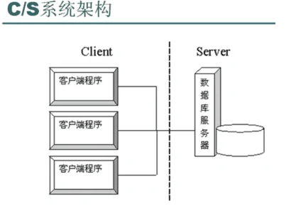

# B/S与C/S结构

### BS：

B/S架构即**浏览器和服务器架构模式**。它是随着Internet技术的兴起，对C/S架构的一种变化或者改进的架构。

在这种架构下，用户工作界面是通过WWW浏览器来实现，极少部分事务逻辑在前端(Browser)实现，但是主要事务逻辑在服务器端(Server)实现，形成所谓三层3-tier结构。B/S架构是WEB兴起后的一种网络架构模式，WEB浏览器是客户端最主要的应用软件。

### CS：

Client/Server结构(C/S结构)是大家熟知的**客户机和服务器结构**。它是**软件系统体系结构**，通过它可以充分利用两端硬件环境的优势，将任务合理分配到Client端和Server端来实现，降低了系统的通讯开销。

**目前大多数应用软件系统都是Client/Server形式的两层结构**，由于现在的软件应用系统正在向分布式的Web应用发展，Web和Client/Server 应用都可以进行同样的业务处理，应用不同的模块共享逻辑组件；

因此，内部的和外部的用户都可以访问新的和现有的应用系统，通过现有应用系统中的逻辑可以扩展出新的应用系统。这也就是目前应用系统的发展方向。

### 两者区别：

##### 1．硬件环境不同：

**C/S 一般建立在专用的网络上，**小范围里的网络环境，局域网之间再通过专门服务器提供连接和数据交换服务。**B/S 建立在广域网之上的，** 不必是专门的网络硬件环境。例如电话上网，租用设备，信息管理，有比C/S更强的适应范围，一般只要有操作系统和浏览器就行。

##### 2．对安全要求不同：

**C/S 一般面向相对固定的用户群， 对信息安全的控制能力很强，** 一般高度机密的信息系统采用C/S 结构适宜，可以通过B/S发布部分可公开信息。**B/S 建立在广域网之上, 对安全的控制能力相对弱，面向是不可知的用户群。**

##### 3．对程序架构不同：

**C/S 程序可以更加注重流程，可以对权限多层次校验**，对系统运行速度可以较少考虑。B/S 对安全以及访问速度的多重的考虑，建立在需要更加优化的基础之上，比C/S有更高的要求。

B/S结构的程序架构是发展的趋势，从MS的.Net系列的BizTalk 2000 Exchange 2000等，全面支持网络的构件搭建的系统.。SUN 和IBM推的JavaBean 构件技术等，使 B/S更加成熟。

##### 4．软件重用不同：

**C/S 程序可以不可避免的整体性考虑**，构件的重用性不如在B/S要求下的构件的重用性好。**B/S 需要多重结构**，要求构件相对独立的功能，能够相对较好的重用。

##### 5．系统维护不同：

系统维护在是软件生存周期中，开销大。**重要C/S 程序由于整体性，必须整体考察**， 处理出现的问题以及系统升级。**升级难**，可能是再做一个全新的系统。**B/S程序由构件组成，方便构件个别的更换，实现系统的无缝升级，系统维护开销减到最小，用户从网上自己下载安装就可以实现升级。**

