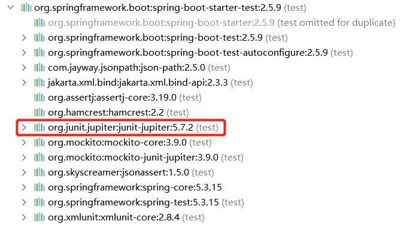

# Junit单元测试

在开发过程中，通常需要对自己的模块进行单元测试，而Junit是单元测试的工具。

## SpringBoot的整合：

在SpringBoot项目中的spring-boot-start-test依赖中也整合了Junit的依赖：

```xml
<!-- Spring Boot测试的依赖项 -->
<dependency>
    <groupId>org.springframework.boot</groupId>
    <artifactId>spring-boot-starter-test</artifactId>
    <scope>test</scope>
</dependency>
```



## Maven项目的使用：

### 1.依赖

```xml
<!--Junit单元测试-->
<dependency>
    <groupId>org.junit.jupiter</groupId>
    <artifactId>junit-jupiter</artifactId>
    <version>5.7.0</version>
    <scope>test</scope>
</dependency>
```

### 2.测试

```java
public class JunitTest {

    private String username;
    private Integer age;
    private String nickname;

    @BeforeAll // 在每个方法之前执行
    static void beforeAll() {
        System.out.println("在每个方法之前执行！");
    }

    @BeforeEach // 在@Test方法之前执行，通常用来初始化参数
    void setUp() {
        System.out.println("开始进行测试前执行的参数初始化！");
        username = "Devotion";
        age = 18;
        nickname = "jstart";
    }

    @Test // 测试
    void testPrint(){
        System.out.println("测试方法正在进行！"+"\r姓名："+username+"年龄："+age+"昵称："+nickname);
    }

    @AfterEach // 在@Test方法测试后执行
    void tearDown() {
        System.out.println("在@Test方法测试后执行！");
    }

    @AfterAll // 在每个方法之后执行
    static void afterAll() {
        System.out.println("在每个方法之后执行！");
    }
}
```

### 3.执行结果

```sh
在每个方法之前执行！
开始进行测试前执行的参数初始化！
姓名：Devotion年龄：18昵称：jstart
在方法测试后执行！
在每个方法之后执行！
```

### 4.注解作用

1. @Test：表示方法是测试方法。
2. @ParameterizedTest：表示方法是参数化测试。
3. @RepeatedTest：表示方法是重复测试
4. @DisplayName：声明测试类或测试方法的自定义显示名称。
5. @BeforeEach：表示被注解的方法应在当前类的每个@Test，@RepeatedTest：@ParameterizedTest方法之前执行; 类似于JUnit 4的@Before。
6. @AfterEach：表示被注解的方法应在当前类的每个@Test，@RepeatedTest，@ParameterizedTest方法之后执行; 类似于JUnit 4的@After。
7. @BeforeAll：表示被注解的方法应该在当前类的所有@Test，@RepeatedTest，@ParameterizedTest和方法之前执行; 类似于JUnit 4的@BeforeClass。
8. @AfterAll：表示被注解的方法应该在当前类的所有@Test，@RepeatedTest，@ParameterizedTest和方法之后执行; 类似于JUnit 4的@AfterClass。
9. @Nested：表示被注解的类是一个嵌套的非静态测试类。
10. @Tag：在类或方法级别声明标签，用于过滤测试。
11. @Disabled：用于禁用测试类或测试方法; 类似于JUnit4的@Ignore。

## 更多参考：

https://blog.csdn.net/qq_52019899/article/details/124369265