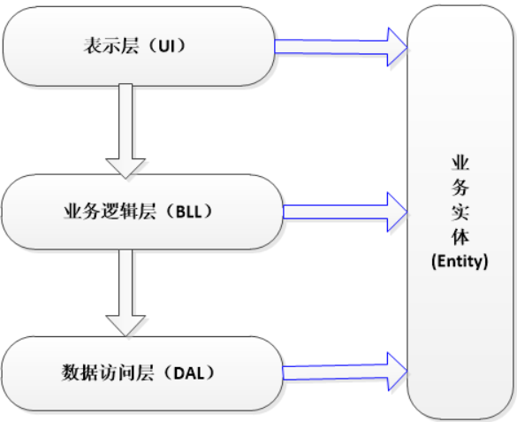
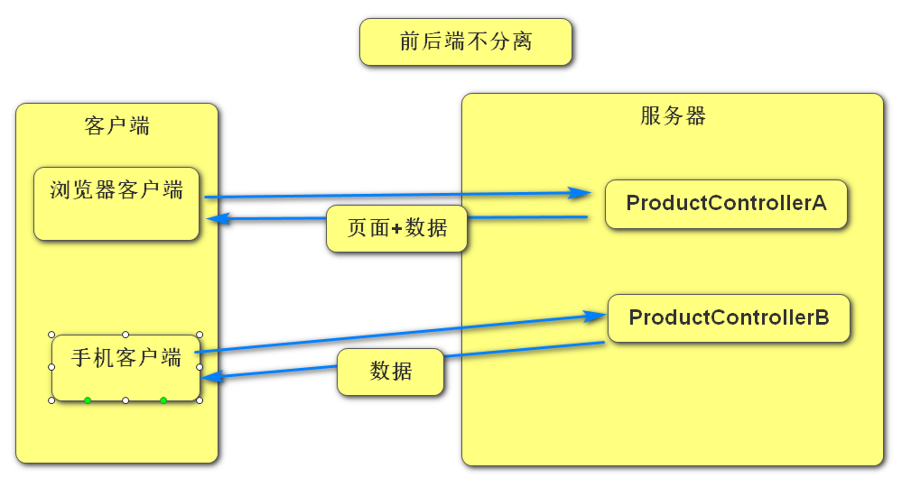
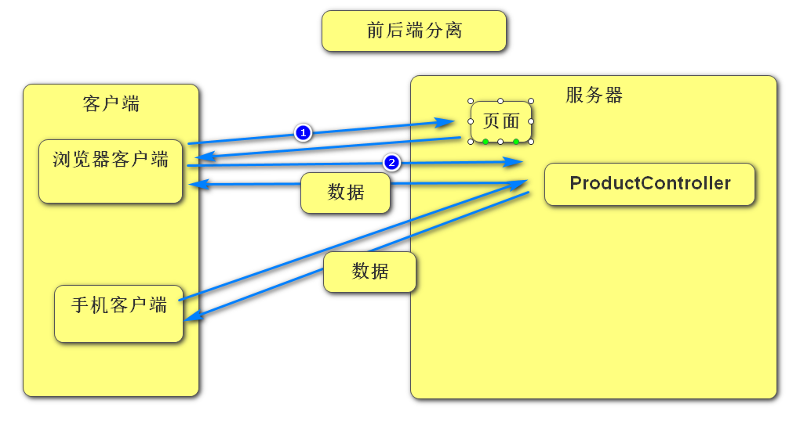

# MVC三层架构

## 一、三层架构包括:

- **UI(表现层)**: 主要是指与用户交互的界面。用于接收用户输入的数据和显示处理后用户需要的数据。
- **BLL:(业务逻辑层)**: UI层和DAL层之间的桥梁。实现业务逻辑。
- **DAL:(数据访问层)**: 与数据库打交道。主要实现对数据的增、删、改、查。将存储在数据库中的数据提交给业务层，同时将业务层处理的数据保存到数据库。（当然这些操作都是基于UI层的。用户的需求反映给界面（UI），UI反映给BLL，BLL反映给DAL，DAL进行数据的操作，操作后再一一返回，直到将用户所需数据反馈给用户）
- **Entity(实体层)**：它不属于三层中的任何一层，但是它是必不可少的一层。

## 二、Entity在三层架构中的作用：

##### 1、实现面向对象思想中的"封装";

##### 2、贯穿于三层，在三层之间传递数据;（注：确切的说实体层贯穿于三层之间，来连接三层）

##### 3、每一条数据就相当于一个对象，每个字段对应对象相应的属性（ORM思想）。

##### 4、每一层（UI—>BLL—>DAL）之间的数据传递（单向）是靠变量或实体作为参数来传递的，这样就构造了三层之间的联系，完成了功能的实现。

## 三、为什么使用三层架构?

目的很简单，实现"**高内聚,低耦合**"

**内聚**：一个模块内各个元素彼此结合的紧密程度，高内聚就是一个模块内各个元素彼此结合的紧密程度高。

**耦合**：一个完整的系统，模块与模块之间，尽可能的使其独立存在，也就是说，让每个模块，尽可能的独立完成某个特定的子功能，模块与模块之间的接口，尽量少而简单，如果某两个模块间的关系比较复杂的话，最好首先进行模块划分，有利于修改和组合。

## 四、与两层的区别

#### 两层:

（当任何一个地方发生变化时，都需要重新开发整个系统。"多层"放在一层，分工不明确耦合度高——难以适应需求变化，可维护性低、可扩展性低）  

#### 三层:

（发生在哪一层的变化，只需更改该层，不需要更改整个系统。层次清晰，分工明确，每层之间耦合度低——提高了效率，适应需求变化，可维护性高，可扩展性高）

#### 三层架构的优势：

##### 1，结构清晰、耦合度低

##### 2，可维护性高，可扩展性高

##### 3，利于开发任务同步进行, 容易适应需求变化

#### 三层架构的劣势：

##### 1、降低了系统的性能。这是不言而喻的。如果不采用分层式结构，很多业务可以直接造访数据库，以此获取相应的数据，如今却必须通过中间层来完成。

##### 2、有时会导致级联的修改。这种修改尤其体现在自上而下的方向。如果在表示层中需要增加一个功能，为保证其设计符合分层式结构，可能需要在相应的业务逻辑层和数据访问层中都增加相应的代码

##### 3、增加了代码量，增加了工作量

## 五、前后端分离

- 前后端不分离: 指在后端代码中需要写前端页面的代码, 这样的话后端程序员需要开发两套Controller,一套Controller负责给浏览器客户端响应页面+数据, 另一套Controller负责给手机端响应数据, 这样的话对于Java后端程序员工作量增加了很多
- 前后端分离: 指在后端代码中不处理页面相关不管客户端是浏览器还是手机端一视同仁只响应数据,这样的话后端只需要提供一套Controller即可, 此时浏览器客户端需要的页面需要单独发请求获取,获取完页面之后再通过异步请求的方式获取数据,然后把数据展示到页面中(这个过程称为页面的局部刷新,只能通过异步请求实现) 所以以后为了解决前后端分离的问题 则不再使用同步请求

### JSON

- JSON是一个轻量级的数据交换格式,也叫作数据封装格式.

刘德华:18&张学友:20&郭富城:30

[{"name":"刘德华","age":18},{"name":"张学友","age":20},{"name":"郭富城","age":30}]

当服务器给客户端响应的数据类型为自定义对象或List集合时, SpringMVC框架会自动将返回的数据转成JSON格式的字符串, 然后通过网络传输给客户端, 客户端接收到的数据是JSON格式的字符串,Axios框架会自动将JSON格式字符串里的数据转成JavaScript语言中的数组或对象