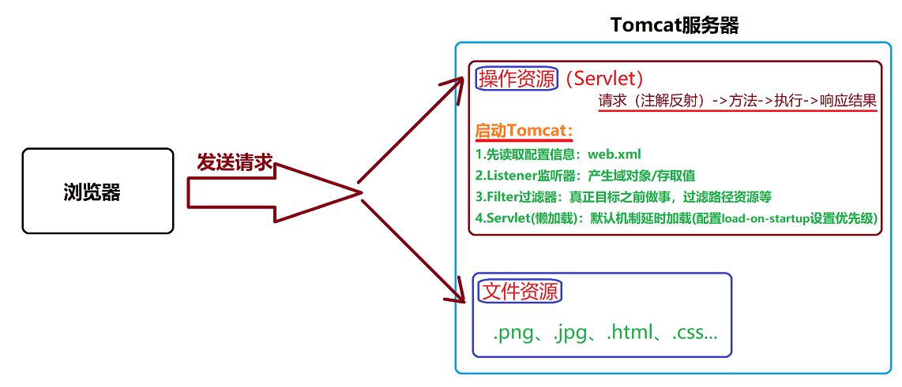

# Tomcat服务器

## 百科概念：

Tomcat是Apache 软件基金会（Apache Software Foundation）的Jakarta 项目中的一个核心项目，由[Apache](https://baike.baidu.com/item/Apache/6265?fromModule=lemma_inlink)、Sun 和其他一些公司及个人共同开发而成。由于有了Sun 的参与和支持，最新的Servlet 和JSP 规范总是能在Tomcat 中得到体现，Tomcat 5支持最新的Servlet 2.4 和JSP 2.0 规范。因为Tomcat 技术先进、性能稳定，而且免费，因而深受Java 爱好者的喜爱并得到了部分软件开发商的认可，成为比较流行的Web 应用服务器。

- Tomcat 服务器是一个免费的开放源代码的Web 应用服务器，属于轻量级应用[服务器](https://baike.baidu.com/item/服务器?fromModule=lemma_inlink)，在中小型系统和并发访问用户不是很多的场合下被普遍使用，是开发和调试JSP 程序的首选。对于一个初学者来说，可以这样认为，当在一台机器上配置好Apache 服务器，可利用它响应[HTML](https://baike.baidu.com/item/HTML?fromModule=lemma_inlink)（[标准通用标记语言](https://baike.baidu.com/item/标准通用标记语言/6805073?fromModule=lemma_inlink)下的一个应用）页面的访问请求。实际上Tomcat是Apache 服务器的扩展，但运行时它是独立运行的，所以当你运行tomcat 时，它实际上作为一个与Apache 独立的进程单独运行的。

- tomcat是一个开源而且免费的jsp服务器，可实现JavaWeb程序的装载，是配置JSP（Java Server Page）和JAVA系统必备的一款环境。它是apache软件基金会的jakarta项目中的一个核心项目，因为tomcat技术先进性能稳定和监督易用性已成为最为广泛的jsp服务器。

## Tomcat启动的加载顺序和对象的创建：

首先Tomcat是一个Web服务器，也可以叫Servlet服务器，作为一种容器用来装载。

##### 流程：

1. 浏览器发送请求到达Tomcat服务器，请求的资源分两种：
   1. 文件资源：`.html`、`.png`、`.jpg`、`.css`等文件
   2. 操作资源：发送请求，反射对应的方法进行处理并给予JSON响应
2. 我们将写好的资源信息提前部署到Tomcat服务器的某一路径下如：`webapps`
3. 启动Tomcat时：
   1. 优先读取一个xml文件配置：`web.xml`拿到类对象名去找并加载
   2. Listener监听器：生成域对象/存取值
   3. Filter过滤器：过滤某些资源文件或者访问路径
   4. Servlet（预加载）：包括Resquest、Response等进行处理业务

