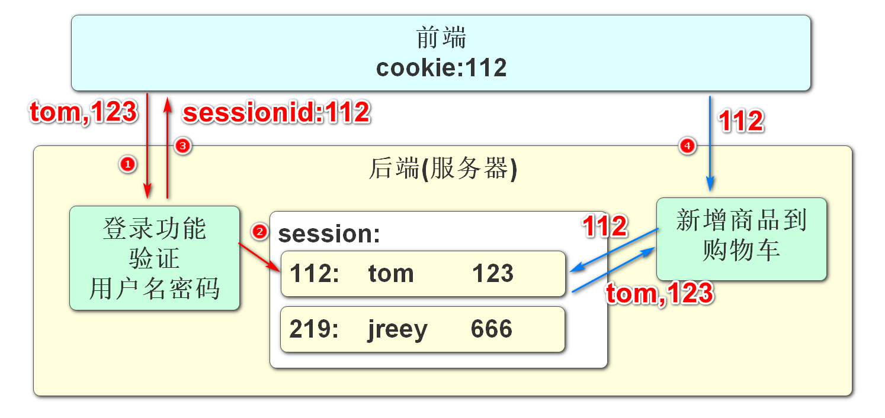
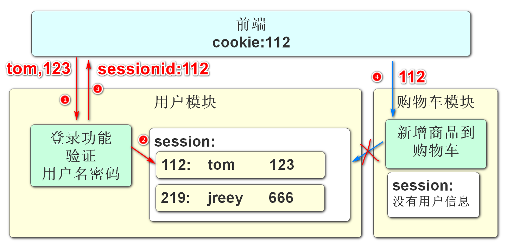
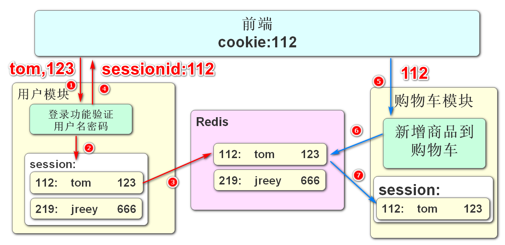
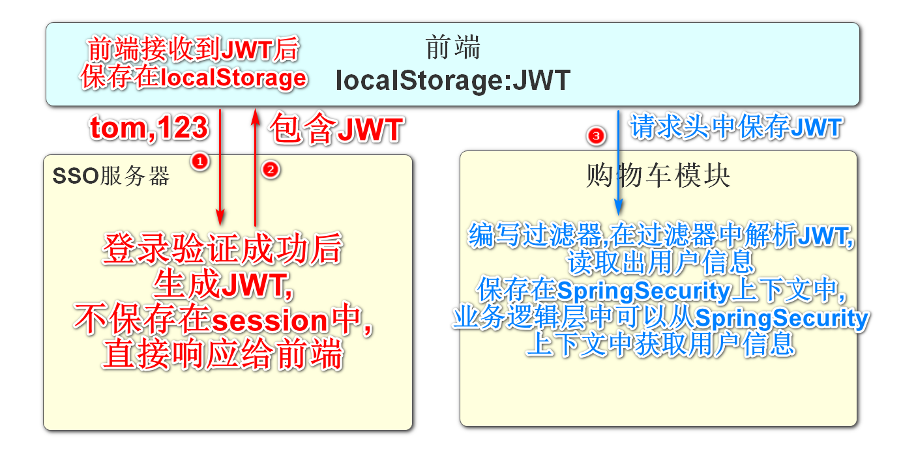
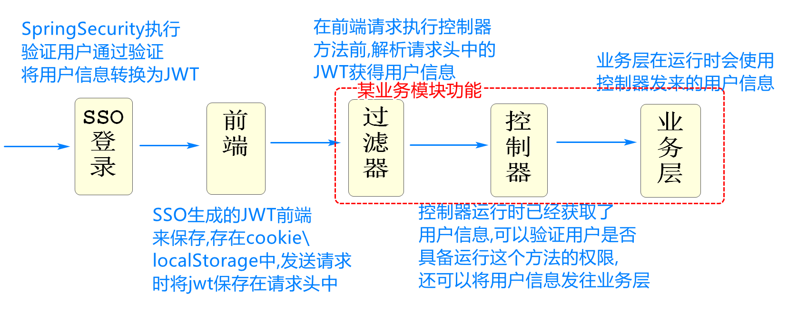
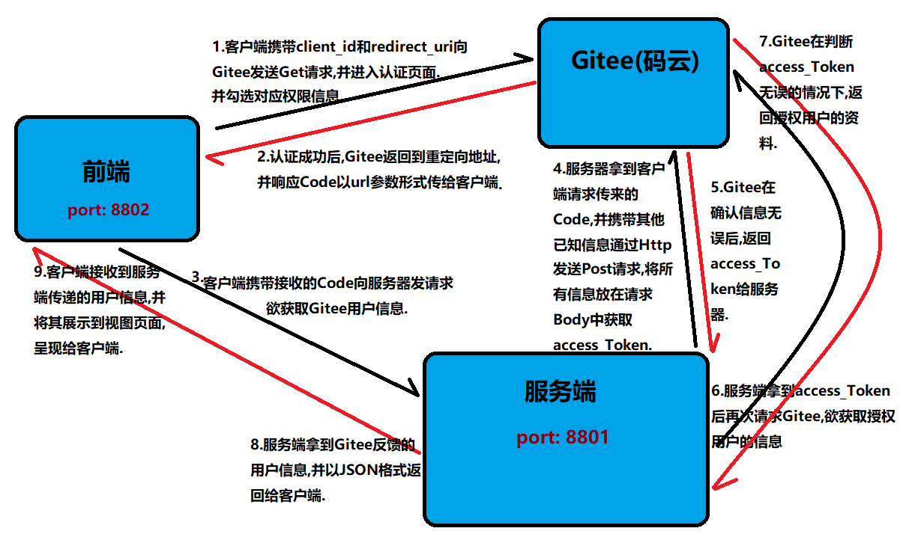

# 单点登录和第三方授权

## 单点登录：

### 普通登录的问题

SSO是单点登录的缩写:SSO(Single Sign On)

微服务架构下,要解决单点登录实现会话保持的问题

首先我们分析一下普通登录和微服务登录的区别

先是单体项目登录之后的操作流程

主要依靠服务器的session保存用户信息

客户端发请求时,将sessionid同时发往服务器,根据sessionid就能确认用户身份



分布式或微服务项目中,服务器不再只有一个

那么就会出现下面的问题:



上面的图片,表示我们在微服务系统中登录时遇到的问题

我们在用户模块中登录,只是将用户信息保存在用户模块的session中

而这个session不会和其他模块共享

所以在我们访问购物车模块或其他模块时,通过sessionid并不能获得在用户模块中登录成功的信息

这样就丢失了用户信息,不能完成业务,会话保持就失败了

市面上现在大多使用JWT来实现微服务架构下的会话保持

也就是在一个服务器上登录成功后,微服务的其他模块也能识别用户的登录信息

这个技术就是单点登录

### 单点登录解决方案

**Session共享**

Session共享是能够实现单点登录效果的

这种方式的核心思想是将用户的登录信息共享给其他模块

适用于小型的,用户量不大的微服务项目



上面这个结构实现起来比较简单,Spring有框架直接支持,添加配置和依赖即可实现单点登录

这样就能将登录成功的用户信息共享给Redis

其他模块根据sessionId获得Redis中保存的用户信息即可

* 这样做最大的缺点就是内存严重冗余,不适合大量用户的微服务项目

**JWT**单点登录

Json Web Token(令牌)

这种登录方式,最大的优点就是不占用内存



生成的JWT由客户端自己保存,不占用服务器内存

在需要表明自己用户身份\信息时,将JWT信息保存到请求头中发送请求即可

### Jwt登录流程图



## 授权登录：

<u>该项目参考Gitee官方的OAuth文档来实现授权过程</u>



### 授权流程:

该项目使用了授权码的模式来完成!

1.应用通过 浏览器 或 Webview 将用户引导到码云三方认证页面上（ **GET请求** ）

```sh
https://gitee.com/oauth/authorize?client_id={client_id}&redirect_uri={redirect_uri}&response_type=code
```

2.用户对应用进行授权

如果之前已经授权过的需要跳过授权页面，需要在上面第一步的 URL 加上 scope 参数，且 scope 的值需要和用户上次授权的勾选的一致。如用户在上次授权了user_info、projects以及pull_requests。则步骤A 中 GET 请求应为：

```sh
https://gitee.com/oauth/authorize?client_id={client_id}&redirect_uri={redirect_uri}&response_type=code&scope=user_info%20projects%20pull_requests
```

3.码云认证服务器通过回调地址{redirect_uri}将 用户授权码 传递给 应用服务器 或者直接在 Webview 中跳转到携带 用户授权码的回调地址上，Webview 直接获取code即可（{redirect_uri}?code=abc&state=xyz)

4.应用服务器 或 Webview 使用 access_token API 向 码云认证服务器发送post请求传入 用户授权码 以及 回调地址（ **POST请求** ）**注：请求过程建议将 client_secret 放在 Body 中传值，以保证数据安全。**

```sh
https://gitee.com/oauth/token?grant_type=authorization_code&code={code}&client_id={client_id}&redirect_uri={redirect_uri}&client_secret={client_secret}
```

5.码云认证服务器返回 access_token,应用通过 access_token 访问 Open API 使用用户数据。

6.当 access_token 过期后（有效期为一天），你可以通过以下 refresh_token 方式重新获取 access_token（ **POST请求** ）

```sh
https://gitee.com/oauth/token?grant_type=refresh_token&refresh_token={refresh_token}
```

- 注意：如果获取 access_token 返回 403，可能是没有设置User-Agent的原因。
  详见：[获取Token时服务端响应状态403是什么情况](https://gitee.com/oschina/git-osc/issues/IDBSA)

> ##### 后端项目地址:https://gitee.com/jstart/login-sso-system
>
> ##### 前端项目地址:https://gitee.com/jstart/login-sso-client

### 网络传输OkHttp:

文档地址:https://square.github.io/okhttp/

提供:

1.Post请求传入url获取响应信息

2.Get请求传入url获取信息

**依赖:**

```xml
<!--http客户端-->
<dependency>
    <groupId>org.apache.httpcomponents</groupId>
    <artifactId>httpclient</artifactId>
    <version>4.5.6</version>
</dependency>

<!--Apache的FastJson-->
<dependency>
    <groupId>com.alibaba</groupId>
    <artifactId>fastjson</artifactId>
    <version>1.2.51</version>
</dependency>

<!--okhttp-->
<dependency>
    <groupId>com.squareup.okhttp3</groupId>
    <artifactId>okhttp</artifactId>
    <version>3.14.1</version>
</dependency>
```
