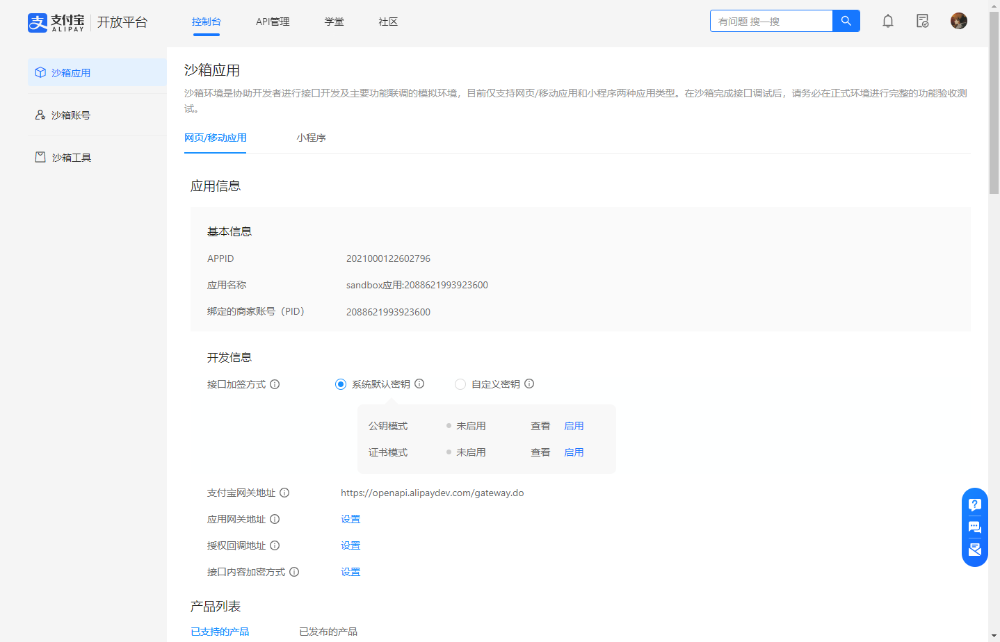
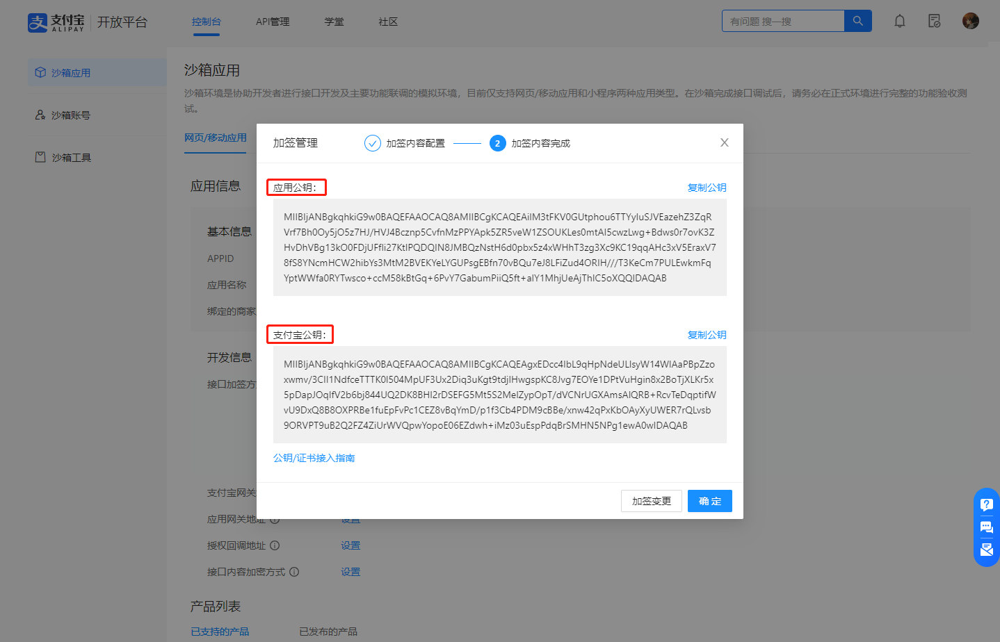
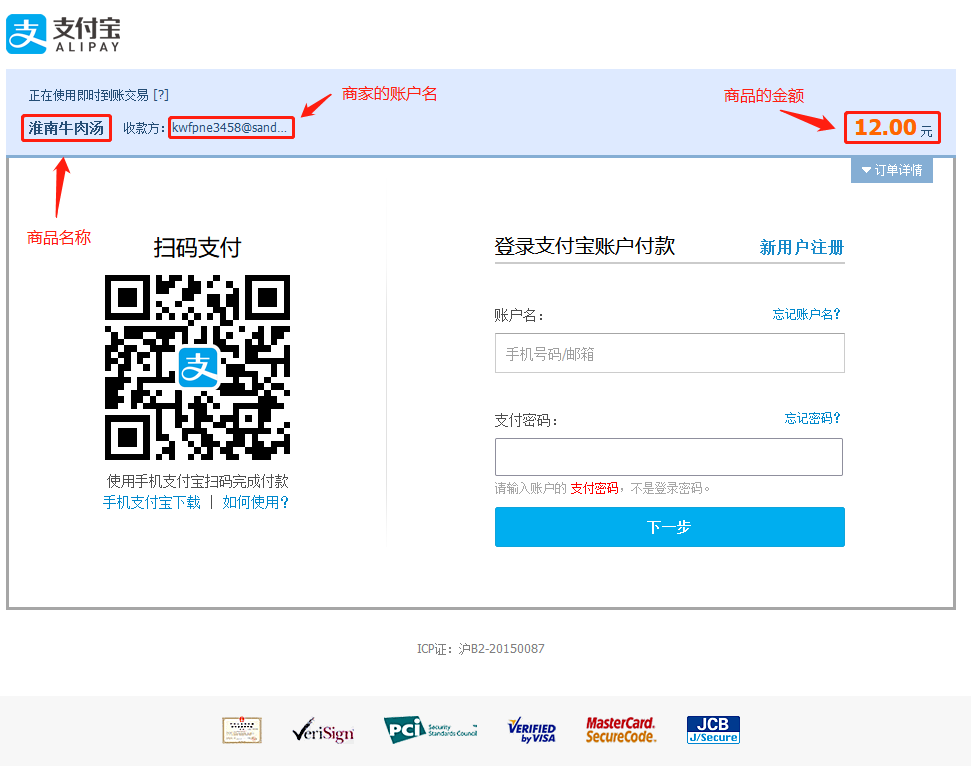
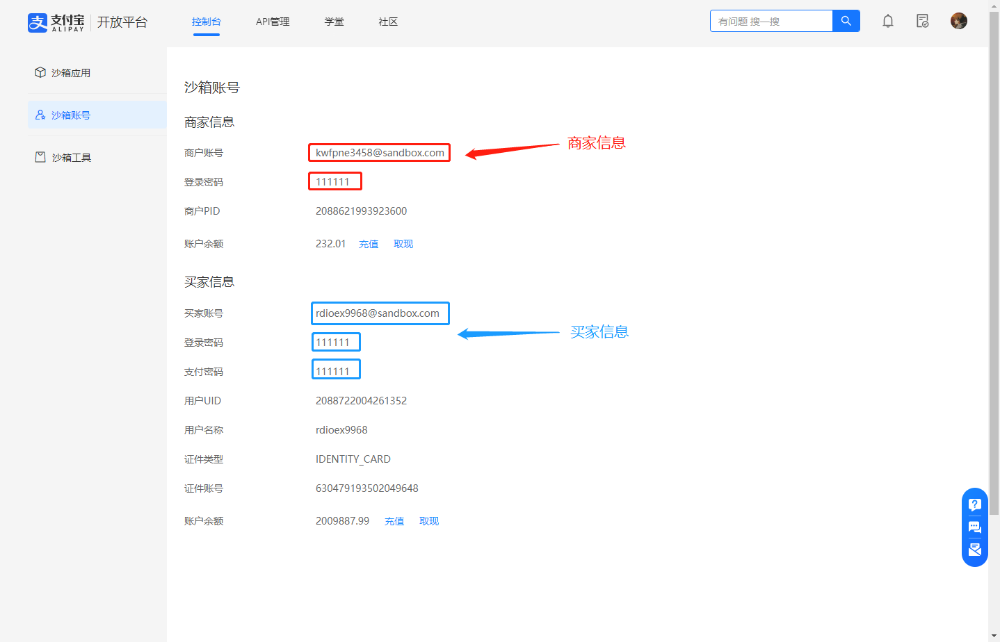
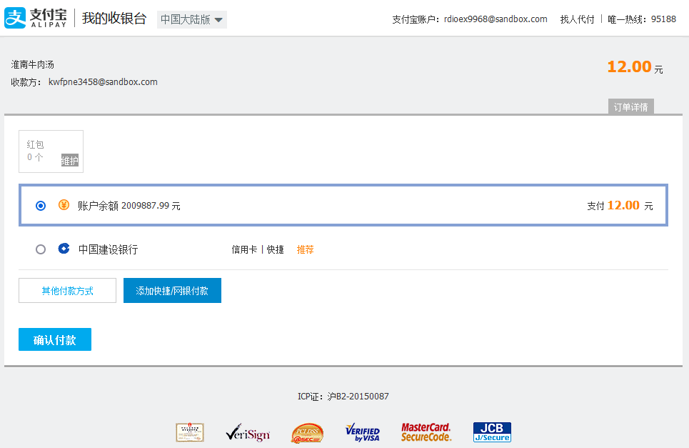
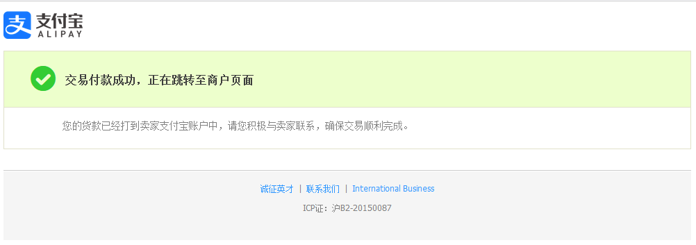
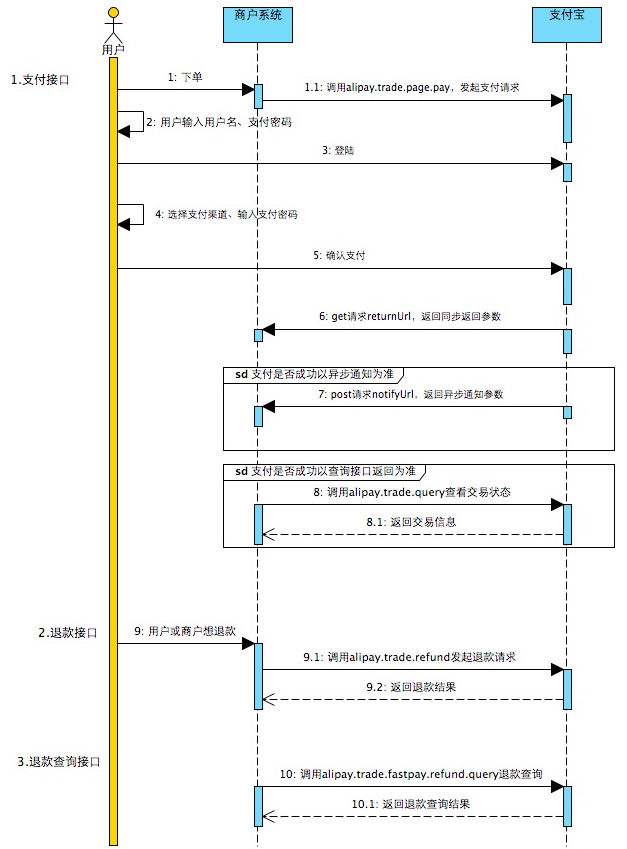

# 支付宝沙箱技术

### 1.环境地址

沙箱环境地址：https://openhome.alipay.com/develop/manage

支付宝开放平台地址：https://open.alipay.com/

### 2.点击沙箱，进入个人沙箱应用



### 3.使用密钥工具自定义生成密钥

下载地址：https://opendocs.alipay.com/common/02kipk



除此之外还会在密钥工具中生成私钥在本机指定的文件夹中

#### 至此，沙箱的基本环境和配置已经配置和生成完毕！

### 4.后端项目的代码配置

##### 1.引入支付宝的依赖

```xml
<!--   支付宝支付的依赖     -->
<dependency>
    <groupId>com.alipay.sdk</groupId>
    <artifactId>alipay-sdk-java</artifactId>
    <version>4.16.2.ALL</version>
</dependency>
```

##### 2.创建并编写支付的`Controller`类

- 将从Controller中进入进入支付宝支付,需完成支付宝提供的对应的支付接口
- 创建`PayController`类,代码如下

1. **APP_ID** （appId，从沙箱管理页面获得）
2. **APP_PRIVATE_KEY** （应用私钥，最开始在密钥工具生成而来）
3. **ALIPAY_PUBLIC_KEY** （支付宝公钥，上一步骤获得）
4. **GATEWAY_URL** （支付宝网关地址，在开发平台沙箱管理页面中获得）
5. **SIGN_TYPE** （签名类型）
6. **NOTIFY_URL** （异步回调地址，须是公网IP，后面再解释）
7. **RETURN_URL** （同步回调地址，可以是私网IP）

**支付的接口**:

```java
// APPId
private static final String APP_ID = "2021000122602796";
private static final String APP_PRIVATE_KET = "私钥";
private static final String CHARSET = "UTF-8";
// 支付宝公钥
private static final String ALIPAY_PUBLIC_KEY = "密钥";
private static final String GATEWAY_URL = "https://openapi.alipaydev.com/gateway.do";
private static final String FORMAT = "JSON";
// 签名方式
private static final String SIGN_TYPE = "RSA2";
// 支付宝一步通知路径，公网地址
private static final String NOTIFY_URL = "";
// 支付宝同步通知路径，也就是当付款完毕后跳转本项目的页面，可私网地址
private static final String RETURN_URL = "http://localhost:9902/product/paySuccess";

/**
 * 处理请求支付的方法
 * @param session 建立HTTP回话
 * @param model 组件
 * @param donaMoney 商品价格
 * @param donaId 商品id
 * @param subject 商品名称
 * @return 返回请求成功后的商品信息
 * @throws AlipayApiException 支付API的内置异常处理
 */
@GetMapping("/alipay")
public String alipay(HttpSession session, Model model, @RequestParam(value = "dona_money") float donaMoney,
                     @RequestParam(value = "dona_id") int donaId,
                     @RequestParam(value = "dona_name") String subject) throws AlipayApiException {
    // 把项目id放在session中
    session.setAttribute("dona_id",donaId);

    // 生成订单号（支付宝的要求）
    String time = new SimpleDateFormat("yyyyMMddHHmmss").format(new Date());
    String user = UUID.randomUUID().toString().replace("-", "").toUpperCase();

    String orderNum = time+user;
    System.out.println("订单号："+orderNum);

    // 调用封装好的方法（给支付宝接口发送请求）
    return sendRequestToAlipay(orderNum,donaMoney,subject);
}
```

> #### 前端请求该路径时需要Get传递的参数(支付宝规定!)
>
> 1.dona_money: 交易金额
>
> 2.dona_id: 商品id
>
> 3.dona_name: 商品名称

**返回给支付宝商品信息的方法**:

```java
sendRequestToAlipay方法
```

除了需要提供之前设置好的私有属性（URL，公钥，私钥，网关等等）外，还需要提供的参数
`outTradeNo`: 订单号，必须为String64位，不能为空且不能重复
`totalAmount`: 支付金额，不能为空
`subject`: 订单名称，不能为空
`body`: 商品描述，可以为空

```java
/**
 * 请求成功后返回商品结果
 * @param outTradeNo 订单号
 * @param totalAmount 商品价格
 * @param subject 商品名称
 * @return 返回结果
 * @throws AlipayApiException 支付API的内置异常处理
 */
private String sendRequestToAlipay(String outTradeNo,Float totalAmount,String subject) throws AlipayApiException {
    // 获得初始化的AlipayClient
    AlipayClient alipayClient = new DefaultAlipayClient(GATEWAY_URL,APP_ID,APP_PRIVATE_KET,FORMAT,CHARSET,ALIPAY_PUBLIC_KEY,SIGN_TYPE);

    // 设置请求参数
    AlipayTradePagePayRequest alipayRequest = new AlipayTradePagePayRequest();
    alipayRequest.setNotifyUrl(NOTIFY_URL); // 支付宝通知的本地地址
    alipayRequest.setReturnUrl(RETURN_URL); // 支付宝异步回调的公网地址

    // 商品描述
    String body = "";
    alipayRequest.setBizContent("{\"out_trade_no\":\"" + outTradeNo + "\","
                    + "\"total_amount\":\"" + totalAmount + "\","
                    + "\"subject\":\"" + subject + "\","
                    + "\"body\":\"" + body + "\","
                    + "\"product_code\":\"FAST_INSTANT_TRADE_PAY\"}");

    // 请求
    String result =  alipayClient.pageExecute(alipayRequest).getBody();
    System.out.println("商品信息结果："+result);
    return result;
}
```

> #### 此时启动项目就可以跳转到支付宝进行支付



利用支付宝自动生成的沙箱账号进行登录完成支付过程!



确认支付:



成功支付:



**成功支付后将会跳转到你自定的同步回调地址,只需在回调地址页面处理返回的支付成功信息即可!**

```java
// 支付宝同步通知路径，也就是当付款完毕后跳转本项目的页面，可私网地址
private static final String RETURN_URL = "http://localhost:9902/product/paySuccess";
```

并且在URL中传递支付成功后支付宝返回的订单信息,信息如下:

```java
http://localhost:9902/product/paySuccess?
  // 字符集
charset=UTF-8
& // 商户订单号
out_trade_no=202212181654202FECAE50F0044FCA8A51C3809B3FFBA3
& // 交易方法
method=alipay.trade.page.pay.return
& // 交易金额
total_amount=12.00
& // 签名
sign=Ko9zmszdEZ%2FrdaUwWXBZyPptyrgBP585CButeFn6APzKrGZJEKB13SLBtKWmGfz6a0PSnpFuIi0bi7IgHHim4g3UZZM728AIuJqIHputrfrAa37fL%2FSmwsLuLRvz6n%2BGGMJHWNC2MH8bwgL9%2BL0nVswLECVT4Q4I2Xon2I8CDiDx%2FudKlXJ2M7tEbW3n7l4zZ6IY9lH1dJ%2Fjnt2wC5VwP%2FAKczYw6jUH6p%2Ft4yQXcl0v7f5X8ly01dWxaPPqFyeEYZY1XCagqC9HqYauutjCB9Re987L%2BnsT3WiCyagAmrAAxlU5yJ4ubGbE8fmDuMdRIG8QosQ%2FEx%2BdPa8e7fEeJg%3D%3D
& // 交易流水号
trade_no=2022121822001461350505670005
& // 沙箱APPId
auth_app_id=2021000122602796
& // 版本(类似乐观锁)
version=1.0
& // 沙箱APPId
app_id=2021000122602796
& // 签名方式
sign_type=RSA2
& // 商户PID
seller_id=2088621993923600
&// 交易时间
timestamp=2022-12-18%2016%3A54%3A49
```

**也可以回调至后端控制器,代码如下**:

```java
/**
 * 该方法可以获取支付成功后,支付宝回调时传递的信息
 * @param request HttpServletRequest
 * @param session 回话
 * @param model model
 * @return 返回页面信息
 * @throws UnsupportedEncodingException 不支持的转码异常
 * @throws AlipayApiException  支付时发生的异常
 */
@RequestMapping("/returnUrl")
public String returnUrlMethod(HttpServletRequest request,HttpSession session,Model model) throws UnsupportedEncodingException, AlipayApiException {
    log.debug("执行同步回调...");
    // 获取支付宝GET请求过来的反馈信息
    Map<String,String> params = new HashMap<>();
    Map<String,String[]> requestParams = request.getParameterMap(); // 获取get参数列表
    for (String name : requestParams.keySet()) {
        String[] values = requestParams.get(name);
        String valueStr = "";
        for (int i = 0; i < values.length; i++) {
            valueStr = (i == values.length - 1) ? valueStr + values[i] : valueStr + values[i] + ",";
        }
        // 解决乱码
        valueStr = new String(valueStr.getBytes("ISO_8859_1"), "utf-8");
        params.put(name, valueStr);
    }

    log.debug("支付宝传递过来的参数：{}",params);
    // 验证签名(支付宝公钥)
    boolean signVerified = AlipaySignature.rsaCheckV1(params, ALIPAY_PUBLIC_KEY, CHARSET, SIGN_TYPE);
    //验证签名通过
    if(signVerified){
        // 商户订单号
        String out_trade_no = new String(request.getParameter("out_trade_no").getBytes("ISO_8859_1"), "UTF-8");

        // 支付宝交易流水号
        String trade_no = new String(request.getParameter("trade_no").getBytes("ISO_8859_1"), "UTF-8");

        // 付款金额
        float money = Float.parseFloat(new String(request.getParameter("total_amount").getBytes("ISO_8859_1"), "UTF-8"));

        System.out.println("商户订单号="+out_trade_no);
        System.out.println("支付宝交易号="+trade_no);
        System.out.println("付款金额="+money);

        //在这里编写自己的业务代码（对数据库的操作）
        /*
        ################################
        */
        //跳转到提示页面（成功或者失败的提示页面）
        model.addAttribute("flag",1);
        model.addAttribute("msg","支持");
        return "common/payTips";
    }else{
        //跳转到提示页面（成功或者失败的提示页面）
        model.addAttribute("flag",0);
        model.addAttribute("msg","支持");
        return "common/payTips";
    }
}
```

### 5.最后提供支付宝官方给的沙箱支付流程图解

