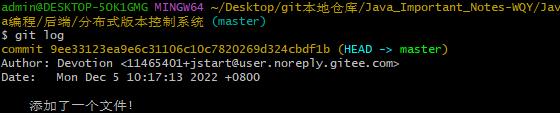

# 分布式版本控制---Git使用


## 关于版本控制

##### 1.什么是版本控制`VCS`?

1. VCS版本控制(Version Control System) RC版本控制(Revision Control)是一种软件工程技巧

2. 在开发过程中,确保由不同人所编译的同一档案都得到更新

3. 举例:

   ```
   我们通常都是手动的重命名一个文件进行备份的 hello.java改成hello1.java或者hello.java.bak等形式
   
   然后这种方式对于单个文件我们还能够管理，但是对于整个项目而言，就会成为噩梦了！！！
   ```

4. 文件版本常见问题

   ```
   合并代码：两个人写的代码如何合并到一起
   版本回退：在写代码过程当中, 代码出现错误,如如何才能加回到以前没有错误的代码
   ```

## 版本管理工具

#### 1.集中式管理

**特点:**

1. 集中式版本控制系统，版本库是集中存放在中央服务器的 而干活的时候，用的都是自己的电脑
2. 所以要先从中央服务器取得最新的版本，然后开始干活，干完活了，再把自己的活推送给中央服务器 中央服务器就好比是一个图书馆
3. 你要改一本书，必须先从图书馆借出来，然后回到家自己改，改完了，再放回图书馆

**缺点:**

集中式版本控制系统最大的毛病就是必须联网才能工作 所有的版本都在一个服务器上面 如果服务挂了， 所有记录的版本都没了

#### 2.分布式管理

**特点:**

1. 分布式版本控制系统，则不需要中央服务器
2. 每个协同开发者都拥有一个完整的版本库
3. 这么一来，任何协同开发者用的服务器发生故障
4. 事后都可以用其它协同开发者本地仓库恢复

**使用方式:**

1. 在实际使用分布式版本控制系统的时候，其实很少在两人之间的电脑上推送版本库的修改，
2. 因为可能你们俩不在一个局域网内，两台电脑互相访问不了，也可能今天你的同事病了，他的电脑压根没有开机。
3. 因此，分布式版本控制系统通常也有一台充当“中央服务器”的电脑，
4. 但这个服务器的作用仅仅是用来方便“交换”大家的修改，没有它大家也一样干活，只是交换修改不方便而已。

## git版本管理

#### git介绍

1. git是是基于 [Linux内核](https://baike.baidu.com/item/Linux内核/10142820?fromModule=lemma_inlink)开发的一款开源分布式版本管理工具，作者Linux之父-Linus
2. 当初Linus 仅仅是为了辅助Linux内核的开发才一并开发了这个至今为止世界上最快的、最简单的版本管理工具

#### 软件安装

git下载地址:https://git-scm.com/


> 安装过程尽量将文件保存到自己的开发目录中

#### Git工作状态

1. Git管理项目时,文件流转分为三个工作区域

```
Git 的工作目录， 暂存区域， 以及本地仓库

对于任何一个文件，在 Git 内都会有三种状态
1.已修改（modified） 已修改表示修改了某个文件，但还没有提交保存
2.已暂存（staged） 已暂存表示把已修改的文件放在下次提交时要保存的清单中
3.已提交（committed） 已提交表示该文件已经被安全地保存在本地数据库中了
```

## 原理流程步骤

1. 从项目中取出某个版本的所有文件和目录，用以开始后续工作的叫做工作目录
2. 这些文件实际上都是从 Git 目录中的压缩对象数据库中提取出来的
3. 接下来就可以在工作目录中对这些文件进行编辑
4. 暂存区域
   只不过是个简单的文件 .git目录之下，名为index，它一般很小，一般不超过1KB左右 一般都放在 Git 目录中
   有时候人们会把这个文件叫做索引文件
   暂存区这个索引文件里面包含的是文件的目录树，像一个虚拟的工作区，在这个虚拟工作区的目录树中，记录了文件名、文件的时间戳、文件长度、文件类型以及最重要的SHA-1值，文件的内容并没有存储在其中
   暂存区的作用：除非是绕过暂存区直接提交，否则Git想把修改提交上去，就必须将修改存入暂存区最后才能commit。每次提交的是暂存区所对应的文件快照
5. git目录(本地仓库)
6. 当我们在某个目录下运行git init命令后，在该目录下便会生成一个.git的子目录，这个目录是隐藏的。
7. 它是 Git 用来保存元数据和对象数据库的地方,这个目录可以说是Git的核心
8. 每次克隆镜像仓库时，实际上拷贝的这个目录里的内容而已
9. 工作流程
   1、在工作目录中修改文件。
   2、暂存文件，将文件的快照放入暂存区域。
   3、提交更新，找到暂存区域的文件，将快照永久性存储到Git仓库目录。


## Git基本操作

##### 1.初始化用户名和邮箱:  `git config --global ...`

```sh
git config --global user.name "自已的名字"
git config --global user.email "自已的邮箱地址"
# 查看配置的信息 git config --list
```

##### 2.初始化本地仓库:  `git init`

1. 先创建一个空文件夹
2. 在空文件夹的当前目录下鼠标右键点击Git Bash Here命令窗口
3. 输入命令`git init`对当前仓库进行初始化


##### 3.查看Git中的当前状态: `git status`


发现文件和文件夹的颜色都是红色 ,当出现这种情况的时候, 说明这些文件还没有添加到git仓库当中

##### 4.将文件添加至git仓库的暂存区中: `git add 文件名(.)`


不输出任何信息为正常,查看状态:


此时全部变成绿色, 文件已经添加到git暂存区当中,还没有提交

##### 5.撤回放入暂存区的内容: `git restore --staged 文件名`


> 撤回到当初未提交状态!

##### 6.提交暂存区中的文件: `git commit`

1.会进入一个vi编辑器界面, 提示让输入信息, 输入本次做了哪些操作, 保存并退出即可

> 使用Linux命令`i`进入插入模式,最后Esc退出并输入`:wq`保存并退出


再次查看状态,已经没有任何需要提交的数据了: nothing to commit


2.也可以在提交命令后指定提交信息: `git commit -m"...."`

参数m译为message(消息),输入该命令后无需进入vi模式输入提交信息


> 最后效果是一样的,提交到Git仓库Repository

##### 7.查看历史日志: `git log`



##### 8.修改文件: `vim 文件名`进入文本编辑模式


老样子,`i`插入模式,最后Esc并敲`:wq`保存并退出

修改后再查看状态,会出现Modified状态


此时需要再次提交到暂存区并提交
执行 `git add *` 和 `git commit`


执行`git log`查看历史日志


##### 9.恢复历史: `git reset --hard 提交编号`

回到指定的版本


##### 10.推送到远程仓库Remove: `git push `

##### 11.从远程仓库拉取文件: `git pull`

##### 12.克隆远程仓库的文件: `git clone 远程仓库地址`

##### 13.查看配置：`git config -l`

## 分支

#### 分支概念:

1. 使用分支意味着你可以把你的工作从开发主线上分离开来，以免影响开发主线
2. 几乎所有的版本控制系统都以某种形式支持分支。


版本控制的体现：


有关分支的操作：


##### 1.创建分支: `git branch 分支名称`


##### 2.查看分支: `git branch`


绿色为当前所在分支,默认有一个master主分支

##### 3.切换分支: `git checkout 分支名称`


再次查看分支:


##### 4.组合命令-创建并切换分支: `git checkout -b <新的分支名>`


##### 5.在新分支修改原来分支中的文件,并查看状态


提交:


再次切换到master分支上,查看日志,里面并没有在newBranch中添加的代码:


##### 6.修改分支名称: `git branch -m 原 现`


##### 7.合并分支: `git merge 分支名称`


> 合并过程中会提示输入合并理由，之后即可合并成功！

```sh
Please enter a commit message to explain why this merge is necessary,
# especially if it merges an updated upstream into a topic branch.
#
# Lines starting with '#' will be ignored, and an empty message aborts
# the commit.
翻译：
请输入一条提交消息，解释为什么需要合并，
#特别是如果它将更新的上游合并到主题分支中。
#
#将忽略以“#”开头的行，并中止一条空消息
#承诺。
```

##### 8.删除分支: `git branch -d 分支名称`

```sh
# 删除分支
git branch -d <分支名称>
1.-d 用于删除已经合并过的分支
2.-D 用于强制删除分支(不管是否合并)
```


## 共享仓库

#### 1.用户clone项目

在当中目录下,clone用户1项目
命令：git clone 要复制的项目路径和名称 复制之后的项目路径和名称

#### 2.共享仓库特点：

1. 以项目名称.git结尾
2. 看不到工作区
3. 它只用来共享, 不能够进行修改添加等操作
4. 从共享仓库当中clone的代码是可以看到工作的

#### 3.创建共享仓库

##### 命令:

两种方式：

1. git init —bare 仓库名称
2. git clone —bare 要clone的项目路径和名称

#### 4.共享仓库上传代码

1. 在本地仓库当中添加文件, 添加加到本地仓库
2. 先提交到本地仓库,再推送到远程仓库

推送命令：`git push 远程仓库地址 分支名称`

#### 5.从共享仓库下拉代码

命令：`git pull 仓库地址 分支名称`

## 冲突

1.什么是冲突?

两个人共同协作开发时, 改了相同的文件,都做了提交

1. 什么情况下会产生冲突
2. 两人同时更改了相同的代码,并且都提交到了本地.
3. 先提交到远程仓库的人不会有任何问题
4. 后提交的人,需要先pull下来,在pull的时候,就会产生冲突
5. 这时就需要先解决冲突,解决冲突完毕后,提交到本地, 再提交到远程仓库

操作：
用户1更改代码，提交代码，用户2做同样的操作


用户2提交远程的时候会报错


#### 解决冲突

先从远程仓库下拉代码，但是也会出现报错


解决方案：
1.打开下拉的文件，进行手动修改，保留最终数据

2.删除<<<<<<head ******** >>>>>>>sha值  保留最终代码

3.再进行提交远程


