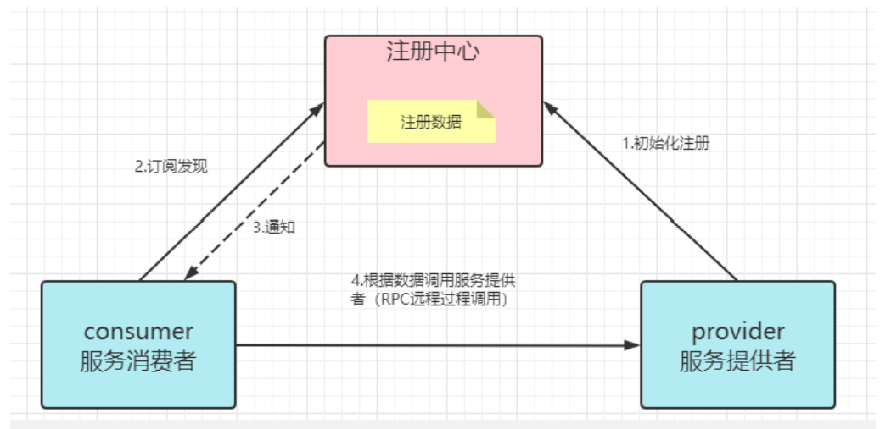

# Dubbo远程调用

## 什么是RPC?

RPC是Remote Procedure Call的缩写 翻译为:远程过程调用

目标是为了实现两台(多台)计算机\服务器,相互调用方法\通信的解决方案

RPC只是实现远程调用的一套标准

该标准主要规定了两部分内容

1.通信协议

2.序列化协议

为了方便大家理解RPC,下面的图片帮助理解


上面图是老婆和老公在家的时,老婆让老公洗碗的调用流程

这个流程可以理解为项目内的功能的调用,类似面向对象编程实例化对象,调用方法的过程

但是这个调用关系如果是远程的,意思是老婆和老公现在是两个不同的项目


我们看到上图中,远程调用必须借助一个通信设备,图片中是手机

**通信协议**

通信协议指的就是远程调用的通信方式

实际上这个通知的方式可以有多种

例如:写信,飞鸽传书,发电报

在程序中,通信方法实际上也是有多种的,每种通信方式会有不同的优缺点

**序列化协议**

序列化协议指通信内容的格式,双方都要理解这个格式

上面的图片中,老婆给老公发信息,一定是双方都能理解的信息

发送信息是序列化过程,接收信息需要反序列化

程序中,序列化的方式也是多种的,每种序列化方式也会有不同的优缺点

## 什么是Dubbo?

上面对RPC有基本认识之后,再学习Dubbo就简单了

Dubbo是一套RPC框架。既然是框架，我们可以在框架结构高度，定义Dubbo中使用的通信协议，使用的序列化框架技术，而数据格式由Dubbo定义，我们负责配置之后直接通过客户端调用服务端代码。

可以说Dubbo就是RPC概念的实现

Dubbo是SpringCloudAlibaba提供的框架

能够实现微服务相互调用的功能!

## Dubbo的发展历程


> Dubbo历程

在dubbo2012年底停止更新后

国内很多公司在Dubbo的基础上进行修改,继续更新

比较知名的修改版本就是当当网的DubboX

2012年底dubbo停止更新后到2017年dubbo继续更新之前

2015SpringCloud开始兴起,当时没有阿里的框架

国内公司要从SpringCloud和Dubbo中抉择使用哪个微服务方案

**我们学习的Dubbo指的都是2.7之后的版本**

是能够和SpringCloudAlibaba配合使用的

## Dubbo对协议的支持

RPC框架分通信协议和序列化协议

Dubbo框架支持多种通信协议和序列化协议,可以通过配置文件进行修改

Dubbo支持的通信协议

* dubbo协议(默认)
* rmi协议
* hessian协议
* http协议
* webservice
* .....

支持的序列化协议

* hessian2(默认)
* java序列化
* compactedjava
* nativejava
* fastjson
* dubbo
* fst
* kryo

Dubbo默认情况下,支持的协议有如下特征

* 采用NIO单一长链接
* 优秀的并发性能,但是处理大型文件的能力差

Dubbo方便支持高并发和高性能

## Dubbo服务的注册与发现

在Dubbo的调用过程中,必须包含注册中心的支持

项目调用服务的模块必须在同一个注册中心中

注册中心推荐阿里自己的Nacos,兼容性好,能够发挥最大性能

但是Dubbo也支持其它软件作为注册中心(例如Redis,zookeeper等)

服务发现，即消费端自动发现服务地址列表的能力，是微服务框架需要具备的关键能力，借助于自动化的服务发现，微服务之间可以在无需感知对端部署位置与 IP 地址的情况下实现通信。

上面RPC的示例中,老婆就是服务的消费端,她能发现老公具备的服务

如果老婆调用了老公的服务,就是完成了Dubbo调用



consumer服务的消费者,指服务的调用者(使用者)也就是老婆的位置

provider服务的提供者,指服务的拥有者(生产者)也就是老公的位置

在Dubbo中,远程调用依据是服务的提供者在Nacos中注册的服务名称

一个服务名称,可能有多个运行的实例,任何一个空闲的实例都可以提供服务

> 常见面试题:Dubbo的注册发现流程

1.首先服务的提供者启动服务时,将自己的具备的服务注册到注册中心,其中包括当前提供者的ip地址和端口号等信息,Dubbo会同时注册该项目提供的远程调用的方法

2.消费者(使用者)启动项目,也注册到注册中心,同时从注册中心中获得当前项目具备的所有服务列表

3.当注册中心中有新的服务出现时,(在心跳时)会通知已经订阅发现的消费者,消费者会更新所有服务列表

4.RPC调用,消费者需要调用远程方法时,根据注册中心服务列表的信息,只需服务名称,不需要ip地址和端口号等信息,就可以利用Dubbo调用远程方法了

# Dubbo实现微服务调用

## 确定调用结构


* order模块调用stock模块的减少库存的功能
* order模块调用cart模块的删除购物车的功能
* business模块调用order新增订单的功能


要想实现Dubbo调用必须按照Dubbo规定的配置和行业标准的结构来实现

## Dubbo调用的好处

直接将要消费的目标（例如order模块中消费stock的方法）编写在当前消费者的业务逻辑层中，无需编写新的代码结构，程序运行流程不会因为Dubbo而变化

## 调用案例：

#### 1.需要将被调项目的依赖植入到当前项目的依赖中即可！

```xml
<?xml version="1.0" encoding="UTF-8"?>
<project xmlns="http://maven.apache.org/POM/4.0.0" xmlns:xsi="http://www.w3.org/2001/XMLSchema-instance"
         xsi:schemaLocation="http://maven.apache.org/POM/4.0.0 https://maven.apache.org/xsd/maven-4.0.0.xsd">
    <modelVersion>4.0.0</modelVersion>
    <!--父项目-->
    <parent>
        <groupId>cn.tedu</groupId>
        <artifactId>csmall</artifactId>
        <version>0.0.1-SNAPSHOT</version>
        <relativePath/> <!-- lookup parent from repository -->
    </parent>
    <!--当前项目-->
    <groupId>cn.tedu</groupId>
    <artifactId>csmall-business</artifactId>
    <version>0.0.1-SNAPSHOT</version>
    <name>csmall-business</name>
    <description>Demo project for Spring Boot</description>
    <!--当前项目的所有依赖-->
    <dependencies>
        <dependency>
            <groupId>org.springframework.boot</groupId>
            <artifactId>spring-boot-starter-web</artifactId>
        </dependency>
        <dependency>
            <groupId>com.github.xiaoymin</groupId>
            <artifactId>knife4j-spring-boot-starter</artifactId>
        </dependency>
        <!--需要调用的项目依赖-->
        <dependency>
            <groupId>cn.tedu</groupId>
            <artifactId>csmall-commons</artifactId>
            <version>0.0.1-SNAPSHOT</version>
        </dependency>
        <!-- business要消费Order模块的服务,需要添加order模块业务逻辑层接口的依赖 -->
        <dependency>
            <groupId>cn.tedu</groupId>
            <artifactId>csmall-order-service</artifactId>
            <version>0.0.1-SNAPSHOT</version>
        </dependency>
</project>
```

#### 2.在当前项目配置类中添加被调用项目的配置，并扫描需要引用的包

```java
// 当前类是配置Spring扫描环境的配置类,必须添加配置注解@Configuration才能生效
@Configuration
// 我们要扫描commons模块中,统一异常处理类所在的包名,使异常处理功能生效
@ComponentScan("cn.tedu.csmall.commons.exception")
public class CommonsConfiguration {
}
```

#### 3.调用其他模块项目的接口：使用`Dubbo`实现

引入`Dubbo`依赖：

```xml
<!--  dubbo 依赖  -->
<dependency>
    <groupId>com.alibaba.cloud</groupId>
    <artifactId>spring-cloud-starter-dubbo</artifactId>
</dependency>
```

案例：

```java
// 接口
public interface IBusinessService {
    // 声明触发提交订单业务的方法
    void buy();
}
// 实现
//@DubboService 该接口可以实现implements远程接口
@Service
@Slf4j
public class BusinessServiceImpl implements IBusinessService {
    // Dubbo调用order模块的新增订单的功能
    // business是单纯的消费者,不需要再类上编写@DubboService
    @DubboReference
    private IOrderService dubboOrderService;

    // Global:全局  Transactional:事务
    // 一旦这个方法标记为 @GlobalTransactional
    // 就相当于设置了分布式事务运行的起点,相当于AT事务模型中的TM(事务管理器)
    // 最终效果就是当前方法开始后,所有远程调用操作数据库的功能,都在同一个事务中
    // 也就是这些远程调用的数据库操作要么都执行,要么都不执行
    @GlobalTransactional
    @Override
    public void buy() {
        // 模拟购买业务
        // 先实例化一个用于新增订单的DTO对象
        OrderAddDTO orderAddDTO=new OrderAddDTO();
        orderAddDTO.setUserId("UU100");
        orderAddDTO.setCommodityCode("PC100");
        orderAddDTO.setCount(5);
        orderAddDTO.setMoney(100);
        // 因为是模拟购买,所以暂时只做输出信息效果即可
        log.info("新增订单信息为:{}",orderAddDTO);
        // dubbo调用,将上面实例化的对象生成订单,真实影响数据库
        dubboOrderService.orderAdd(orderAddDTO);
    }
}
```

因为order模块也是**生产者**@EnableDubbo注解仍然要写

```java
@SpringBootApplication
@EnableDubbo
public class CsmallOrderWebapiApplication {

    public static void main(String[] args) {
        SpringApplication.run(CsmallOrderWebapiApplication.class, args);
    }

}
```

#### 4.测试：

首先保证Nacos启动

我们项目的启动顺序,尽量保证生产者先启动

启动消费者

stock\cart最后启动order

#### 5.访问：

http://localhost:20002/doc.html运行测试

注意运行前,数据库的数据状态和运行后的比较一下

> 启动服务时,可能发生RpcException或RemotingException异常,如果不影响运行,是可以无视掉的,出现的原因可能是电脑的防火墙\杀毒软件不让Dubbo访问某些网络资源导致的
>
> 也有和无线wifi网卡驱动冲突造成的

**Dubbo调用常见错误**：

```
No provider available from registry localhost:8848 for service cn.tedu.csmall.stock.service.IStockService on consumer 192.168.126.1 use dubbo version 2.7.8, please check status of providers(disabled, not registered or in blacklist).
```

(disabled, not registered or in blacklist)是这个错误信息的特征

发生这个错误原因是消费者无法在指定的位置找到需要的服务

* 检查调用目标的服务是否启动(上面示例中可能是因为stock模块没有启动导致的)
* 检查被调用的目标服务SpringBoot启动类是否编写的@EnableDubbo注解
* 检查被调用的模块的业务逻辑层实现类是否编写了@DubboService注解

## Dubbo生产者消费者配置小结:

Dubbo生产者消费者相同的配置

pom文件添加dubbo依赖,yml文件配置dubbo信息

**生产者**

* 要有service接口项目

* 提供服务的业务逻辑层实现类要添加@DubboService注解
* SpringBoot启动类要添加@EnableDubbo注解

**消费者**

* pom文件添加消费模块的service依赖
* 业务逻辑层远程调用前,模块使用@DubboReference注解获取业务逻辑层实现类对象