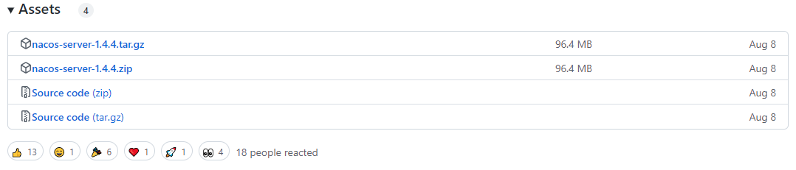
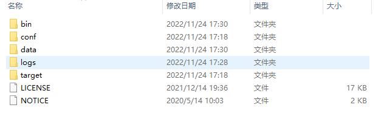
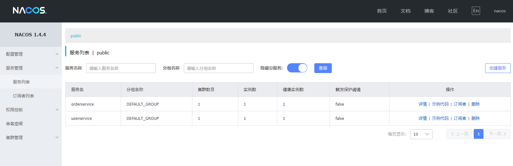
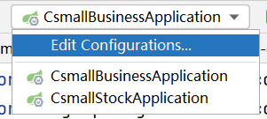
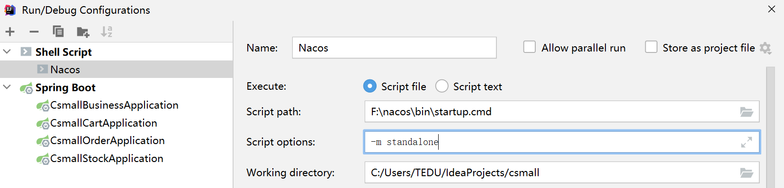
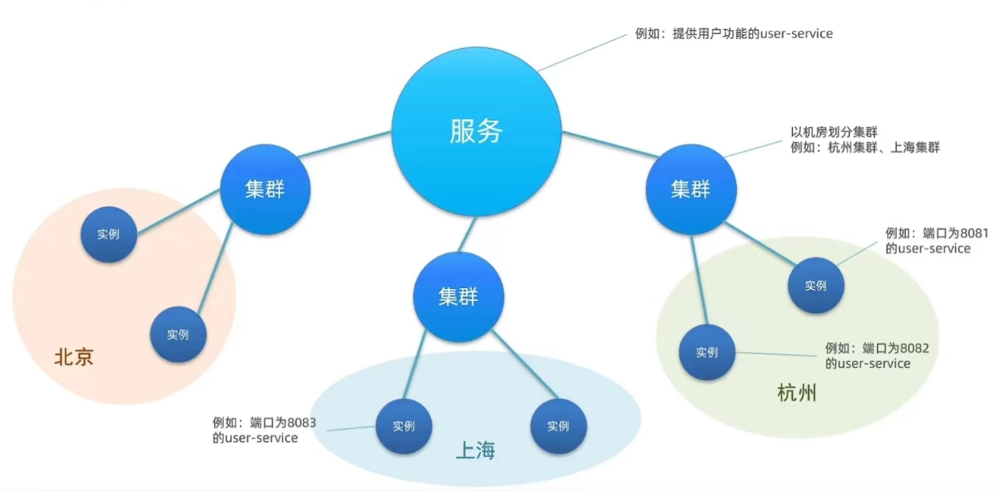
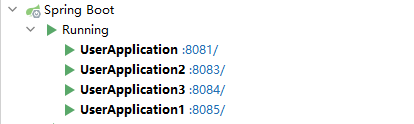
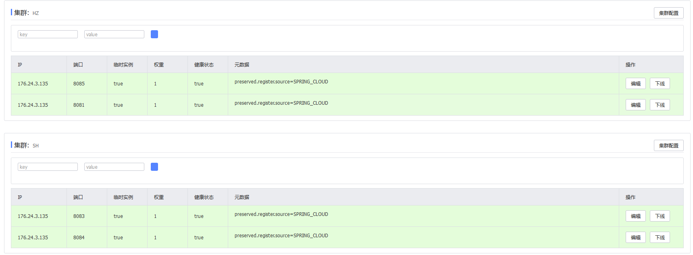

# Nacos服务管理平台


## 百科概念:

Nacos /nɑ:kəʊs/ 是 Dynamic Naming and Configuration Service的首字母简称，一个更易于构建云原生应用的动态服务发现、配置管理和服务管理平台。

Nacos 致力于帮助您发现、配置和管理微服务。Nacos 提供了一组简单易用的特性集，帮助您快速实现动态服务发现、服务配置、服务元数据及流量管理。

Nacos 帮助您更敏捷和容易地构建、交付和管理微服务平台。 Nacos 是构建以“服务”为中心的现代应用架构 (例如微服务范式、云原生范式) 的服务基础设施。

## 认识Nacos

Nacos是阿里巴巴的产品,现在是SpringCloud中的一个组件,相比Eureka功能更加丰富,在国内受欢迎程度较高

## 安装

1.敲网址:https://nacos.io/ -->前往Github  https://github.com/alibaba/nacos/releases/tag/ 可以指定版本



> 第一个是Linux系统的
>
> 第二个是windows系统的,会得到zip压缩包

2.安装完成后建议自行准备一个**非中文**(含中文有可能出错)的nacos目录,将解压后的文件放入



3.文件处理完后,在conf目录里的application.properties中可以自行配置端口号,默认8848

4.启动时需在该目录的bin下打开命令行,敲命令


- ```
  startup.cmd -m standalone #认真敲,一个空格都不能少
  ```


> ##### 不出错就说明完成了启动!

5.启动后可访问网址:http://localhost:8848/nacos/  

6.进入后输入用户名和密码即可

---- 用户名:nacos

---- 密码:nacos

## Nacos服务

### 1.Nacos服务端,注册中心

> #### 与Eureka服务相比,Nacos服务会更加清晰,整洁,可读性强



> ##### 服务列表中就列举了注册的服务接口和各种信息

实际Nacos的服务类型还有分类:

1. 临时实例(默认)
2. 持久化实例(永久实例)

### 2.将服务接口注册到Nacos

1.在cloud-demo父工程中添加spring-cloud-alibaba的管理依赖

```xml
<!--nacos的管理依赖-->
<dependency>
    <groupId>com.alibaba.cloud</groupId>
    <artifactId>spring-cloud-alibaba-dependencies</artifactId>
    <version>2.2.5.RELEASE</version>
    <type>pom</type>
    <scope>import</scope>
</dependency>
```

2.注释掉原来的Eureka依赖

3.添加nacos的客户端依赖

```xml
<!-- nacos客户端依赖包 -->
<dependency>
    <groupId>com.alibaba.cloud</groupId>
    <artifactId>spring-cloud-starter-alibaba-nacos-discovery</artifactId>
</dependency>
```

4.启动项目即可到Nacos注册中心查看微服务的信息

> #### 注意:

默认情况下,服务启动后每隔5秒回向Nacos发送一个"心跳包",这个心跳包中包含了当前服务的基本信息

---Nacos接收到这个心跳包,首先检查当前服务在不在注册列表中,如果不在按新服务的业务进行注册,如果在,表示当前这个服务是健康状态

---如果一个服务连续3次心跳(默认15秒)没有和Nacos进行信息的交互,就会将当前服务标记为非健康状态

---如果一个服务连续6次心跳(默认30秒)没有和Nacos进行信息的交互,Nacos会将这个服务从注册列表中剔除

### 3.Nacos心跳机制

> 常见面试题

心跳:周期性的操作,来表示自己是健康可用的机制

注册到Nacos的微服务项目(模块)都是会遵循这个心跳机制的

**心跳机制的目的**：

1.是表示当前微服务模块运行状态正常的手段

2.是表示当前微服务模块和Nacos保持沟通和交换信息的机制

默认情况下,服务启动开始每隔5秒会向Nacos发送一个"心跳包",这个心跳包中包含了当前服务的基本信息

Nacos接收到这个心跳包,首先检查当前服务在不在注册列表中,如果不在按新服务的业务进行注册,如果在,表示当前这个服务是健康状态

如果一个服务连续3次心跳(默认15秒)没有和Nacos进行信息的交互,就会将当前服务标记为不健康的状态

如果一个服务连续6次心跳(默认30秒)没有和Nacos进行信息的交互,Nacos会将这个服务从注册列表中剔除

这些时间都是可以通过配置修改的

**实例类型分类**：

实际上Nacos的服务类型还有分类

* 临时实例(默认)
* 持久化实例(永久实例)

默认每个服务都是临时实例，如果想标记一个服务为永久实例：

```yaml
cloud:
  nacos:
    discovery:
      # ephemeral设置当前项目启动时注册到nacos的类型 true(默认):临时实例 false:永久实例
      ephemeral: false 
```

持久化实例启动时向nacos注册,nacos会对这个实例进行持久化处理

心跳包的规则和临时实例一致,只是不会将该服务从列表中剔除

一般情况下,我们创建的服务都是临时实例

只有项目的主干业务才会设置为永久实例

### 4.IDEA整合Nacos

之前我们启动Nacos都是使用dos命令行

启动过程比较复杂,命令比较长

Idea实际上支持我们更加方便的启动Nacos

步骤1:



步骤2:


步骤3:



配置成功之后Nacos就会出现在idea的启动选项中了

这种方法实际上只是为了简便大家启动nacos的操作,还是**需要掌握命令行的启动方式的!**

## Nacos服务分级存储模型(地域概念)



> 1.一级是服务,例如userservice
>
> 2.二级是集群,例如杭州或上海
>
> 3.三级是实例,例如杭州机房的某台部署了userservice的服务器

### Nacos跨集群调用问题

> 若是在局域网内进行调用和访问,距离近,速度快,如果是跨域跨集群访问又会如何?

#### 1.服务集群属性

- 修改application.yml,添加如下内容

  ```yaml
  spring:
    cloud:
      nacos:
        server-addr: localhost:8848 # nacos服务端地址
        discovery:
          cluster-name: HZ # 配置集群名称,也就是机房位置,★可以进行修改例如: HZ,杭州  SH,上海
  ```

- 当一个启动实例还包含多个自启动实例时,可以在彼此启动的间隙来改变集群的位置

  

#### 2.当再次刷新Nacos服务页面时,点击userservice微服务详情即可看到多个集群的接口服务状态

>这里的四个服务接口分别处于两个集群(SH,HZ)



#### 3.优先访问本地集群

在服务消费者中添加Nacos负载均衡规则配置

```yaml
userservice:
  ribbon:
    NFLoadBalancerRuleClassName: com.alibaba.cloud.nacos.ribbon.NacosRule  # 负载均衡规则
```

测试开启userservice的3个服务,集群分别是default,SH,HZ-------orderservice是HZ集群

连续访问,发现所有访问都在HZ集群的userservice中

证明了NacosRule优先选择本地集群的特点.

## 开发需要：

**一个项目要想成为微服务项目体系的一部分必须将当前项目的信息注册到Nacos**

我们要添加一些配置,实现business模块启动时注册到Nacos的效果

首先business模块pom文件中添加依赖：

```xml
<!-- 支持项目注册到Nacos注册中心的依赖   discovery是发现的意思(微服务项目的发现) -->
<dependency>
    <groupId>com.alibaba.cloud</groupId>
    <artifactId>spring-cloud-starter-alibaba-nacos-discovery</artifactId>
</dependency>
```

我们在创建好的application-dev.yml中编写对nacos注册的配置信息

```yaml
spring:
  application:
    # 设置当前项目的名称,这个名字会提交到Nacos,注册为当前微服务的名称
    name: nacos-business
  cloud:
    nacos:
      discovery:
        # 配置Nacos的位置,用于提交当前项目信息
        server-addr: localhost:8848
```

启动--查看服务列表