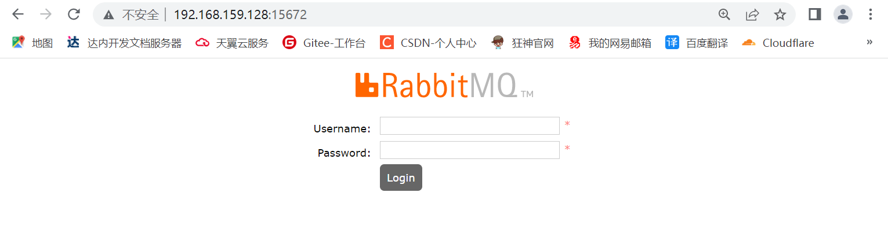
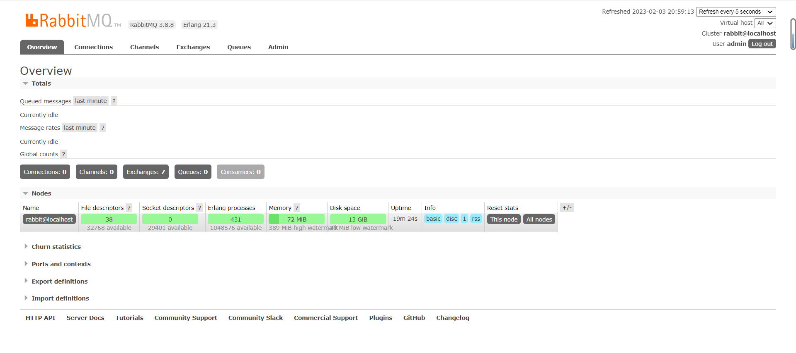
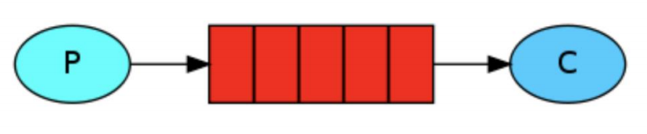
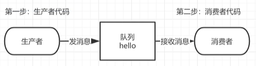
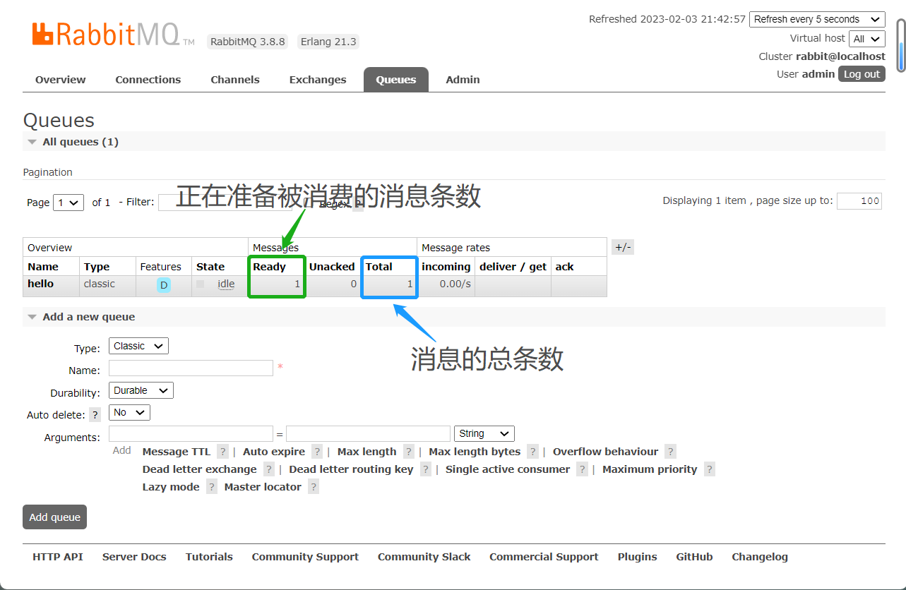
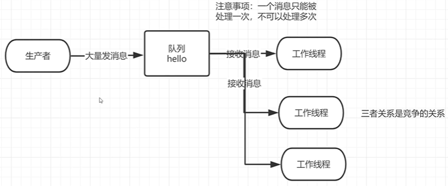

# RabbitMQ消息中间件

## 百科概念：

*MQ*（Message Queue）消息队列，是基础数据结构中“先进先出”的一种数据结构。一般用来解决应用解耦，异步消息，流量削峰等问题，实现高性能，高可用，可伸缩和最终一致性架构。

## 安装：

官网：https://rabbitmq.com/download.html

安装RabbitMQ的前提需要安装[Erlang](https://baike.baidu.com/item/Erlang/1152752?fr=aladdin)语言的环境（网盘中有）

通常企业使用Linux系统运行RabbitMQ

### 1.安装Erlang语言环境：

```sh
[root@localhost dev]# ls
erlang-21.3-1.el7.x86_64.rpm  rabbitmq-server-3.8.8-1.el7.noarch.rpm
[root@localhost dev]# rpm -ivh erlang-21.3-1.el7.x86_64.rpm
```

### 2.安装RabbitMQ

先安装一个依赖包：

```sh
yum install socat -y
```

安装RabbitMQ：

```sh
[root@localhost dev]# ls
erlang-21.3-1.el7.x86_64.rpm  rabbitmq-server-3.8.8-1.el7.noarch.rpm
[root@localhost dev]# rpm -ivh rabbitmq-server-3.8.8-1.el7.noarch.rpm
```

### 3.启动RabbitMQ

```sh
chkconfig rabbitmq-server on # 开机自启动
/sbin/service rabbitmq-server start # 启动
/sbin/service rabbitmq-server status # 查看状态
/sbin/service rabbitmq-server stop # 停止
```

> active说明是活着的，running说明已经启动！

### 4.开启Web管理插件

先停止服务

```sh
/sbin/service rabbitmq-server stop # 停止rabbitmq服务
```

安装插件：

```sh
rabbitmq-plugins enable rabbitmq_management
```

### 5.测试访问

保证RabbitMQ服务启动的情况下打开Google浏览器。

地址栏输入：<u>连接的系统主机IP:端口号15672</u>

第一次访问可能无果，原因是因为Linux服务器的防火墙未关闭，需关闭：

```sh
systemctl stop firewalld
```



> 出现该结果说明插件测试成功！

##### 初始化账户密码guest：

初次登录会出错：`User can only log in via localhost`

### 6.添加新用户

##### 创建账号和密码：

```sh
[root@localhost dev]# rabbitmqctl add_user admin 123456
Adding user "admin" ...
```

##### 设置用户角色：

```sh
[root@localhost dev]# rabbitmqctl set_user_tags admin administrator
Setting tags for user "admin" to [administrator] ...
```

##### 设置用户权限：

```sh
# 规范 set_permissions[-p <vhostpath>] <user> <conf> <write> <read>
[root@localhost dev]# rabbitmqctl set_permissions -p "/" admin ".*" ".*" ".*"
Setting permissions for user "admin" in vhost "/" ...
```

用户user_admin具有/vhost1这个virtual host中所有资源的配置写、读权限

##### 查看当前用户和角色：

```sh
rabbitmqctl list_users
```

##### 登录：



进入服务内部！

# 使用RabbitMQ：

## <u>1.Hello World</u>

使用Java编写两个程序。发送单个消息的生产者和接受消息并打印出来的消费者。介绍Java API中的一些细节。

在下图中，“ P”是我们的生产者，“ C”是我们的消费者。中间的框是一个队列-RabbitMQ 代表使用者保留的消息缓冲区



### 1.依赖：

```xml
<!--指定 jdk 编译版本-->
<build>
   <plugins>
      <plugin>
         <groupId>org.apache.maven.plugins</groupId>
            <artifactId>maven-compiler-plugin</artifactId>
              <configuration>
                <source>8</source>
                <target>8</target>
              </configuration>
       </plugin>
   </plugins>
</build>
<dependencies>
     <!--rabbitmq 依赖客户端-->
     <dependency>
         <groupId>com.rabbitmq</groupId>
         <artifactId>amqp-client</artifactId>
         <version>5.8.0</version>
     </dependency>
     <!--操作文件流的一个依赖-->
     <dependency>
         <groupId>commons-io</groupId>
         <artifactId>commons-io</artifactId>
         <version>2.6</version>
     </dependency>
</dependencies>
```

### 2.代码逻辑：



### 3.消息生产者：

// 生产消息的Java代码

```java
package com.jstart.rabbitmq.one;

import com.rabbitmq.client.Channel;
import com.rabbitmq.client.Connection;
import com.rabbitmq.client.ConnectionFactory;

import java.io.IOException;
import java.util.concurrent.TimeoutException;

/**
 * 生产者：发消息
 *
 * @author java@Wqy
 * @version 0.0.1
 * @since 2023.2.3
 */
public class Producer {
    // 队列名称
    public static final String QUEUE_NAME = "hello";

    // 发消息
    public static void main(String[] args) throws IOException, TimeoutException {
        // 创建一个连接工厂
        ConnectionFactory factory = new ConnectionFactory();
        // 工厂IP连接RabbitMQ的队列
        factory.setHost("192.168.159.128");
        // 用户名
        factory.setUsername("admin");
        // 密码
        factory.setPassword("123456");

        // 创建连接connection
        Connection connection = factory.newConnection();
        // 获取信道channel
        Channel channel = connection.createChannel();
        /*
         * 生成一个队列
         * 1.队列名称
         * 2.队列里面的消息是否持久化（存储在磁盘上）默认情况消息保存在内存中
         * 3.该队列是否只供一个消费者进行消费 是否进行消息的共享，允许可以多个消费者
         * 4.是否自动删除 最后一个消费者端开连接以后 该队列是否自动删除 true自动删除
         */
        channel.queueDeclare(QUEUE_NAME, true, false, false, null);
        // 发消息
        String message = "Hello World";// 初次使用

        /*
         * 发送一个消费
         * 1.发送到哪个交换机
         * 2.路由的Key值是哪一个 本次是队列的名称
         * 3.表示其他参数信息
         * 4.发送消息的消息体
         */
        channel.basicPublish("", QUEUE_NAME, null,message.getBytes());
        System.out.println("消息发送完毕！");
    }
}
```

查看服务页面：



### 4.消息消费者：

// 消费生产者生产的消息

```java
package com.jstart.rabbitmq.one;

import com.rabbitmq.client.*;

import java.io.IOException;
import java.util.concurrent.TimeoutException;

/**
 * 消费者：消费消息
 *
 * @author java@Wqy
 * @version 0.0.1
 * @since 2023.2.3
 */
public class Consumer {
    // 队列名称
    public static final String QUEUE_NAME = "hello";
    // 接收消息
    public static void main(String[] args) throws IOException, TimeoutException {
        // 创建连接工厂
        ConnectionFactory factory = new ConnectionFactory();
        // 工厂IP连接RabbitMQ的队列
        factory.setHost("192.168.159.128");
        // 用户名
        factory.setUsername("admin");
        // 密码
        factory.setPassword("123456");
        // 建立连接connection
        Connection connection = factory.newConnection();
        // 创建信道channel
        Channel channel = connection.createChannel();

        // Lambda表达式()->{};
        // 声明接收消息
        DeliverCallback deliverCallback = (consumerTag,message)
            // 获取消息体(如果不用消息体会输出被处理的消息对象例如:com.rabbitmq.client.Delivery@4039c79e)
                -> System.out.println(new String(message.getBody()));
        // 取消消息时的回调
        CancelCallback cancelCallback = consumerTag -> System.out.println("消息消费被中断");

        /*
         * 消费者消费消息
         * 1.消费哪个队列
         * 2.消费成功之后是否自动应答 true/false
         * 3.消费者未成功消费的回调
         * 4.消费者取消消费的回调
         */
        channel.basicConsume(QUEUE_NAME,true,deliverCallback,cancelCallback);
    }
}
```

## <u>2.Work Queues</u>

工作队列(又称任务队列)的主要思想是避免立即执行资源密集型任务，而不得不等待它完成。

相反我们安排任务在之后执行。我们把任务封装为消息并将其发送到队列。在后台运行的工作进程将弹出任务并最终执行作业。当有多个工作线程时，这些工作线程将一起处理这些任务。



### 1.轮询分发消息：

关于对RabbitMQ的连接代码会被重复使用，为防止冗余，将其抽取到工具类中。

```java
public class RabbitMqUtils {

    // 获取信道channel的静态方法
    public static Channel getChannel() throws Exception {
        // 创建连接工厂
        ConnectionFactory factory = new ConnectionFactory();
        // 工厂IP连接RabbitMQ的队列
        factory.setHost("192.168.159.128");
        // 用户名
        factory.setUsername("admin");
        // 密码
        factory.setPassword("123456");
        // 建立连接connection
        Connection connection = factory.newConnection();
        // 创建信道channel
        return connection.createChannel();
    }
}
```

**多线程消费者**：

```java
public class WorkerTh1 {
    // 队列名称
    public static final String QUEUE_NAME = "hello";

    // 接收消息
    public static void main(String[] args) throws Exception {
        Channel channel = RabbitMqUtils.getChannel();

        // 声明接收消息
        DeliverCallback deliverCallback = (consumerTag, message)
                // 获取消息体(如果不用消息体会输出被处理的消息对象例如：com.rabbitmq.client.Delivery@4039c79e)
                -> System.out.println("接收到的消息：" + new String(message.getBody()));
        // 取消消息时的回调
        CancelCallback cancelCallback = consumerTag -> System.out.println(consumerTag + "消息消费被消费者取消消费接口回调逻辑");

        // 消息的接收
        System.out.println("C2等待接收消息......");
        channel.basicConsume(QUEUE_NAME, true, deliverCallback, cancelCallback);
    }
}
```

**生产者发送大量消息**：

```java
public class Task01 {

    // 队列名称
    public static final String QUEUE_NAME = "hello";

    // 发送大量消息
    public static void main(String[] args) throws Exception {
        try (Channel channel = RabbitMqUtils.getChannel()) {
            channel.queueDeclare(QUEUE_NAME, false, false, false, null);
            // 从控制台当中接收信息
            Scanner scanner = new Scanner(System.in);// 扫描控制台输入的内容
            while (scanner.hasNext()) {
                String message = scanner.next();
                channel.basicPublish("", QUEUE_NAME, null, message.getBytes());
                System.out.println("发送消息完成：" + message);
            }
        }
    }
}
```

