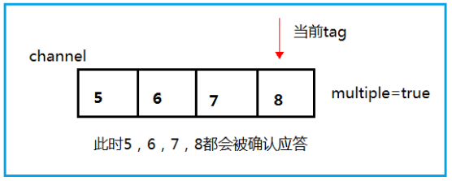

# RabbitMQ消息中间件

## 一、概念：

***MQ*（Message Queue）消息队列**，是基础数据结构中“先进先出”的一种数据结构。一般用来解决**<u>流量削峰</u>**，**<u>应用解耦</u>**，**<u>异步处理</u>**等问题，实现高性能，高可用，可伸缩和最终一致性架构。

### 1.流量消峰：

**问题**：

为了防止双十一因单位时间下单量过大导致的限制用户下单行为，会影响用户的满意度。

**使用MQ消息队列解决该问题**：

使用消息队列将订单做缓冲，取消该限制将订单分时间段进行处理。

### 2.应用解耦：

**问题**：

电商应用有订单系统、库存系统、支付系统，用户下单后，如果耦合性的调用三个系统时，任何一个系统出故障都会导致下单异常。

**使用MQ消息队列解决该问题**：

当物流系统出问题，会将要处理的内存数据先缓存到消息队列，不影响支付，问题解决后再进行物流系统的处理，用户感受不到故障，提升用户体验！


### 3.异步处理：

**问题**：

很多服务之间的调用是异步的，如A调用B，B花很长时间去执行，A不知B何时执行完，通常：A一段时间内调B去查询，或者提供一个`CallBack API`，当B执行完调用`CallBack API`通知A。

**使用MQ消息队列解决该问题**：
当A调用B服务后，只需监听B处理完成的消息，当B完成后会发送消息给MQ，并转告A服务，这样就无需循环调B查询API，也不用提供`CallBack API`,A服务也能及时得到异步处理的结果！

## 二、MQ分类：

### 1.ActiveMQ

**优点**：**单机吞吐量万级**，**时效性ms级**，**可用性高**，基于主从架构实现高可用性，消息可靠性较低的概率丢失数据

**缺点**：官方对ActiveMQ 5.X**维护越来越少**，高吞吐量较少使用

视频: http://www.gulixueyuan.com/course/322

### 2.Kafka

**大数据的杀手锏**，**百万级TPS的吞吐量**，在数据采集、传输、存储的过程中发挥着举足轻重的作用。目前已经被 LinkedIn，Uber, Twitter, Netflix 等大公司所采纳。

**优点**：性能卓越，**单机写入TPS约在百万条/秒**，**吞吐量高**，Kafka是**分布式**的，一个数据多个版本，少数宕机不会丢失数据，不会导致不可用,消费者采用 Pull 方式获取消息, 消息有序, 通过控制能够保证所有消息被消费且仅被消费一次;有优秀的第三方Kafka Web 管理界面 Kafka-Manager；在日志领域比较成熟，被多家公司和多个开源项目使用；功能支持：功能较为简单，主要支持简单的 MQ 功能，在大数据领域的实时计算以及**日志采集**被大规模使用

**缺点**：Kafka单机超过64个队列/分区，**Load会发生明显的飙高现象**，队列越多，Load越高，消息响应时间越长，使用轮询方式，实时性取决于轮询间隔时间，**消息失败不支持重试**，支持消息顺序但是一台代理宕机就会产生消息乱序，**社区更新较慢**。

### 3.RocketMQ

出自**阿里巴巴的开源产品**，用**Java语言实现**，在设计时参考了Kafka，在此之上有些改进，被阿里广泛用于订单、交易、流计算、消息推送、日志流处理。

**优点**：**单机吞吐十万级**，**可用性非常高**，**分布式架构**，**消息可以做到0丢失**，**功能完善**，**扩展性好**，**支持10亿级别的消息堆积**，不会因此下降性能，源码可阅读。

**缺点**：**支持的客户端语言不多**，目前是java以及C++，其中C++不成熟；社区活跃度一般,没有在 MQ核心中去实现 JMS 等接口,有些系统要迁移需要修改大量代码。

### 4.RabbitMQ

2007 年发布，是一个在 AMQP(高级消息队列协议)基础上完成的，可复用的企业消息系统，是**当前最主流的消息中间件之一**。

**优点**：由于**Erlang语言的高并发特性**，性能较好；**吞吐量万级**，MQ**功能比较完备**,健壮、稳定、易用、跨平台、**支持多种语言** 如：Python、Ruby、.NET、Java、JMS、C、PHP、ActionScript、XMPP、STOMP等，支持 AJAX 文档齐全；开源提供的管理界面非常棒，用起来很好用,**社区活跃度高**；更新频率相当高。

**缺点**：商业版需要**收费**，学习**成本较高**。

## 三、RabbitMQ核心：

### 1.生产者`Producer`

产生数据发送消息的程序

### 2.交换机`Exchange`

交换机是RabbitMQ非常重要的一个部件，一方面它接收来自生产者的消息，另一方面将消息推送到队列。

**交换机需要决定如何处理接收的消息，推送到特定队列还是多个队列**。

### 3.队列`Queue`

队列是RabbitMQ内部使用的一种数据结构，尽管消息流经RabbitMQ和应用，但消息始终是储存在队列中的。队列受主机的内存和磁盘约束，本质是一个大的消息缓冲区。许多生产者可以将消息发送到一个队列，许多消费者可以尝试向一个队列取数据。

### 4.消费者`Consumer`

消费与接收具有相似意义。消费者大多是等待接收消息的程序。

生产者、消费者、消息中间件很多时候并不是在同一机器上，同一个APP既可以是生产者`Producer`也可以是消费者`Consumer`


## 四、RabbitMQ工作原理：


**描述**：

1. 首先与RabbitMQ服务建立连接
2. 生产者利用连接`connection`创建一个信道`Channel`，通过信道发送消息到交换机`Exchange`
3. 交换机接收生产者发送的消息，并将消息发送到队列`Queue`
4. 消费者`Consumer`通过连接创建信道`Channel`，通过该信道进行接收队列中的信息。

## 五、安装：

官网：https://rabbitmq.com/download.html

安装RabbitMQ的前提需要安装[Erlang](https://baike.baidu.com/item/Erlang/1152752?fr=aladdin)语言的环境（网盘中有）

通常企业使用Linux系统运行RabbitMQ

### 1.安装Erlang语言环境：

```sh
[root@localhost dev]# ls
erlang-21.3-1.el7.x86_64.rpm  rabbitmq-server-3.8.8-1.el7.noarch.rpm
[root@localhost dev]# rpm -ivh erlang-21.3-1.el7.x86_64.rpm
```

### 2.安装RabbitMQ

先安装一个依赖包：

```sh
yum install socat -y
```

安装RabbitMQ：

```sh
[root@localhost dev]# ls
erlang-21.3-1.el7.x86_64.rpm  rabbitmq-server-3.8.8-1.el7.noarch.rpm
[root@localhost dev]# rpm -ivh rabbitmq-server-3.8.8-1.el7.noarch.rpm
```

### 3.启动RabbitMQ

```sh
chkconfig rabbitmq-server on # 开机自启动
/sbin/service rabbitmq-server start # 启动
/sbin/service rabbitmq-server status # 查看状态
/sbin/service rabbitmq-server stop # 停止
```

> active说明是活着的，running说明已经启动！

### 4.开启Web管理插件

先停止服务

```sh
/sbin/service rabbitmq-server stop # 停止rabbitmq服务
```

安装插件：

```sh
rabbitmq-plugins enable rabbitmq_management
```

### 5.测试访问

保证RabbitMQ服务启动的情况下打开Google浏览器。

地址栏输入：<u>连接的系统主机IP:端口号15672</u>

第一次访问可能无果，原因是因为Linux服务器的防火墙未关闭，需关闭：

```sh
systemctl stop firewalld
```


> 出现该结果说明插件测试成功！

##### 初始化账户密码guest：

初次登录会出错：`User can only log in via localhost`

### 6.添加新用户

##### 创建账号和密码：

```sh
[root@localhost dev]# rabbitmqctl add_user admin 123456
Adding user "admin" ...
```

##### 设置用户角色：

```sh
[root@localhost dev]# rabbitmqctl set_user_tags admin administrator
Setting tags for user "admin" to [administrator] ...
```

##### 设置用户权限：

```sh
# 规范 set_permissions[-p <vhostpath>] <user> <conf> <write> <read>
[root@localhost dev]# rabbitmqctl set_permissions -p "/" admin ".*" ".*" ".*"
Setting permissions for user "admin" in vhost "/" ...
```

用户user_admin具有/vhost1这个virtual host中所有资源的配置写、读权限

##### 查看当前用户和角色：

```sh
rabbitmqctl list_users
```

##### 登录：


进入服务内部！

## 六、使用RabbitMQ：

### <u>1.Hello World</u>

使用Java编写两个程序。发送单个消息的生产者和接受消息并打印出来的消费者。介绍Java API中的一些细节。

在下图中，“ P”是我们的生产者，“ C”是我们的消费者。中间的框是一个队列-RabbitMQ 代表使用者保留的消息缓冲区


#### 1.依赖：

```xml
<!--指定 jdk 编译版本-->
<build>
   <plugins>
      <plugin>
         <groupId>org.apache.maven.plugins</groupId>
            <artifactId>maven-compiler-plugin</artifactId>
              <configuration>
                <source>8</source>
                <target>8</target>
              </configuration>
       </plugin>
   </plugins>
</build>
<dependencies>
     <!--rabbitmq 依赖客户端-->
     <dependency>
         <groupId>com.rabbitmq</groupId>
         <artifactId>amqp-client</artifactId>
         <version>5.8.0</version>
     </dependency>
     <!--操作文件流的一个依赖-->
     <dependency>
         <groupId>commons-io</groupId>
         <artifactId>commons-io</artifactId>
         <version>2.6</version>
     </dependency>
</dependencies>
```

#### 2.代码逻辑：


#### 3.消息生产者：

// 生产消息的Java代码

```java
package com.jstart.rabbitmq.one;

import com.rabbitmq.client.Channel;
import com.rabbitmq.client.Connection;
import com.rabbitmq.client.ConnectionFactory;

import java.io.IOException;
import java.util.concurrent.TimeoutException;

/**
 * 生产者：发消息
 *
 * @author java@Wqy
 * @version 0.0.1
 * @since 2023.2.3
 */
public class Producer {
    // 队列名称
    public static final String QUEUE_NAME = "hello";

    // 发消息
    public static void main(String[] args) throws IOException, TimeoutException {
        // 创建一个连接工厂
        ConnectionFactory factory = new ConnectionFactory();
        // 工厂IP连接RabbitMQ的队列
        factory.setHost("192.168.159.128");
        // 用户名
        factory.setUsername("admin");
        // 密码
        factory.setPassword("123456");

        // 创建连接connection
        Connection connection = factory.newConnection();
        // 获取信道channel
        Channel channel = connection.createChannel();
        /*
         * 生成一个队列
         * 1.队列名称
         * 2.队列里面的消息是否持久化（存储在磁盘上）默认情况消息保存在内存中
         * 3.该队列是否只供一个消费者进行消费 是否进行消息的共享，允许可以多个消费者
         * 4.是否自动删除 最后一个消费者端开连接以后 该队列是否自动删除 true自动删除
         */
        channel.queueDeclare(QUEUE_NAME, true, false, false, null);
        // 发消息
        String message = "Hello World";// 初次使用

        /*
         * 发送一个消费
         * 1.发送到哪个交换机
         * 2.路由的Key值是哪一个 本次是队列的名称
         * 3.表示其他参数信息
         * 4.发送消息的消息体
         */
        channel.basicPublish("", QUEUE_NAME, null,message.getBytes());
        System.out.println("消息发送完毕！");
    }
}
```

查看服务页面：


#### 4.消息消费者：

// 消费生产者生产的消息

```java
package com.jstart.rabbitmq.one;

import com.rabbitmq.client.*;

import java.io.IOException;
import java.util.concurrent.TimeoutException;

/**
 * 消费者：消费消息
 *
 * @author java@Wqy
 * @version 0.0.1
 * @since 2023.2.3
 */
public class Consumer {
    // 队列名称
    public static final String QUEUE_NAME = "hello";
    // 接收消息
    public static void main(String[] args) throws IOException, TimeoutException {
        // 创建连接工厂
        ConnectionFactory factory = new ConnectionFactory();
        // 工厂IP连接RabbitMQ的队列
        factory.setHost("192.168.159.128");
        // 用户名
        factory.setUsername("admin");
        // 密码
        factory.setPassword("123456");
        // 建立连接connection
        Connection connection = factory.newConnection();
        // 创建信道channel
        Channel channel = connection.createChannel();

        // Lambda表达式()->{};
        // 声明接收消息
        DeliverCallback deliverCallback = (consumerTag,message)
            // 获取消息体(如果不用消息体会输出被处理的消息对象例如:com.rabbitmq.client.Delivery@4039c79e)
                -> System.out.println(new String(message.getBody()));
        // 取消消息时的回调
        CancelCallback cancelCallback = consumerTag -> System.out.println("消息消费被中断");

        /*
         * 消费者消费消息
         * 1.消费哪个队列
         * 2.消费成功之后是否自动应答 true/false
         * 3.消费者未成功消费的回调
         * 4.消费者取消消费的回调
         */
        channel.basicConsume(QUEUE_NAME,true,deliverCallback,cancelCallback);
    }
}
```

### <u>2.Work Queues</u>

工作队列(又称任务队列)的主要思想是避免立即执行资源密集型任务，而不得不等待它完成。

相反我们安排任务在之后执行。我们把任务封装为消息并将其发送到队列。在后台运行的工作进程将弹出任务并最终执行作业。当有多个工作线程时，这些工作线程将一起处理这些任务。


#### 1.轮询分发消息：

关于对RabbitMQ的连接代码会被重复使用，为防止冗余，将其抽取到工具类中。

```java
public class RabbitMqUtils {

    // 获取信道channel的静态方法
    public static Channel getChannel() throws Exception {
        // 创建连接工厂
        ConnectionFactory factory = new ConnectionFactory();
        // 工厂IP连接RabbitMQ的队列
        factory.setHost("192.168.159.128");
        // 用户名
        factory.setUsername("admin");
        // 密码
        factory.setPassword("123456");
        // 建立连接connection
        Connection connection = factory.newConnection();
        // 创建信道channel
        return connection.createChannel();
    }
}
```

**多线程消费者**：

```java
public class WorkerTh1 {
    // 队列名称
    public static final String QUEUE_NAME = "hello";

    // 接收消息
    public static void main(String[] args) throws Exception {
        Channel channel = RabbitMqUtils.getChannel();

        // 声明接收消息
        DeliverCallback deliverCallback = (consumerTag, message)
                // 获取消息体(如果不用消息体会输出被处理的消息对象例如：com.rabbitmq.client.Delivery@4039c79e)
                -> System.out.println("接收到的消息：" + new String(message.getBody()));
        // 取消消息时的回调
        CancelCallback cancelCallback = consumerTag -> System.out.println(consumerTag + "消息消费被消费者取消消费接口回调逻辑");

        // 消息的接收
        System.out.println("C2等待接收消息......");
        channel.basicConsume(QUEUE_NAME, true, deliverCallback, cancelCallback);
    }
}
```

**生产者发送大量消息**：

```java
public class Task01 {

    // 队列名称
    public static final String QUEUE_NAME = "hello";

    // 发送大量消息
    public static void main(String[] args) throws Exception {
        try (Channel channel = RabbitMqUtils.getChannel()) {
            channel.queueDeclare(QUEUE_NAME, true, false, false, null);
            // 从控制台当中接收信息
            Scanner scanner = new Scanner(System.in);// 扫描控制台输入的内容
            while (scanner.hasNext()) {
                String message = scanner.next();
                channel.basicPublish("", QUEUE_NAME, null, message.getBytes());
                System.out.println("发送消息完成：" + message);
            }
        }
    }
}
```

**测试**：

开启多个消费者线程，开启一个生产者利用控制台发送大量消息，消费者进行轮询接收消息。


### <u>3.消息应答</u>

#### 1.概念

消费者完成一个任务可能需要一段时间，如果其中一个消费者处理一个长的任务并仅只完成了部分突然它挂掉了，会发生什么情况。RabbitMQ 一旦向消费者传递了一条消息，便立即将该消息标记为删除。在这种情况下，突然有个消费者挂掉了，我们将丢失正在处理的消息。以及后续发送给该消费这的消息，因为它无法接收到。

为了保证消息在发送过程中不丢失，rabbitmq 引入消息应答机制，消息应答就是: **消费者在接收到消息并且处理该消息之后，告诉 rabbitmq 它已经处理了，rabbitmq 可以把该消息删除了。**

#### 2.自动应答

消息发送后立即被认为已经传送成功，这种模式需要在**高吞吐量和数据传输安全性方面做权衡**,因为这种模式如果消息在接收到之前，消费者那边出现连接或者 channel 关闭，那么消息就丢失了,当然另一方面这种模式消费者那边可以传递过载的消息，**没有对传递的消息数量进行限制**，当然这样有可能使得消费者这边由于接收太多还来不及处理的消息，导致这些消息的积压，最终使得内存耗尽，最终这些消费者线程被操作系统杀死，**所以这种模式仅适用在消费者可以高效并以某种速率能够处理这些消息的情况下使用**。

#### 3.消息应答的方法

**A.Channel.basicAck(用于肯定确认)**

​    RabbitMQ已知道该消息并且成功的处理消息，可以将其丢弃了

**B.Channel.basicNack(用于否定确认)**

**C.Channel.basicReject(用于否定确认)**

​    与Channel.basicNack相比少一个参数

​    不处理该消息了直接拒绝，可以将其丢弃了。

#### 4.Multiple的解释

**<u>手动应答的好处是可以批量应答并且减少网络拥堵</u>**

multiple 的 true 和 false 代表不同意思：

- true 代表批量应答 channel 上未应答的消息

比如说 channel 上有传送 tag 的消息 5,6,7,8 当前 tag 是 8 那么此时5-8 的这些还未应答的消息都会被确认收到消息应答



- false 同上面相比只会应答 tag=8 的消息 5,6,7 这三个消息依然不会被确认收到消息应答


#### 5.消息的自动重新入队

如果消费者由于某些原因失去连接(其通道已关闭，连接已关闭或 TCP 连接丢失)，导致消息未发送 ACK 确认，RabbitMQ 将了解到消息未完全处理，并将对其重新排队。**如果此时其他消费者可以处理，它将很快将其重新分发给另一个消费者**。这样，即使某个消费者偶尔死亡，也可以确保不会丢失任何消息。

#### 6.手动应答的代码

**消息手动应答时，不丢失，重新放回到队列中以供消费！**

消息生产者：

```java
```

