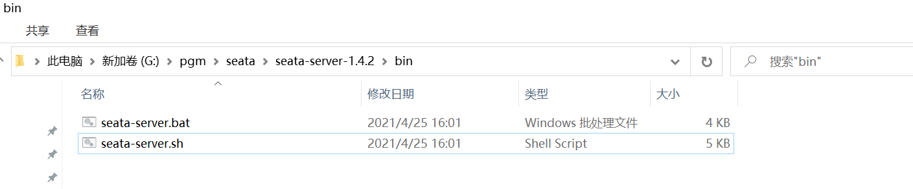

# Seata分布式事务

## 下载Seata

https://github.com/seata/seata/releases

https://github.com/seata/seata/releases/download/v1.4.2/seata-server-1.4.2.zip

我们可以直接从第五阶段资料压缩包中获取

## 什么是Seata

Seata 是一款开源的分布式事务解决方案，致力于在微服务架构下提供高性能和简单易用的分布式事务服务

也是Spring Cloud Alibaba提供的组件

Seata官方文档

https://seata.io/zh-cn/

更多信息可以通过官方文档获取

## 为什么需要Seata

我们之前学习了单体项目中的事务

使用的技术叫Spring声明式事务

能够保证一个业务中所有对数据库的操作要么都成功,要么都失败,来保证数据库的数据完整性

但是在微服务的项目中,业务逻辑层涉及远程调用,当前模块发生异常,无法操作远程服务器回滚

这时要想让远程调用也支持事务功能,就需要使用分布式事务组件Seata

Seata保证微服务远程调用业务的原子性

**Seata将为用户提供了 AT、TCC、SAGA 和 XA 事务模式,为用户打造一站式的分布式解决方案。**

## Seata的运行原理

观察下面事务模型


上面结构是比较典型的远程调用结构

如果account操作数据库失败需要让order模块和storage模块撤销(回滚)操作

声明式事务不能完成这个操作

需要使用Seata来解决


Seata构成部分包含

* 事务协调器TC
* 事务管理器TM
* 资源管理器RM

我们项目使用AT(自动)模式完成分布式事务的解决

AT模式运行过程

1.事务的发起方(TM)会向事务协调器(TC)申请一个全局事务id,并保存

2.Seata会管理事务中所有相关的参与方的数据源,将数据操作之前和之后的镜像都保存在undo_log表中,这个表是seata组件规定的表,没有它就不能实现效果,依靠它来实现提交(commit)或回滚(roll back)的操作

3.事务的发起方(TM)会连同全局id一起通过远程调用,运行资源管理器(RM)中的方法

4.RM接收到全局id,去运行指定方法,并将运行结果的状态发送给TC

5.如果所有分支运行都正常,TC会通知所有分支进行提交,真正的影响数据库内容,

反之如果所有分支中有任何一个分支发生异常,TC会通知所有分支进行回滚,数据库数据恢复为运行之前的内容

## seata的启动

seata也是java开发的,启动方式和nacos很像

只是启动命令不同

>它要求配置环境变量中Path属性值有java的bin目录路径

解压后路径不要用中文,不要用空格

也是解压之后的bin目录下



在路径上输入cmd进入dos窗口

mac系统同学直接参考启动nacos的命令

```
D:\tools\seata\seata-server-1.4.2\bin>seata-server.bat -h 127.0.0.1 -m file
```

输入后,最后出现8091端口的提示即可!

> 如果想使用idea启动seata,和之前nacos启动相似

如果seata启动时发送内存不足的错误,可以参考下面的文章解决

https://blog.csdn.net/he_lei/article/details/116229467

保证当前seata的环境变量是java1.8

在windows系统中运行seata可能出现不稳定的情况,重启seata即可解决

# 使用Seata

## 配置Seata

cart\stock\order三个模块时需要Seata支持进行事务管理的模块

这三个模块都需要添加下面pom依赖和配置

```xml
<!--   Seata和SpringBoot整合依赖     -->
<dependency>
    <groupId>io.seata</groupId>
    <artifactId>seata-spring-boot-starter</artifactId>
</dependency>
<!--  Seata 完成分布式事务的两个相关依赖(Seata会自动使用其中的资源)  -->
<dependency>
    <groupId>com.github.pagehelper</groupId>
    <artifactId>pagehelper-spring-boot-starter</artifactId>
</dependency>
<dependency>
    <groupId>com.alibaba</groupId>
    <artifactId>fastjson</artifactId>
</dependency>
```

下面修改cart\stock\order模块的application-dev.yml

代码如下

```yaml
seata:
  # 定义事务的分组,一般是以项目为单位的,不同项目用它来区分
  tx-service-group: csmall_group
  service:
    vgroup-mapping:
      # 设置csmall_group分组使用默认(default)的seata配置
      csmall_group: default
    grouplist:
      # 设置seata的ip和端口号位置
      default: localhost:8091
```

注意同一个事务必须在同一个tx-service-group中

同时指定相同的seata地址和端口

**business模块的配置**

business模块作为当前分布式事务模型的触发者

它应该是事务的起点,但是它不连接数据库,所以配置稍有不同

pom文件seata依赖仍然需要,但是只需要seata依赖

```xml
<!--   Seata和SpringBoot整合依赖     -->
<dependency>
    <groupId>io.seata</groupId>
    <artifactId>seata-spring-boot-starter</artifactId>
</dependency>
```

application-dev.yml是一样的

```yaml
seata:
  tx-service-group: csmall_group
  service:
    vgroup-mapping:
      csmall_group: default
    grouplist:
      default: localhost:8091
```

添加完必要的配置之后

要想激活Seata功能非常简单,只要在起点业务的业务逻辑方法上添加专用的注解即可

添加这个注解的模块就是模型中的TM

他调用的所有远程模块都是RM

business模块添加订单的业务逻辑层开始的方法

```java
@Service
@Slf4j
public class BusinessServiceImpl implements IBusinessService {

    // Dubbo调用order模块的新增订单的功能
    // business是单纯的消费者,不需要再类上编写@DubboService
    @DubboReference
    private IOrderService dubboOrderService;

    // Global:全局  Transactional:事务
    // 一旦这个方法标记为 @GlobalTransactional
    // 就相当于设置了分布式事务运行的起点,相当于AT事务模型中的TM(事务管理器)
    // 最终效果就是当前方法开始后,所有远程调用操作数据库的功能,都在同一个事务中
    // 也就是这些远程调用的数据库操作要么都执行,要么都不执行
    @GlobalTransactional
    @Override
    public void buy() {
         //  代码略...
    }
}
```

先启动nacos,再启动seata

然后按顺序启动四个服务  cart\stock\order\business

利用knife4j进行访问,

business模块 localhost:20000/doc.html

## Seata效果

要想seata出现效果,我们要有一个发生异常的情况

当发生异常时,去观察是否会回滚

我们可以编写代码随机的抛出异常,来根据是否有异常,是否回滚,判断seata是否有效

OrderServiceImpl在新增订单方法前添加随机发送异常的方法

```java
@Override
public void orderAdd(OrderAddDTO orderAddDTO) {
    // 1.先去减少订单中商品的库存数量(调用stock模块减少库存的方法)
    // 库存模块减少库存需要StockReduceCountDTO对象,才能运行,所以先实例化它
    StockReduceCountDTO countDTO=new StockReduceCountDTO();
    countDTO.setCommodityCode(orderAddDTO.getCommodityCode());
    countDTO.setReduceCount(orderAddDTO.getCount());
    // 利用dubbo调用stock模块的业务逻辑层方法实现库存的减少
    stockService.reduceCommodityCount(countDTO);

    // 2.从购物车中删除用户勾选的商品(调用cart模块删除购物车商品的方法)
    // 利用dubbo调用cart模块的业务逻辑层方法实现购物车中商品的删除
    cartService.deleteUserCart(orderAddDTO.getUserId(),
                                orderAddDTO.getCommodityCode());
	// ↓↓↓↓↓↓↓↓↓↓↓↓↓↓↓↓↓↓↓↓↓↓↓↓↓↓↓↓↓↓↓↓↓↓↓↓↓↓↓↓↓
    if(Math.random()<0.5){
        // 随机发生业务异常
        throw new CoolSharkServiceException(
                ResponseCode.INTERNAL_SERVER_ERROR,"发生随机异常!");
    }
    // 3.新增订单信息
    Order order=new Order();
    BeanUtils.copyProperties(orderAddDTO,order);
    // 执行新增
    orderMapper.insertOrder(order);
    log.info("新增订单信息为:{}",order);

}
```

再次测试localhost:20000/doc.html

点击触发购买业务的功能,观察是否发生异常

以及发生异常时数据库是否没有变化

正常运行时,数据库数据是否正常变化

## Seata其他模式介绍

上次课我们讲解了Seata软件AT模式的运行流程

AT模式的运行有一个非常明显的前提条件,这个条件不满足,就无法使用AT模式

这个条件就是事务分支都必须是操作关系型数据库(Mysql\MariaDB\Oracle)

因为关系型数据库才支持提交和回滚,其它非关系型数据库都是直接影响数据(例如Redis)

所以如果我们在业务过程中有一个节点操作的是Redis或其它非关系型数据库时,就无法使用AT模式

**除了AT模式之外还有TCC、SAGA 和 XA 事务模式**

### TCC模式

简单来说,TCC模式就是自己编写代码完成事务的提交和回滚

在TCC模式下,我们需要为参与事务的业务逻辑编写一组共3个方法

(prepare\commit\rollback)

prepare:准备

commit:提交

rollback:回滚

* prepare方法是每个模块都会运行的方法
* 当所有模块的prepare方法运行都正常时,运行commit
* 当任意模块运行的prepare方法有异常时,运行rollback

这样的话所有提交或回滚代码都由自己编写

优点:虽然代码是自己写的,但是事务整体提交或回滚的机制仍然可用(仍然由TC来调度)

缺点:每个业务都要编写3个方法来对应,代码冗余,而且业务入侵量大

### SAGA模式

SAGA模式的思想是对应每个业务逻辑层编写一个新的类,可以设置指定的业务逻辑层方法发生异常时,运行当新编写的类中的代码

相当于将TCC模式中的rollback方法定义在了一个新的类中

这样编写代码不影响已经编写好的业务逻辑代码

一般用于修改已经编写完成的老代码

缺点是每个事务分支都要编写一个类来回滚业务,

会造成类的数量较多,开发量比较大

### XA模式

支持XA协议的数据库分布式事务,使用比较少