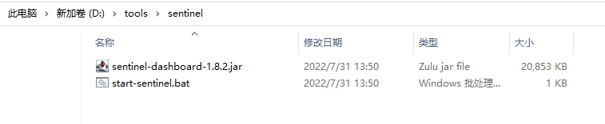
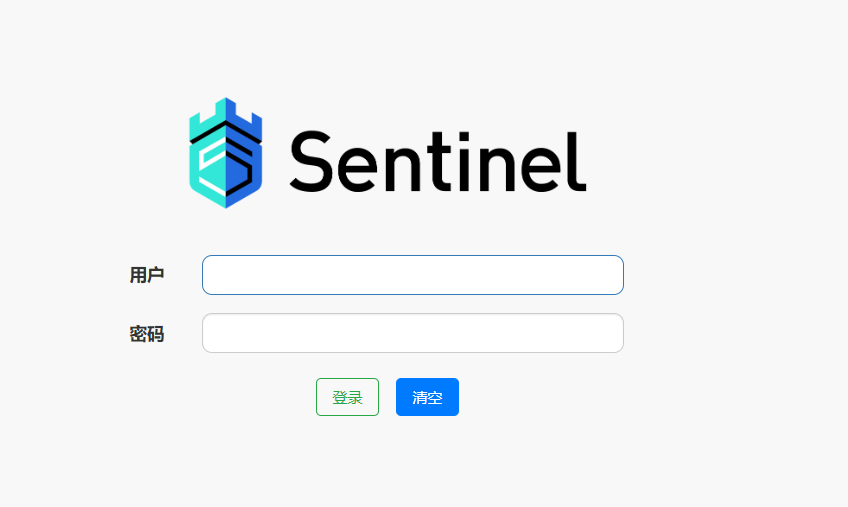
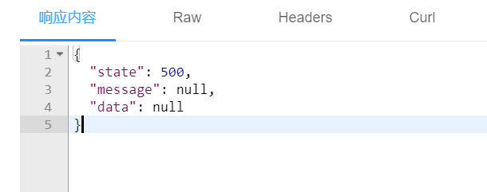

# Sentinel流控

官网地址

https://sentinelguard.io/zh-cn/

下载地址

https://github.com/alibaba/Sentinel/releases

文件在第五阶段资料中,jsd2203项目解压后的doc目录下

## 什么是Sentinel

Sentinel英文翻译"哨兵\门卫"

Sentinel也是Spring Cloud Alibaba的组件

随着微服务的流行，服务和服务之间的稳定性变得越来越重要。Sentinel 以流量为切入点，从流量控制、熔断降级、系统负载保护等多个维度保护服务的稳定性。

## 为什么需要Sentinel

为了保证服务器运行的稳定性,在请求数到达设计最高值时,将过剩的请求限流,保证在设计的请求数内的请求能够稳定完成处理

- 丰富的应用场景

  双11,秒杀,12306抢火车票

- 完备的实时状态监控

  可以支持显示当前项目各个服务的运行和压力状态,分析出每台服务器处理的秒级别的数据

- 广泛的开源生态

  很多技术可以和Sentinel进行整合,SpringCloud,Dubbo,而且依赖少配置简单

- 完善的SPI扩展

  Sentinel支持程序设置各种自定义的规则

## Sentinel启动

windows同学直接双击start-sentinel.bat文件

mac同学使用下面命令执行jar包

```
java -jar sentinel-dashboard-1.8.2.jar
```

启动之后

打开浏览器http://localhost:8080/

会看到下面的界面



用户名和密码都是

sentinel

刚开始什么都没有,是空界面

后面我们有控制器的配置就会出现信息了

## 基本配置

我们的限流针对的是控制器方法

我们找一个简单的模块来测试和观察限流效果

在csmall-stock-webapi模块中

添加sentinel的依赖

```xml
<!--  Sentinel 整合SpringCloud依赖  -->
<dependency>
    <groupId>com.alibaba.cloud</groupId>
    <artifactId>spring-cloud-starter-alibaba-sentinel</artifactId>
</dependency>
```

application-dev.yml文件添加配置

```yaml
spring:  
  cloud:
    sentinel:
      transport:
        # 配置sentinel提供的仪表台服务器的位置
        dashboard: localhost:8080
        # 执行限流的端口号,每个项目必须设置不同的端口号,例如cart模块要限流就可以设置为8722
        port: 8721
    nacos:
      discovery:
        server-addr: localhost:8848 # 指定正在运行的Nacos服务器的位置
```

## 限流方法

我们以stock模块为例

演示限流的效果

StockController在减少库存的方法上添加限流的注解

```java
@PostMapping("/reduce/count")
@ApiOperation("减少库存数")
// @SentinelResource注解需要标记在控制层方法上,在该方法第一次运行后,会被Sentinel仪表台检测
// 该方法在运行前,不会出现在仪表台中
// 括号中"减少库存数"这个描述会出现在仪表台上,代表这个方法
@SentinelResource("减少库存数")
public JsonResult reduceCommodityCount(StockReduceCountDTO stockReduceCountDTO){
    // 调用业务逻辑层
    stockService.reduceCommodityCount(stockReduceCountDTO);
    return JsonResult.ok("库存减少完成!");
}
```

nacos\seata\sentinel要启动

重启stock服务(其它服务都可以停掉)

如果不运行knife4j测试,sentinel的仪表盘不会有任何信息

在第一次运行了减少库存方法之后,sentinel的仪表盘才会出现nacos-stock的信息

选中这个信息点击"簇点链路"

找到我们编写的"减少库存数"方法,点  "＋流控"

设置流控规则

我们先设置QPS为1也就是每秒请求数超过1时,进行限流

然后我们可以快速双击knife4j减少库存的方法,触发它的流控效果



这样的流控没有正确的消息提示

我们需要自定义方法进行正确的提示给用户看到

## 自定义限流方法

对于被限流的请求,我们可以自定义限流的处理方法

默认情况下可能不能正确给用户提示,一般情况下,对被限流的请求也要有"服务器忙请重试"或类似的提示

StockController类中@SentinelResource注解中,可以自定义处理限流情况的方法

```java
@PostMapping("/reduce/count")
@ApiOperation("减少库存数")
// @SentinelResource注解需要标记在控制层方法上,在该方法第一次运行后,会被Sentinel仪表台检测
// 该方法在运行前,不会出现在仪表台中
// 括号中"减少库存数"这个描述会出现在仪表台上,代表这个方法
// blockHandler可以设置当前控制器方法被限流时,要运行的自定义限流方法,blockError就是方法名称
@SentinelResource(value = "减少库存数",blockHandler = "blockError" )
public JsonResult reduceCommodityCount(StockReduceCountDTO stockReduceCountDTO){
    // 调用业务逻辑层
    stockService.reduceCommodityCount(stockReduceCountDTO);
    return JsonResult.ok("库存减少完成!");
}

// Sentinel自定义限流方法定义规则
// 1.访问修饰符必须是public
// 2.返回值类型必须和控制器方法一致
// 3.方法名必须是控制器方法注解中由blockHandler标记的方法名称
// 4.方法的参数必须包含控制器方法的所有参数,再额外添加一个BlockException的异常参数类型
public JsonResult blockError(StockReduceCountDTO stockReduceCountDTO,
                             BlockException e){
    // 这个方法运行表示当前请求被限流了,我们给与返回,提示它被限流即可
    return JsonResult.failed(
            ResponseCode.INTERNAL_SERVER_ERROR,"服务器忙,请稍后再试");
}
```

重启stock-webapi模块

再次尝试被限流,观察被限流的提示

## QPS与并发线程数

* QPS:是每秒请求数

  单纯的限制在一秒内有多少个请求访问控制器方法

* 并发线程数:是当前正在使用服务器资源请求线程的数量

  限制的是使用当前服务器的线程数

并发线程数测试可能需要阻塞当前控制器方法一段时间,方便测试

```java
stockService.reduceCommodityCount(stockReduceCountDTO);
try {
    Thread.sleep(5000);
} catch (InterruptedException e) {
    e.printStackTrace();
}
return JsonResult.ok("库存减少完成!");
```

## 自定义降级方法

所谓降级就是正常运行控制器方法的过程中

控制器方法发生了异常,Sentinel支持我们运行别的方法来处理异常,或运行别的业务流程处理

我们也学习过处理控制器异常的统一异常处理类,和我们的降级处理有类似的地方

但是Sentinel降级方法优先级高,而且针对单一控制器方法编写

StockController类中@SentinelResource注解中,可以定义处理降级情况的方法

```java
@PostMapping("/reduce/count")
@ApiOperation("减少库存数")
// @SentinelResource注解需要标记在控制层方法上,在该方法第一次运行后,会被Sentinel仪表台检测
// 该方法在运行前,不会出现在仪表台中
// 括号中"减少库存数"这个描述会出现在仪表台上,代表这个方法
// blockHandler可以设置当前控制器方法被限流时,要运行的自定义限流方法,blockError就是方法名称
@SentinelResource(  value = "减少库存数",
        blockHandler = "blockError",
        fallback = "fallbackError")
public JsonResult reduceCommodityCount(StockReduceCountDTO stockReduceCountDTO){
    // 调用业务逻辑层
    stockService.reduceCommodityCount(stockReduceCountDTO);
    // 随机发生异常,测试自定义降级方法效果
    if(Math.random()<0.5){
        throw new CoolSharkServiceException(
                ResponseCode.INTERNAL_SERVER_ERROR,"发生随机异常");
    }
    return JsonResult.ok("库存减少完成!");
}

// 限流方法略.....

// 自定义降级方法: 由@SentinelResource的fallback属性指定
// 自定义降级方法和自定义限流方法的格式规则基本一致
// 只是额外返回的异常类型使用Throwable
// 当上面的控制层方法发生异常时,会调用自定义降级方法
// 实际开发中,可能调用运行一些老版本的代码,所以称之为"降级"
public JsonResult fallbackError(StockReduceCountDTO stockReduceCountDTO,
                                Throwable throwable){
    // 输入异常信息
    throwable.printStackTrace();
    // 返回降级方法运行的信息
    return JsonResult.failed(ResponseCode.INTERNAL_SERVER_ERROR,"服务降级");
}
```

重启csmall-stock-webapi模块测试

当发生随机异常时,就运行降级方法

当没有发生随机异常时,就正常运行!