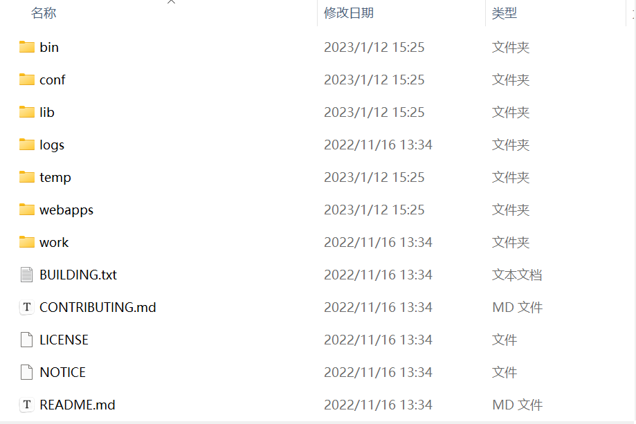

# 动态资源两种

### 1.JavaWeb的概念

所有用java语言编写的可以通过浏览器进行访问的总称

### 2.Web资源的分类

通过浏览器访问的都叫Web，不论是什么语言

web资源按实现的技术和呈现的效果不同，又分为静态资源和动态资源两种

静态资源：html、css、js、txt、mp4视频、jpg图片

动态资源：jsp页面、Servlet程序

### 3.常用的Web服务器

Tomcat：由Apache组织提供的一种Web服务器，提供对jsp和Servlet的支持。它是一种轻量级的javaWeb服务器，也是当前应用最广泛的javaWeb服务器(免费)。

Jboss：是一个遵从javaEE规范的、开放源代码的、纯Java的EJB服务器，它支持所有的JavaEE规范(免费)。

GlassFish：由Oracle公司开发的一款JavaWeb服务器，是一款强健的商业服务器，达到产品级质量(应用很少)。

Resin：是CAUCHO公司的产品，是一个非常流行的服务器，对servlet和jsp提供了良好的支持，性能也比较优良，resin自身采用Java语言开发(收费，应用比较多)。

WebLogic：是Oracle公司的产品，是目前应用最广泛的Web服务器，支持JavaEE规范，而且不断地完善以适应新的开发要求，适合大型项目(收费，用的不多，适合大公司)。

### 4.Tomcat服务器和Servlet版本的对应关系

当前企业常用的版本 7.* / 8.*

| Tomcat版本 | Servlet/JSP版本 | JavaEE版本 | 运行环境 |
| ---------- | --------------- | ---------- | -------- |
| 4.1        | 2.3/1.2         | 1.3        | JDK1.3   |
| 5.0        | 2.4/2.0         | 1.4        | JDK1.4   |
| 5.5/6.0    | 2.5/2.1         | 5.0        | JDK5.0   |
| 7.0        | 3.0/2.2         | 6.0        | JDK6.0   |
| 8.0        | 3.1/2.3         | 7.0        | JDK7.0   |

Servlet程序从2.5版本是现在市面上使用最多的版本(xml配置)

到了Servlet3.0之后。就是注解版本的Servlet使用。

### 5.Tomcat的目录结构

1. bin：专门用来存放Tomcat服务器的可执行文件
2. conf：专门用来存放Tomcat服务器的配置文件
3. lib：专门用来存放Tomcat服务器的Jar包
4. logs：专门用来存放Tomcat服务器运行时输出的日志
5. temp：专门用来存放Tomcat运行时的临时数据
6. webapps：专门用来存放部署的Web项目
7. work：时Tomcat工作时的目录，用来存放Tmocat运行时jsp翻译为Servlet的源码，和Session钝化的目录