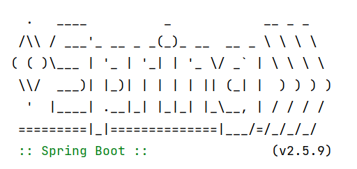
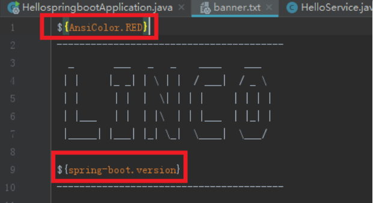
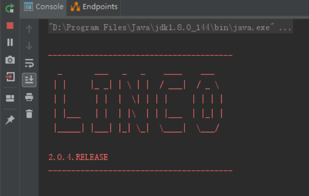

# SpringBoot项目启动Banner样式

**传统样式**：



SpringBoot应用程序启动过程中，都会默认在控制台输出上图所显示的内容，即是我们本篇文章所说的Banner。

当然，SpringBoot 提供了默认的Banner之外，也提供了自定义设置Banner的功能。

#### 1、自定义Banner内容

自定义Banner很简单，只需要在 **src/main/resource** 下新建 banner.txt ，将我们的banner内容放到banner.txt里面即可，启动时SpringBoot会自动读取并使用这个文本文件中的banner。（banner.txt 也可以替换成 banner.gif ， banner.jpg 或 banner.png 等图片。图片会转换为字符画（ASCII art）形式），同时存在多个banner文件，启动时会依次打印所有banner。

自定义banner样式网址：https://www.bootschool.net/ascii

#### 2、Banner样式设置

如果我们是以 banner.txt 自定义Banner的话，我们可以在banner.txt 加入以下的一些占位符样式等属性。

| 变量                                                         | 描述                                                         |
| ------------------------------------------------------------ | ------------------------------------------------------------ |
| ${Ansi.NAME}（或<br/>${AnsiColor.NAME}，<br/>${AnsiBackground.NAME},<br/>${AnsiStyle.NAME}） | NAME代表一种ANSI编码，具体详情查<br/>看 [AnsiPropertySource](https://github.com/spring-projects/spring-boot/blob/ca0de4385c01cbbd120e96ec9f83427fb48c9a15/spring-boot-project/spring-boot/src/main/java/org/springframework/boot/ansi/AnsiPropertySource.java) |
| ${application.version}                                       | MANIFEST.MF中声明的应用版本号，例<br/>如 Implementation-Version: 1.0 会<br/>打印 1.0 |
| ${application.formatted-version}                             | MANIFEST.MF中声明的被格式化后的应<br/>用版本号（被括号包裹且以v作为前<br/>缀），用于显示，例如( v1.0 ) |
| ${spring-boot.version}                                       | 当前Spring Boot的版本号，例<br/>如 2.0.4.RELEASE             |
| ${spring-boot.formatted-version}                             | 当前Spring Boot被格式化后的版本号<br/>（被括号包裹且以v作为前缀）, 用于显<br/>示，例如( v2.0.0.RELEASE ) |
| ${application.title}                                         | MANIFEST.MF 中声明的应用title，例<br/>如 Implementation-Title: MyApp 会<br/>打印 MyApp |

##### 示例：

banner.txt 内容加入 **${AnsiColor.Name}** 设置banner颜色，加入**${spring-boot.version}**显示当前SpringBoot版本号。

注：这里 ${AnsiColor.Name}的作用**范围**只对 ${AnsiColor.Name} 以下的内容有效。



##### 运行效果：



#### 3、通过编程方式实现Banner

除了创建banner文件之外，spring boot 还提供了一个接口org.springframework.boot.Banner，它的实例可以被传给SpringApplication的setBanner(banner)方法。我们只需要实现Banner接口的printBanner方法，并使用SpringBootApplication.setBanner(…) 方法设置我们自己的Banner实例即可。

#### 4、关闭Banner

当然，如果我们不喜欢Banner的打印，也可以将其关闭。关闭方法如下：

##### 1）在application.properties进行配置

```yaml
spring:
  main:
    banner-mode: off
# spring.main.show-banner=false 已经过时
```

##### 2）在SpringApplication中设置

```java
public static void main(String[] args) {
        SpringApplication application = new SpringApplication(HellospringbootApplication.class);
        application.setBannerMode(Banner.Mode.OFF);
        application.run(args);
}
```

#### 补充：

关于佛祖保佑的txt文件：

```sh
————————————————————————————————————————————————————————————————————
//                          _ooOoo_                               //
//                         o8888888o                              //
//                         88" . "88                              //
//                         (| ^_^ |)                              //
//                         O\  =  /O                              //
//                      ____/`---'\____                           //
//                    .'  \\|     |//  `.                         //
//                   /  \\|||  :  |||//  \                        //
//                  /  _||||| -:- |||||-  \                       //
//                  |   | \\\  -  /// |   |                       //
//                  | \_|  ''\---/''  |   |                       //
//                  \  .-\__  `-`  ___/-. /                       //
//                ___`. .'  /--.--\  `. . ___                     //
//              ."" '<  `.___\_<|>_/___.'  >'"".                  //
//            | | :  `- \`.;`\ _ /`;.`/ - ` : | |                 //
//            \  \ `-.   \_ __\ /__ _/   .-` /  /                 //
//      ========`-.____`-.___\_____/___.-`____.-'========         //
//                           `=---='                              //
//      ^^^^^^^^^^^^^^^^^^^^^^^^^^^^^^^^^^^^^^^^^^^^^^^^^^        //
//              佛祖保佑       永不宕机     永无BUG                  //
————————————————————————————————————————————————————————————————————
```

