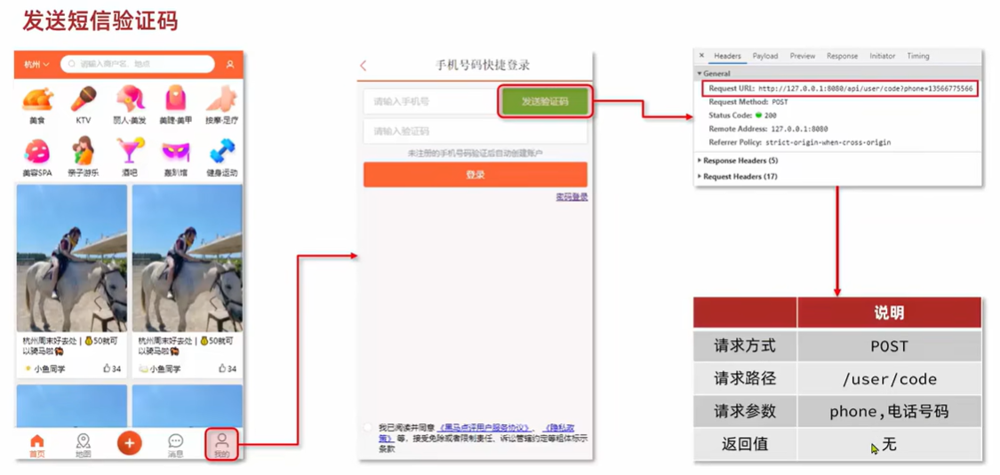

# 实现短信验证登录

基于Session实现登录：


## 工具

### 1.hutool工具包

```xml
<!--hutool-->
<dependency>
    <groupId>cn.hutool</groupId>
    <artifactId>hutool-all</artifactId>
    <version>5.7.17</version>
</dependency>
```

### 2.正则表达式

```java
public abstract class RegexPatterns {
    /**
     * 手机号正则
     */
    public static final String PHONE_REGEX = "^1([38][0-9]|4[579]|5[0-3,5-9]|6[6]|7[0135678]|9[89])\\d{8}$";
    /**
     * 邮箱正则
     */
    public static final String EMAIL_REGEX = "^[a-zA-Z0-9_-]+@[a-zA-Z0-9_-]+(\\.[a-zA-Z0-9_-]+)+$";
    /**
     * 密码正则。4~32位的字母、数字、下划线
     */
    public static final String PASSWORD_REGEX = "^\\w{4,32}$";
    /**
     * 验证码正则, 6位数字或字母
     */
    public static final String VERIFY_CODE_REGEX = "^[a-zA-Z\\d]{6}$";
}
```

## 1.发送短信验证码



### 客户端：

点击发送验证码：传递手机号给服务端

### 服务端：

1. 接收手机号`phone`和当前会话`session`
2. 校验手机号（正则表达式）
3. 生成验证码（hutool工具包）
4. 保存验证码（保存到session）
5. 发送验证码（调用第三方短信平台实现，例如：阿里云）
6. 返回验证结果

### 代码：

```java
public Result sendCode(String phone, HttpSession session) {
    // 1.校验手机号
    if (RegexUtils.isPhoneInvalid(phone)) {
        // 2.如果不符合，返回错误信息
        return Result.fail("手机号格式错误！");
    }
    // 3.符合，生成验证码hutool工具包
    String code = RandomUtil.randomNumbers(6);

    // 4.保存验证码到 session
    stringRedisTemplate.opsForValue().set(LOGIN_CODE_KEY + phone, code, LOGIN_CODE_TTL, TimeUnit.MINUTES);

    // 5.发送验证码
    log.debug("发送短信验证码成功，验证码：{}", code);
    // 返回ok
    return Result.ok();
}
```

