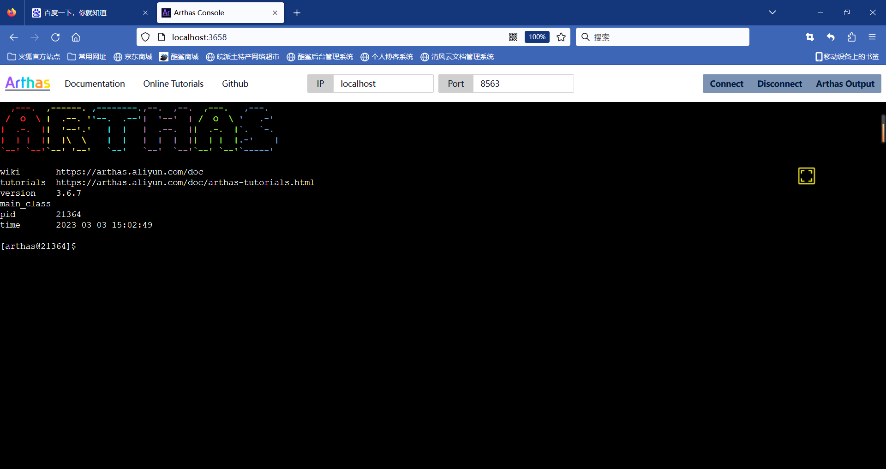

# Arthas（阿尔萨斯）

## 简介

### LOGO


Arthas 是一款线上监控诊断产品，通过全局视角实时查看应用 load、内存、gc、线程的状态信息，并能在不修改应用代码的情况下，对业务问题进行诊断，包括查看方法调用的出入参、异常，监测方法执行耗时，类加载信息等，大大提升线上问题排查效率。

### 背景

通常，本地开发环境无法访问生产环境。如果在生产环境中遇到问题，则无法使用 IDE 远程调试。更糟糕的是，在生产环境中调试是不可接受的，因为它会暂停所有线程，导致服务暂停。

开发人员可以尝试在测试环境或者预发环境中复现生产环境中的问题。但是，某些问题无法在不同的环境中轻松复现，甚至在重新启动后就消失了。

如果您正在考虑在代码中添加一些日志以帮助解决问题，您将必须经历以下阶段：测试、预发，然后生产。这种方法效率低下，更糟糕的是，该问题可能无法解决，因为一旦 JVM 重新启动，它可能无法复现，如上文所述。

Arthas 旨在解决这些问题。开发人员可以在线解决生产问题。无需 JVM 重启，无需代码更改。 Arthas 作为观察者永远不会暂停正在运行的线程。

### Arthas能做什么？

<u>**`Arthas` 是 Alibaba 开源的 Java 诊断工具，深受开发者喜爱。**</u>

当你遇到以下类似问题而束手无策时，`Arthas`可以帮助你解决：

1. 这个类从哪个 jar 包加载的？为什么会报各种类相关的 Exception？
2. 我改的代码为什么没有执行到？难道是我没 commit？分支搞错了？
3. 遇到问题无法在线上 debug，难道只能通过加日志再重新发布吗？
4. 线上遇到某个用户的数据处理有问题，但线上同样无法 debug，线下无法重现！
5. 是否有一个全局视角来查看系统的运行状况？
6. 有什么办法可以监控到 JVM 的实时运行状态？
7. 怎么快速定位应用的热点，生成火焰图？
8. 怎样直接从 JVM 内查找某个类的实例？

`Arthas` 支持 JDK 6+，支持 Linux/Mac/Windows，采用命令行交互模式，同时提供丰富的 `Tab` 自动补全功能，进一步方便进行问题的定位和诊断。

## 安装

### 使用`arthas-boot`（推荐）

下载`arthas-boot.jar`，然后用`java -jar`的方式启动：

```bash
curl -O https://arthas.aliyun.com/arthas-boot.jar
java -jar arthas-boot.jar
```

打印帮助信息：

```bash
java -jar arthas-boot.jar -h
```

- 如果下载速度比较慢，可以使用 aliyun 的镜像：

  ```bash
  java -jar arthas-boot.jar --repo-mirror aliyun --use-http
  ```

### 使用`as.sh`

Arthas 支持在 Linux/Unix/Mac 等平台上一键安装，请复制以下内容，并粘贴到命令行中，敲 `回车` 执行即可：

```bash
curl -L https://arthas.aliyun.com/install.sh | sh
```

上述命令会下载启动脚本文件 `as.sh` 到当前目录，你可以放在任何地方或将其加入到 `$PATH` 中。

直接在 shell 下面执行`./as.sh`，就会进入交互界面。

也可以执行`./as.sh -h`来获取更多参数信息。

## 卸载

- 在 Linux/Unix/Mac 平台

  删除下面文件：

  ```bash
  rm -rf ~/.arthas/
  rm -rf ~/logs/arthas
  ```

- Windows 平台直接删除 user home 下面的`.arthas`和`logs/arthas`目录

## 启动

1.打开cmd终端，切换到放arthas-boot.jar的路径，输入

```sh
java -jar arthas-boot.jar
```

示例：

```sh
D:\devtools\arthas>java -jar arthas-boot.jar
[INFO] JAVA_HOME: D:\Java\1.8\jre
[INFO] arthas-boot version: 3.6.7
[INFO] Found existing java process, please choose one and input the serial number of the process, eg : 1. Then hit ENTER.
* [1]: 11344 org.jetbrains.idea.maven.server.RemoteMavenServer36
  [2]: 16484 org.jetbrains.jps.cmdline.Launcher
  [3]: 21364 cn.jstart.interface_test.InterfaceTestApplication
  [4]: 9300
```

2.选择要操作的进程号，回车：

```sh
3
[INFO] arthas home: C:\Users\21681\.arthas\lib\3.6.7\arthas
[INFO] Try to attach process 21364
[INFO] Attach process 21364 success.
[INFO] arthas-client connect 127.0.0.1 3658
  ,---.  ,------. ,--------.,--.  ,--.  ,---.   ,---.
 /  O  \ |  .--. ''--.  .--'|  '--'  | /  O  \ '   .-'
|  .-.  ||  '--'.'   |  |   |  .--.  ||  .-.  |`.  `-.
|  | |  ||  |\  \    |  |   |  |  |  ||  | |  |.-'    |
`--' `--'`--' '--'   `--'   `--'  `--'`--' `--'`-----'

wiki       https://arthas.aliyun.com/doc
tutorials  https://arthas.aliyun.com/doc/arthas-tutorials.html
version    3.6.7
main_class
pid        21364
time       2023-03-03 15:02:49

[arthas@21364]$
```

接下来就可以对当前进程进行运行时的操作啦！

## Web Console

本地启动Arthas后，可以根据连接的端口号来访问浏览器，例如：

```sh
# 上面启动的本地端口
[INFO] arthas-client connect 127.0.0.1 3658
```

浏览器输入：`http://localhost:3658`



这样也可以在浏览器的控制台进行操作，没有太大差别！

## 使用命令

Arthas可以通过全局视角实时查看应用 load、内存、gc、线程的状态信息。

### 1.基础命令

- [base64](https://arthas.aliyun.com/doc/base64.html) - base64 编码转换，和 linux 里的 base64 命令类似
- [cat](https://arthas.aliyun.com/doc/cat.html) - 打印文件内容，和 linux 里的 cat 命令类似
- [cls](https://arthas.aliyun.com/doc/cls.html) - 清空当前屏幕区域
- [echo](https://arthas.aliyun.com/doc/echo.html) - 打印参数，和 linux 里的 echo 命令类似
- [grep](https://arthas.aliyun.com/doc/grep.html) - 匹配查找，和 linux 里的 grep 命令类似
- [help](https://arthas.aliyun.com/doc/help.html) - 查看命令帮助信息
- [history](https://arthas.aliyun.com/doc/history.html) - 打印命令历史
- [keymap](https://arthas.aliyun.com/doc/keymap.html) - Arthas 快捷键列表及自定义快捷键
- [pwd](https://arthas.aliyun.com/doc/pwd.html) - 返回当前的工作目录，和 linux 命令类似
- [quit](https://arthas.aliyun.com/doc/quit.html) - 退出当前 Arthas 客户端，其他 Arthas 客户端不受影响
- [reset](https://arthas.aliyun.com/doc/reset.html) - 重置增强类，将被 Arthas 增强过的类全部还原，Arthas 服务端关闭时会重置所有增强过的类
- [session](https://arthas.aliyun.com/doc/session.html) - 查看当前会话的信息
- [stop](https://arthas.aliyun.com/doc/stop.html) - 关闭 Arthas 服务端，所有 Arthas 客户端全部退出
- [tee](https://arthas.aliyun.com/doc/tee.html) - 复制标准输入到标准输出和指定的文件，和 linux 里的 tee 命令类似
- [version](https://arthas.aliyun.com/doc/version.html) - 输出当前目标 Java 进程所加载的 Arthas 版本号

### 2.jvm 相关

- [dashboard](https://arthas.aliyun.com/doc/dashboard.html) - 当前系统的实时数据面板
- [getstatic](https://arthas.aliyun.com/doc/getstatic.html) - 查看类的静态属性
- [heapdump](https://arthas.aliyun.com/doc/heapdump.html) - dump java heap, 类似 jmap 命令的 heap dump 功能
- [jvm](https://arthas.aliyun.com/doc/jvm.html) - 查看当前 JVM 的信息
- [logger](https://arthas.aliyun.com/doc/logger.html) - 查看和修改 logger
- [mbean](https://arthas.aliyun.com/doc/mbean.html) - 查看 Mbean 的信息
- [memory](https://arthas.aliyun.com/doc/memory.html) - 查看 JVM 的内存信息
- [ognl](https://arthas.aliyun.com/doc/ognl.html) - 执行 ognl 表达式
- [perfcounter](https://arthas.aliyun.com/doc/perfcounter.html) - 查看当前 JVM 的 Perf Counter 信息
- [sysenv](https://arthas.aliyun.com/doc/sysenv.html) - 查看 JVM 的环境变量
- [sysprop](https://arthas.aliyun.com/doc/sysprop.html) - 查看和修改 JVM 的系统属性
- [thread](https://arthas.aliyun.com/doc/thread.html) - 查看当前 JVM 的线程堆栈信息
- [vmoption](https://arthas.aliyun.com/doc/vmoption.html) - 查看和修改 JVM 里诊断相关的 option
- [vmtool](https://arthas.aliyun.com/doc/vmtool.html) - 从 jvm 里查询对象，执行 forceGc

### 3.class/classloader 相关

- [classloader](https://arthas.aliyun.com/doc/classloader.html) - 查看 classloader 的继承树，urls，类加载信息，使用 classloader 去 getResource
- [dump](https://arthas.aliyun.com/doc/dump.html) - dump 已加载类的 byte code 到特定目录
- [jad](https://arthas.aliyun.com/doc/jad.html) - 反编译指定已加载类的源码
- [mc](https://arthas.aliyun.com/doc/mc.html) - 内存编译器，内存编译`.java`文件为`.class`文件
- [redefine](https://arthas.aliyun.com/doc/redefine.html) - 加载外部的`.class`文件，redefine 到 JVM 里
- [retransform](https://arthas.aliyun.com/doc/retransform.html) - 加载外部的`.class`文件，retransform 到 JVM 里
- [sc](https://arthas.aliyun.com/doc/sc.html) - 查看 JVM 已加载的类信息
- [sm](https://arthas.aliyun.com/doc/sm.html) - 查看已加载类的方法信息

## 相关案例

### 热部署

通常我们将SpringBoot项目打成jar包后进行启动并访问，如果代码需要微小改动，过程非常麻烦，使用Arthas可以利用热部署进行线上维护和改动编译代码。

测试前提：

我们已经启动了一个项目jar包，现在需要改动代码内容。

1. 找到要改动的类，改动后项目重新编译`Rebuild Project`；

2. 找到编译后的字节码文件`.class`，复制当前路径；

3. 来到Arthas的启动页面，回车即可；

   ```sh
   retransform 目录位置
   ```

4. 再次刷新浏览器，访问测试！

## 更多参考

https://arthas.aliyun.com/doc/
