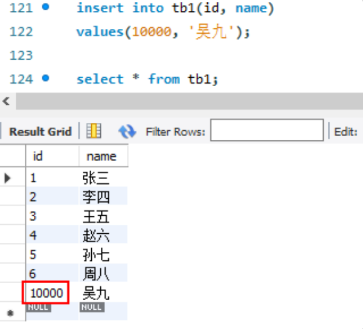
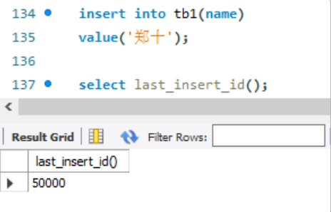
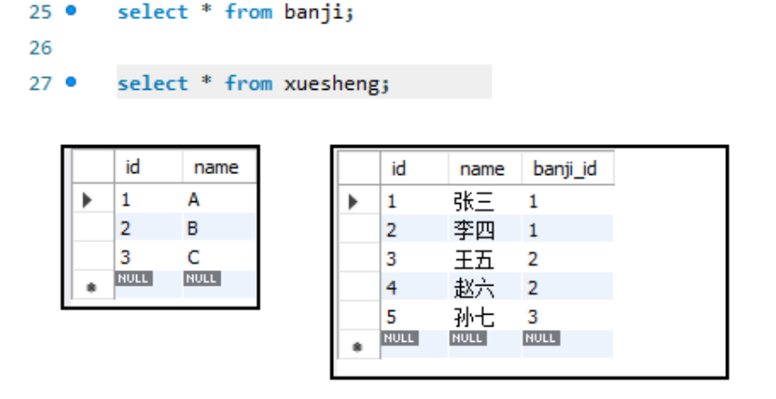
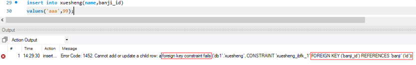
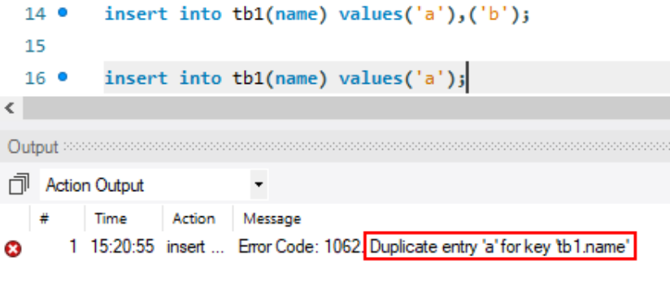
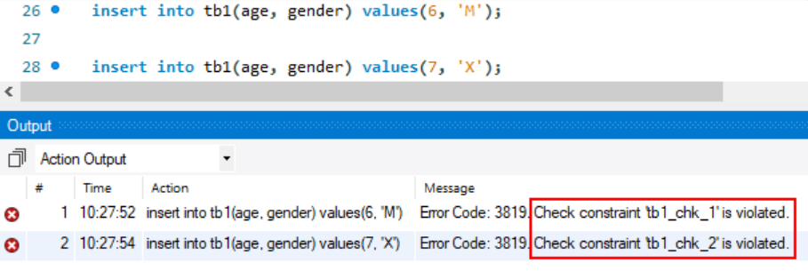

# 数据库六大约束

## 1.主键约束----`Primary Key`

表示这张表通过id来增删改查数据,id为主键且自增

**主键会限制字段不能取重复值和NULL值**

#### 1.添加主键

```sql
drop table if exists tb1;
    create table tb1(
    id int primary key,
    name varchar(20)
) engine=innodb charset=utf8mb4;
# 或
create table tb1(
    id int,
    name varchar(20),
    primary key(id)
)engine=innodb charset=utf8mb4;
```

#### 2.修改表时添加主键

```mysql
create table tb1(
    id int,
    name varchar(20)
)engine=innodb charset=utf8mb4;
-- 1.修改表，将id字段设置为主键
alter table tb1 add primary key(id);
-- 2.修改表，将id字段设置为主键
alter table tb1
modify id int primary key;
```

#### 3.双主键

- 两字段组合不能重复
- 单字段可以重复
- 两个字段都不能取NULL
- 创建两个字段的组合索引

新建表创建：

```mysql
create table app(
    title varchar(50),
    version varchar(20),
    detail varchar(255),
    primary key(title, version)
)engine=innodb charset=utf8mb4;
```

修改表创建：

```mysql
create table app(
    title varchar(50),
    version varchar(20),
    detail varchar(255)
)engine=innodb charset=utf8mb4;
alter table app add primary key(title, version);
```

#### 4.查看主键约束

```mysql
desc tb1;
show create table tb1;
```

#### 5.删除主键约束

```mysql
alter table tb1 drop primary key;
```

#### 6.自增主键

**整数类型**的**主键字段或唯一字段**可以使用`auto_increment`关键字设置为自增，这样只需要提供其他字段数据，该字段会自动自增插入.

添加表时添加自增：

```mysql
create table tb1(
    id int primary key auto_increment,
    name varchar(20)
)engine=innodb charset=utf8mb4;
# 或
create table tb1(
    id int auto_increment,
    name varchar(20),
    primary key(id)
)engine=innodb charset=utf8mb4;
```

修改表时添加自增：

```mysql
alter table tb1
modify id int auto_increment;
```

#### 7.查看自增值

```mysql
show create table tb1;
```

#### 8.修改自增值

自增字段也可以手动插入指定的值(必须大于当前自增值)，下一个自增值会被自动修改

```mysql
insert into tb1(id, name)
values(10000, '吴九');
```



#### 9.获取新产生的自增主键值

有时插入数据后想及时获得刚插入的数据产生的自增主键值，使用`last_insert_id()`函数。

`last_insert_id()`函数只能获取当前会话新插入的自增主键值。

```mysql
insert into tb1(name)
value('郑十');
select last_insert_id();
```



#### 10.取消自增

不添加 `auto_increment` 关键字就可以取消自增：

```mysql
alter table tb1
modify id int;
```

## 2.外键约束----`Foreign Key`

- 表A中的某个非主键字段是另外一个表中的主键字段，此时该字段叫做外键，外键关系是需要建立的，若创建好2张表后，没有建立外键约束，此时就不存在外键。

> 注意:通常使用逻辑外键，在业务层中处理存在逻辑外键关系的数据(在业务层中，删除部门信息之前，先将该部门对应的员工信息删除)

#### 方法1.创建表时添加

- ```sql
  -- 新建班级表
  create table banji(
      id int primary key auto_increment,
      name varchar(20)
  );
  -- 创建学生表并添加外键
  create table xuesheng(
      id int primary key auto_increment,
      name varchar(20),
      banji_id int,
      foreign key(banji_id) references banji(id)
  );
  # 关键句
  foreign key(子表字段) references 父表(父表与子表相关字段)
  ```

这样在学生表banji_id字段中的值必须是班级表主键id存在的，或者取Null值：



如果学生的banji_id字段中填入不存在的班级id：



#### 方法2.修改表时添加

```mysql
create table xuesheng(
    id int primary key auto_increment,
    name varchar(20),
    banji_id int
);
-- 上面新建表时没有设置外键
-- 这里对表进行修改，将banji_id设置为外键
alter table xuesheng
add foreign key(banji_id) references banji(id);
```

#### 查看外键约束

```mysql
show create table xuesheng;
```

#### 删除外键约束

```mysql
alter table xuesheng
drop foreign key xuesheng_ibfk_1;
```

## 3.非空约束----`Not NULL`

添加到某字段上,则该字段的值不允许为Null

#### 1.创建表时添加约束

```mysql
-- 添加 not null 关键字设置非空约束
create table tb1(
    id int primary key auto_increment,
    name varchar(20) not null
);
```

#### 2.修改表时添加

```mysql
-- 添加 not null 关键字设置非空约束
create table tb1(
    id int primary key auto_increment,
    name varchar(20)
);
alter table tb1
modify name varchar(20) not null;
```

#### 3.查看非空约束

```mysql
desc tb1;
show create table tb1;
```

#### 4.删除非空约束

```mysql
-- 不写not null就是取消
alter table tb1
modify name varchar(20);

-- 字段后面添加null关键字，表示允许null值
alter table tb1
modify name varchar(20) null;
```

## 4.唯一性约束----`Unique`

**唯一约束限制字段中不能有重复值**

**唯一约束会自动创建索引**

> 用户表中的用户名字段,生产环境中生产环境中通常都要求唯一，则在创建表时需要给该字段添加唯一性约束

#### 1.创建表添加唯一约束

```mysql
-- unique，将字段设置为唯一，不重复
create table tb1(
    id int primary key auto_increment,
    name varchar(20) unique
);

-- 用unique key(name)，将name字段设置为唯一，不重复
create table tb1(
    id int primary key auto_increment,
    name varchar(20),
    unique key(name)
);
```

#### 2.修改表时添加

```mysql
# 第一种
alter table tb1
modify name varchar(20) unique;
# 第二种
alter table tb1
add unique key(name);
```

#### 3.多字段组合唯一约束

```mysql
drop table if exists app;
create table app(
    id int primary key auto_increment,
    title varchar(50),
    version varchar(20),
    detail varchar(255),
    unique key(title, version)
)engine=innodb charset=utf8mb4;
```

#### 4.违反唯一约束会报错



#### 5.查看唯一约束

```mysql
desc tb1;
show create table tb1;
```

#### 6.删除唯一约束

使用字段名称进行删除：

```mysql
alter table tb1
drop index name
```

## 5.检查约束----`check`

**检查约束可以设置检查条件，来判断插⼊字段的值是否符指定的条件。**

作用于字段上,用于检查该字段的值是否满足给出的检查条件,若不满足则不会插入到表中

#### 1.创建表时添加

```mysql
create table tb1(
    id int primary key auto_increment,
    age tinyint unsigned,
    gender char(1),
    check(age>=7 and age<=60),
    check(gender in('M','F'))
);
```

#### 2.修改表时添加

```mysql
create table tb1(
    id int primary key auto_increment,
    age tinyint unsigned,
    gender char(1)
);
alter table tb1 add(
check(age>=7 and age<=60),
check(gender in('M','F'))
);
```

#### 3.不符合检查约束会报错



#### 4.查看检查约束

```mysql
show create table tb1;
```

#### 5.删除检查约束

```mysql
alter table tb1
drop constraint tb1_chk_1;
```

# 总结前五种约束：

**MySQL中有五种约束**：

1. 主键约束用于唯一标识一行记录，会自动创建索引
2. 外键约束用来引用主键中的值
3. 非空约束不允许该字段插入Null值
4. 唯一约束限制该字段的数据不能重复，而且会自动创建索引
5. 检查约束用来检查字段是否符合规定要求

## 6.默认约束(通常不算该约束)----`Default`

- 作用于表或字段上
- 字段上可以设置默认值
- 表中可以设置默认的存储引擎和字符集

```mysql
# 物流配送表
DROP TABLE IF EXISTS ups_logistics;
CREATE TABLE ups_logistics
(
    id           bigint(20) unsigned DEFAULT NULL AUTO_INCREMENT COMMENT '数据id',
    name         varchar(50)         DEFAULT NULL COMMENT '物流名称',
    note         varchar(255)        DEFAULT NULL COMMENT '物流备注',
    gmt_create   datetime            DEFAULT NULL COMMENT '数据创建时间',
    gmt_modified datetime            DEFAULT NULL COMMENT '数据最后修改时间',
    PRIMARY KEY (id)
) DEFAULT CHARSET = utf8mb4 COMMENT ='物流配送';
```

