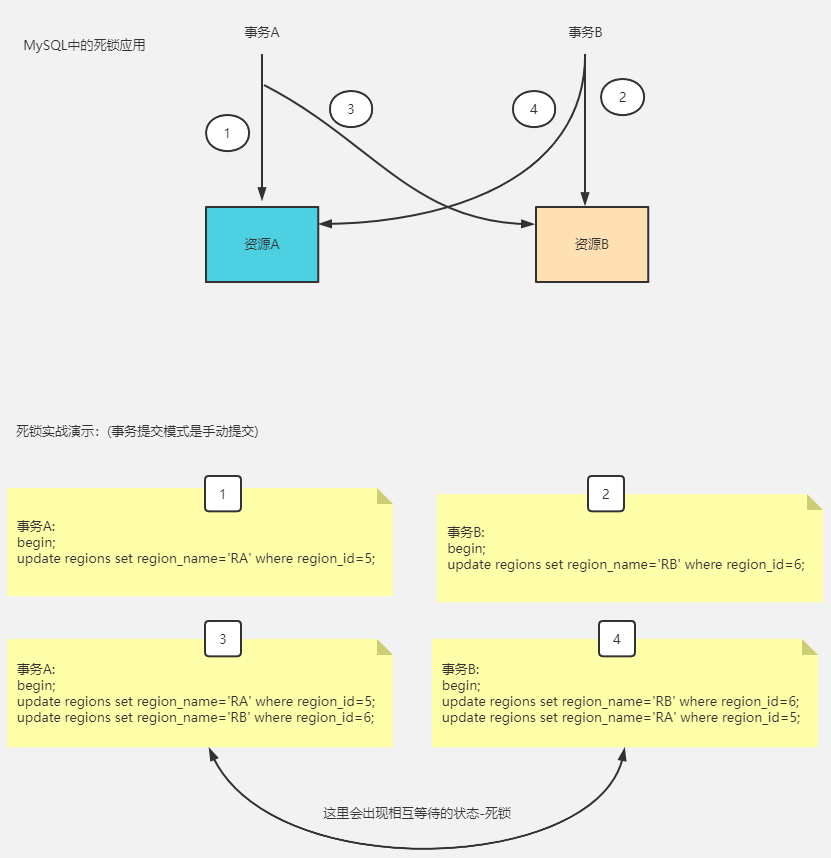
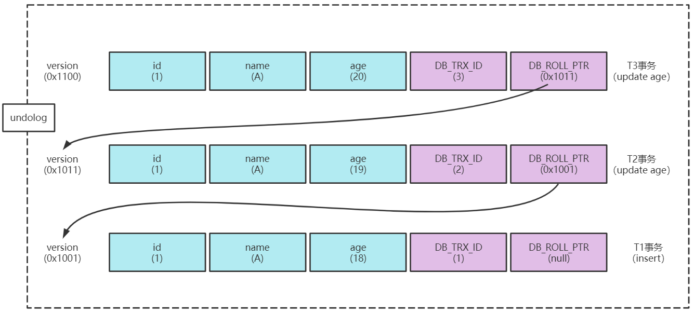
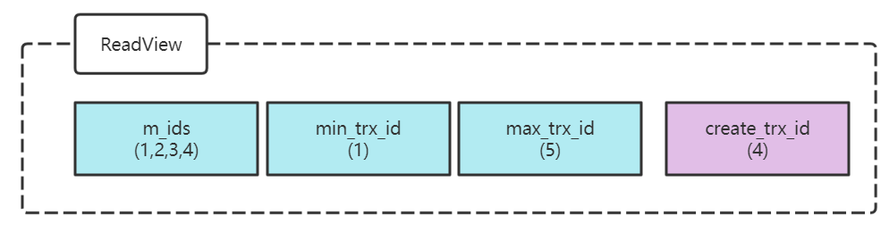

# MySQL锁机制

## 一、什么是锁？

##### 锁是计算机协调多个进程或线程并发访问某一资源的机制（避免抢夺）。

在数据库中，除传统的计算资源（如CPU、RAM、IO等）的争用以外，数据也是一种供许多用户使用的资源。

如何保证数据库并发访问的一致性、有效性将是数据库必须解决的问题，锁冲突也是影响数据库并发访问性能的一个重要因素。这使得锁对数据库来说显得尤为重要和复杂。

#### 1.从数据操作的粒度划分

1）全局锁：全局锁可以对库中所有表上锁,默认是关闭的,使用前可以手动打开.

```mysql
flush tables with read lock. # 打开全局锁
```

```mysql
unlock tables; # 关闭全局锁
```

* 全局锁案例演示

| 事务A                                                        | 事务B                                        |
| ------------------------------------------------------------ | -------------------------------------------- |
| flush tables with read lock                                  |                                              |
| select * from regions                                        | select * from regions                        |
| select * from jobs                                           | select * from jobs                           |
| insert into jobs (region_name) values ('A8');                |                                              |
| Can't execute the query because you have a conflicting read lock | insert into jobs(region_name) values ('A9'); |
| ...                                                          | 阻塞;                                        |
| unlock tables                                                |                                              |
| ....                                                         | 阻塞结束开始执行.                            |

添加了全局锁后，多个回话可以读，但当前回话更新会报错，其他回话更新会阻塞，直到当前回话unlock table解锁或自行超时，停止阻塞。

2）表锁：操作时，会锁定整个表

> 表锁是对整张表进行锁定的一种锁的设计,可以分为表读锁,表写锁.

3）行锁：操作时，会锁定当前操作的行

#### 2.从对数据操作的类型划分

1）读锁（共享锁）：针对同一份数据，多个读操作可以同时进行而不会互相影响

2）写锁（排它锁）：当前操作没有完成之前，会阻断其他写锁和读锁

#### 3.从性能维度划分

1）悲观锁：认为所有并发事务都会对数据进行更新

2）乐观锁：认为所有并发事务都不会对数据进行更新

> 各存储引擎对锁的支持

| 存储引擎 | 表级锁 | 行级锁 |
| -------- | ------ | ------ |
| MyISAM   | 支持   | 不支持 |
| InnoDB   | 支持   | 支持   |
| MeMory   | 支持   | 不支持 |
| BDB      | 支持   | 不支持 |

## 二、锁的特性

MySQL锁的特性大致归纳如下：

**表级锁**：偏向MyISAM存储引擎，开销小，加锁快；不会出现死锁；锁定粒度大，发生锁冲突的概率最高，并发度低。

**行级锁**：偏向InnoDB存储引擎，开销大，加锁慢，会出现死锁；锁定粒度最小，发生锁冲突的概率最低，并发度也最高。

> 可见，不能判断哪一种锁更好，只能就具体应用特点来判断哪一个锁更加合适！
>
> 表级锁更适合与查询为主，少量按索引更新数据
>
> 行级锁更适合有大量索引条件并发更新少量不同数据

## 三、表锁的应用

* ##### 什么是表锁?

表锁是对整张表进行锁定的一种锁的设计,可以分为表读锁,表写锁.

* ##### 如何对mysql中的表添加读写锁(注意这里要先开启事务，再加锁)?

1. 添加表读锁(lock table regions read);
2. 添加表写锁(lock table regions write);

* 如何对mysql中的表进行解锁?

```mysql
unlock tables;
```

* ##### 当前线程对表添加了表读锁,当前线程可以执行的操作?

1. 读
2. 不可以写,当前线程写会出错:  `ERROR 1099 (HY000): Table 'transaction_test' was locked with a READ lock and can't be updated`，其他线程写会阻塞！

* ##### 当前线程对表添加了表写锁,其它线程可以执行的操作?

1. 当前事务可以读和写
1. 其他事务想要读和写都会阻塞,直到当前事务解开写锁`unlock table`或超时

**总结**:

* 当前线程对表添加了读锁,当前线程可以执行的操作?

  1.可以读

  2.不可以写

* 当前线程对表添加了写锁,其他线程可以执行的操作?

  1. 当前线程可以读写
  2. 其他线程不可以读写,都会被阻塞.(直到当前线程解锁或超时)

* 当其他线程未提交事务时，当前事务不能加锁，会阻塞！

## 四、行锁应用

* ##### 什么是行锁?

行锁是mysql中InnoDB存储引擎的一种针对行记录进行加锁的一种实现方式,默认所有的select 操作不加锁.

* ##### 如何理解行锁上的共享锁与排它锁?

- ##### 共享锁(S锁):

   1. 允许当前事务和其他事务读取一行
   2. 阻止其它事务对相同记录添加排它锁.

   $添加共享锁后再添加排它锁会报错: `ERROR 1317 (70100): Query execution was interrupted`**直到事务提交**

   > 不同版本数据库结果不同，可能阻塞也可能报错

- ##### 排它锁(X锁):

   1. 允许当前事务获取和更新数据
   2. 阻止其它事务获取相同数据集的共享锁,排它锁.

   $当一个事务的某一行添加了排它锁,其他事务再添加共享或排它锁时会报错: `ERROR 1317 (70100): Query execution was interrupted`

* ##### 查询时如何添加共享锁和排它锁?

1. 共享锁:select * from user where id=1 lock in share mode
2. 排它锁:select * from user where id=1 for update

* ##### 如何保证多个并发事务对同一记录进行操作时数据的一致性?

  $可以对这条记录添加排它锁,但是这样可能会降低系统并发性能.

## 五、死锁案例

当两个事务在事务未提交的情况下相互添加排他锁时，会出现死锁

或者当一个事务添加了排他间隙锁时，其他事务添加排它锁会发生死锁



------

## 六、MyISAM表锁

MyISAM存储引擎只支持表锁

#### 如何添加表锁？

MyISAM存储引擎会在查询语句SELECT前，自动给涉及的所有表加读锁，在执行更新操作UPDATE、DELETE、INSERT前，会自动给涉及的表加写锁，这个过程并不需要用户干预，因此，用户一般不需直接用Lock Table 命令给MyISAM表显式加锁。

```mysql
手动加表读锁： lock table table_name read；

手动加表写锁： lock table table_name write；
```

#### 表锁特点

1）对MyISAM表的读操作，不会阻塞其他用户对同一表的读取请求，但会阻塞对同一表的写请求；

2）对MyISAM表的写操作，则会阻塞其他用户对同一表的读和写操作

> 简而言之，就是读锁会阻塞写，但是不会阻塞读。而写锁，则既会阻塞读，又会阻塞写

此外，MyISAM 的[读写锁](https://so.csdn.net/so/search?q=读写锁&spm=1001.2101.3001.7020)调度是写优先，这也是MyISAM不适合做写为主的表的存储引擎的原因。因为写锁后，其他线程不能做任何操作，大量的更新会使查询很难得到锁，从而造成永远阻塞。

```mysql
 
-- MySQL的锁机制
drop database if exists  mydb14_lock;
create database mydb14_lock ;
 
use mydb14_lock;
  
create table `tb_book` (
  `id` int(11) auto_increment,
  `name` varchar(50) default null,
  `publish_time` date default null,
  `status` char(1) default null,
  primary key (`id`)
) engine=myisam default charset=utf8 ;
 
insert into tb_book (id, name, publish_time, status) values(null,'java编程思想','2088-08-01','1');
insert into tb_book (id, name, publish_time, status) values(null,'solr编程思想','2088-08-08','0');
```

## 七、InnoDB行锁

#### 行锁特点

偏向InnoDB 存储引擎，开销大，加锁慢；会出现死锁；锁定粒度最小，发生锁冲突的概率最低,并发度也最高。

#### 行锁模式

InnoDB 实现了以下两种类型的行锁。

**共享锁（S）**：又称为读锁，简称S锁，共享锁就是多个事务对于同一数据可以共享一把锁，都能访问到数据，但是只能读不能修改。
**排他锁（X）**：又称为写锁，简称X锁，排他锁就是不能与其他锁并存，如一个事务获取了一个数据行的排他锁，其他事务就不能再获取该行的其他锁，包括共享锁和排他锁，但是获取排他锁的事务是可以对数据就行读取和修改。

对于UPDATE、DELETE和INSERT语句，InnoDB会自动给涉及数据集加排它锁（X）；

对于普通的SELECT语句，InnoDB不会任何锁；

**可以通过以下语句显示给记录集加共享锁或排他锁 。**

```mysql
共享锁（S）：SELECT * FROM table_name WHERE ... LOCK IN SHARE MODE 
排他锁（X) ：SELECT * FROM table_name WHERE ... FOR UPDATE
```

```mysql
-- 行锁 
drop table if exists test_innodb_lock;
create table test_innodb_lock(
    id int(11),
    name varchar(16),
    sex varchar(1)
)engine = innodb ;
 
insert into test_innodb_lock values(1,'100','1');
insert into test_innodb_lock values(3,'3','1');
insert into test_innodb_lock values(4,'400','0');
insert into test_innodb_lock values(5,'500','1');
insert into test_innodb_lock values(6,'600','0');
insert into test_innodb_lock values(7,'700','0');
insert into test_innodb_lock values(8,'800','1');
insert into test_innodb_lock values(9,'900','1');
insert into test_innodb_lock values(1,'200','0');
 
create index idx_test_innodb_lock_id on test_innodb_lock(id);
create index idx_test_innodb_lock_name on test_innodb_lock(name);
```

## 八、MVCC(多版本并发控制)

* MVCC 是什么?

MVCC(Multi Version Concurrent Control)多版本并发控制,它可以**通过历史版本保证读数据的一致性**,但是这样方式相对于添加排它锁,并发性能要好.

* 你是否还记得事务的四个特性,底层是如何保证这些特性成功的?

1. 原子性(通过undolog实现-执行回滚)
2. 隔离性(通过锁,MVCC-版本控制)
3. 一致性(通过undolog,redolog,隔离性)
4. 持久性(通过redolog日志实现)

* MVCC的底层逻辑是如何实现的呢?

  MVCC的实现原理主要依赖于记录中的三个隐藏字段，undolog，ReadView来实现的.

* MVCC中的隐藏字段指的是哪些？(了解)

1. **DB_TRX_ID**：**记录创建这条记录或者最后一次修改该记录的事务id**
2. **DB_ROLL_PTR**：回滚指针，指向这条记录的上一个版本,用于配合undolog实现数据的**回滚（回滚到上一版本）**.
3. **DB_ROW_ID**：隐藏的主键，**如果数据表没有主键**，那么innodb会自动生成一个row_id，




* 什么是ReadView？**当前事务的一个读一致性视图（内存事务的快照）**

对于Read Committed和Repeatable Read的隔离级别,都要读取已经提交的事务数据,也就是说如果版本链中的事务没有提交,该版本的记录是不能被读取的,那哪个版本的事务是可以读取的,此时就引入了ReadView.

**在事务启动或执行操作时,会生成当前事务的ReadView**,保存当前事务之前活跃的所有事务id。

* ReadView中包含什么？



1. m_ids: 截止到当前事务id之前,所有活跃的事务id。
2. min_trx_id: 记录以上活跃事务id中的最小值。
3. max_trx_id: 保存当前事务结束后应分配的下一个id值。
4. creator_trx_id: 保存创建ReadView的当前事务id。

* 事务隔离(RC,RR)特性的实现？

1. 如果db_trx_id与Readview中的creator_trx_id相等，则说明当前事务在访问自己的操作数据，此时可以访问。
2. 如果db_trx_id小于ReadView中的min_trx_id值,表明生成的该版本的事务在当前事务生成readview之前已经提交,所以可以直接读取.
3. 如果被访问版本的db_trx_id大于ReadView中的max_trx_id值,表明该版本的事务在当前事务生成ReadView后才开启的,所以该版本不可以被当前事务访问.
4. 如果访问的版本的db_trx_id属性值在min_trx_id和max_trx_id之间 ,就需要判断一下db_trx_id的值是不是在m_ids列表中,如果在,说明创建 ReadView时,生成的该版本的事务还是活跃的,该版本不可以访问,如果不存在,则说明创建ReadView时,生成该版本的事务已经提交则可以读取.

# 总结(Summary)

## FAQ分析

* 如何创建用户？(mysql5.7)

```mysql
create user 'tmooc'@'%' identified by 'tmooc';
```

* 如何为用户授权?

```mysql
grant all on 你的数据库.* to 'tmooc'@'%';

grant reload on *.* to 'tmooc'@'%';
```

* 如何撤销用户权限

```mysql
revoke all on 你的数据库.* from 'tmooc'@'%';
```

* 如何保证事务的四大特性落地？(回滚日志，重做日志，binlog，锁和MVCC)
* 为什么使用锁？(保证事务并发执行时数据的正确性,实现事务与事务之间的隔离)
* MySQL中常用的锁的类型？(全局锁，表锁、行锁、间隙锁、...)
* 什么是共享锁(读共享、乐观锁)、排它锁(悲观锁)？
* 如何理解全局锁以及如何添加全局锁?(对所有库的一种加锁方式)
* 如何理解表锁以及如何添加表锁？(表读锁、表写锁)
* 如何添加行读锁(共享锁)？select xx from xx where xx  lock in share mode
* 如何添加行写锁(排它锁)？ select xx from xx where xxx lock for update
* 如何理解mysql中的死锁？(并发事务处于相互等待的一种状态)
* 如何理解MVCC？(多版本并发控制，用于更好实现事务隔离,例如RC、RR)
* MVCC底层逻辑是如何实现的？(依赖于回滚日志链、ReadView，记录中的隐藏字段)
* RR隔离级别下何时创建ReadView?(事务启动时)
* RC隔离级别下何时创建ReadView?(每次执行查询时都会创建ReadView)  
* 可重复读底层逻辑是如何实现的？(https://www.processon.com/view/link/63a1a5cb517570317d7bb536)
