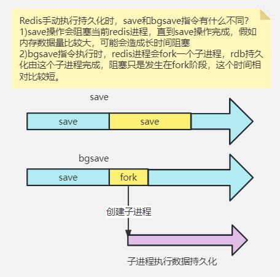
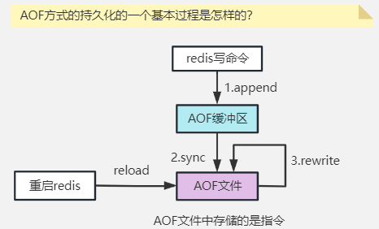

# Redis持久化

<u>Redis是将数据保存到内存中的！</u>

内存的特征就是读写效率非常快，但是断电即失！

对于Redis来讲，所有数据丢失后，再重新加载数据，就需要从数据库中重新查询所有数据，这个操作不但费时，而且还会给数据库带来压力。

为了防止Redis的重启对数据库带来额外的压力和数据的丢失,Redis支持了持久化的功能

所谓持久化就是将Redis中保存的数据,以指定方式保存在Redis当前服务器的硬盘上

如果存在硬盘上,那么断电数据也不会丢失,再启动Redis时,利用硬盘中的信息来回复数据

**Redis实现持久化有两种策略**：

## RDB:(Redis Database Backup)

<u>RDB本质上就是数据库快照(就是当前Redis中所有数据转换成二进制的对象,保存在硬盘上)</u>

默认情况下,每次备份会生成一个dump.rdb的文件

当Redis断电或宕机后,重新启动时,会从这个文件中恢复数据,获得dump.rdb中所有内容

实现这个效果我们可以在Redis的配置文件中添加如下信息

```sh
save 60 5
```

上面配置中60表示秒

5表示Redis的key被更新的次数

配置效果:1分钟内如果有5个及以上的key被更新,就启动rdb数据库快照程序



### 优点:

* 因为是整体Redis数据的二进制格式,数据恢复是整体恢复的（适合灾难级恢复）、
* 性能好，执行持久化可以fork一个子进程由子进程处理保存工作，父进程无须执行任何磁盘 I/O 操作。

### 缺点:

* **RDB方式在服务器故障时容易造成数据的丢失**。实际项目中，我们可通过配置来控制持久化的频率。但是，如果频率太频繁，可能会对 Redis 性能产生影响。所以通常可能设置至少5分钟才保存一次快照，这时如果 Redis 出现宕机等情况，则意味着最多可能丢失5分钟数据。
* **RDB持久化过程中的fork操作，可能会导致内存占用加倍**，Linux系统fork 子进程采用的是 copy-on-write 的方式（写时复制，修改前先复制），在 Redis 执行 RDB 持久化期间，如果 client 写入数据很频繁，那么将增加 Redis 占用的内存，最坏情况下，内存的占用将达到原先的2倍。
* **如果数据过于庞大，子进程在内存中fork操作会比较耗时，该过程父进程无法对外提供服务。**

## AOF(Append Only File):

<u>AOF策略是将Redis运行过的所有命令(日志)备份下来,保存在硬盘上</u>

这样即使Redis断电,我们也可以根据运行过的日志,恢复为断电前的样子

我们可以在Redis的配置文件中添加如下配置信息

```sh
appendonly yes
```

经过这个设置,就能保存运行过的指令的日志了

理论上任何运行过的指令都可以恢复

但是实际情况下,Redis非常繁忙时,我们会将日志命令缓存之后,整体发送给备份,减少io次数以提高备份的性能 和对Redis性能的影响

实际开发中,配置一般会采用每秒将日志文件发送一次的策略,断电最多丢失1秒数据



### 优点:

- 相对RDB来讲,信息丢失的较少,比较可靠
- AOF文件易读，记录写指令
- 支持重写

### 缺点:

- 写日志操作比较频繁会影响Redis的性能。
- 因为保存的是运行的日志,所以占用空间较大

实际开发中RDB和AOF是可以同时开启的,也可以选择性开启


> Redis的AOF为减少日志文件的大小,支持AOF rewrite
>
> 简单来说就是将日志中无效的语句删除,能够减少占用的空间 

## 参考：

https://www.processon.com/view/link/63a95c3100f3b050934b0611