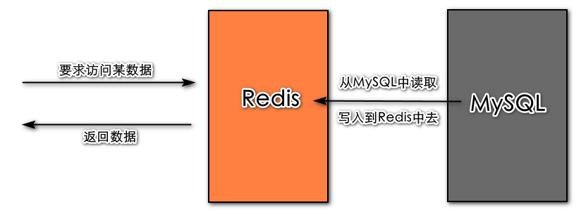
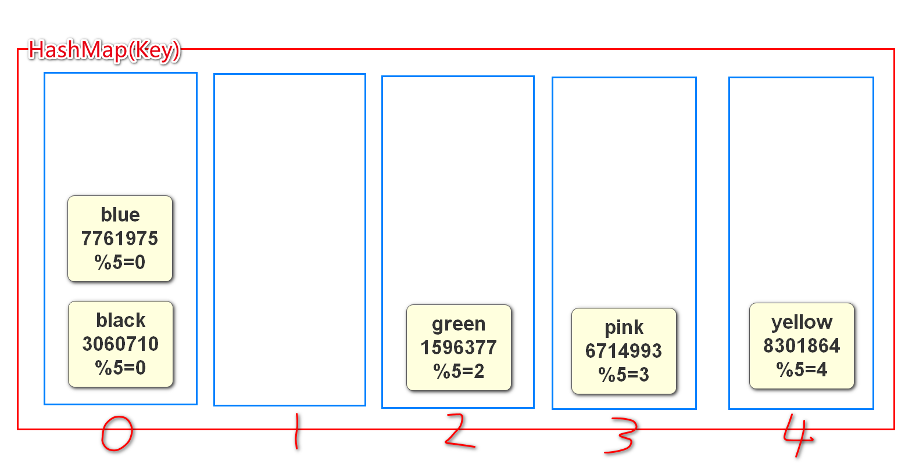
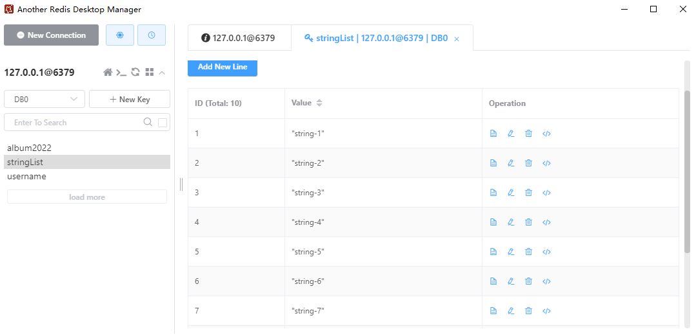
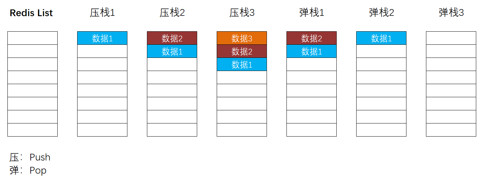
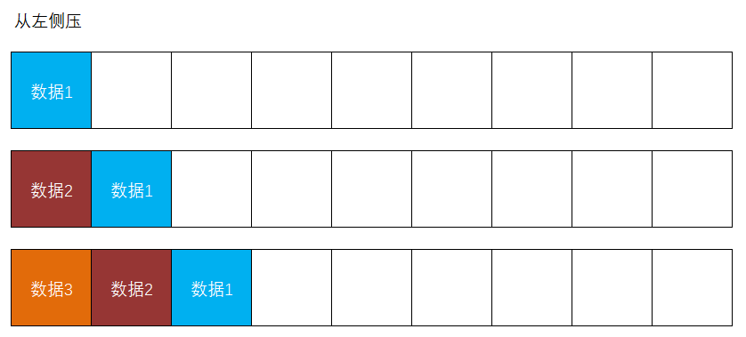
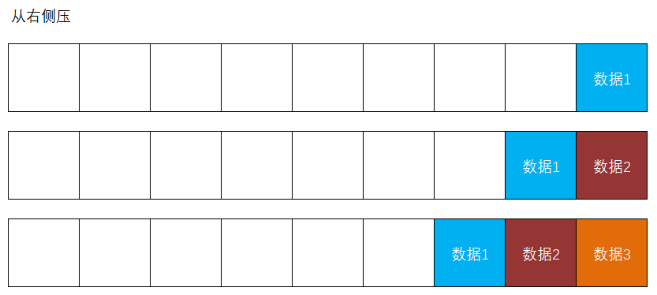
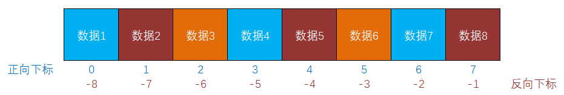

# Redis编程


官网：https://redis.io/

中文官网：https://www.redis.net.cn/

**下载地址**:https://github.com/microsoftarchive/redis/releases

Redis是一款基于内存的、使用K-V结构来实现读写数据的NoSQL非关系型数据库

- **基于内存**的：Redis访问的数据都在内存中
  
  - Redis的读写效率非常高
  - 其实Redis也会自动的处理持久化，但是正常读写都是在内存中执行的
  
- **NoSQL**：不涉及SQL语句，`No`可理解为日常英语中的`no`（没有），也可理解为`No Operation`（不操作）
- ##### 非关系型数据库：不关心数据库中存储的是什么数据，几乎没有数据种类的概念，更不存在数据与数据之间的关联

通常，在项目中，Redis用于实现缓存！



当使用Redis后：

- 【优点】读取数据的效率会高很多
- 【优点】能够一定程度上保障缓解数据库的查询压力，提高数据库的安全性
- 【缺点】需要关注数据一致性问题，即Redis中的数据与MySQL中的数据是否一致，如果不一致，是否需要处理

使用Redis可以做：

- **缓存**
- 计数器
- 排行榜
- 消息队列
- 分布式锁

# 1. Redis的基本操作

在Windows操作系统中，通过`.msi`安装包来安装的Redis，会自动注册Redis服务，开机会自动启动Redis，所以，Redis处于随时可用的状态。

可以在命令提示符窗口或终端窗口通过`redis-cli`命令，登录Redis控制台：

```sh
D:\IdeaProjects\jsd2207-csmall-product-teacher>redis-cli
127.0.0.1:6379>
```

当操作提示符变成 `127.0.0.1:6379>` 后，表示已经登录到Redis客户端的控制台。

在Redis客户端控制台中，可以通过`ping`命令实时检测Redis是否仍处理可用状态，如果Redis服务正常可用，将反馈`PONG`：

```sh
127.0.0.1:6379> ping
PONG
```

在Redis客户端控制台中，可以通过`exit`命令退出，以回到操作系统的终端：

```sh
127.0.0.1:6379> exit

D:\IdeaProjects\jsd2207-csmall-product-teacher>
```

在Redis客户端控制台中，可以通过`set`命令向Redis中存入值数据，例如：

```sh
127.0.0.1:6379> set name wangkejing
OK
```

在Redis客户端控制台中，可以通过`get`命令向Redis中存入值数据，例如：

```sh
127.0.0.1:6379> get name
"wangkejing"
```

```sh
127.0.0.1:6379> get email
(nil)
```

提示：以上使用的`set`命令，既是新增数据的命令（当Key尚且不存在时），也是修改数据的命令（当Key已经存在时），例如：

```sh
127.0.0.1:6379> set name fanchuanqi
OK
127.0.0.1:6379> get name
"fanchuanqi"
```

在Redis客户端控制台中，可以通过`keys`命令向Redis中存入值数据，此命令必须有参数，在参数中可以使用通配符，例如：

```sh
127.0.0.1:6379> keys username1
1) "username1"

127.0.0.1:6379> keys username0
(empty list or set)

127.0.0.1:6379> keys user* #查询所有user开头加一个通配符的key
1) "username1"
2) "username3"
3) "username2"
4) "username4"

127.0.0.1:6379> keys *
1) "username1"
2) "email1"
3) "email2"
4) "username3"
5) "name"
6) "username2"
7) "username4"
```

**注意：`keys`命令会根据模式查找当前Redis中的Key，可能耗时较长，会导致“阻塞”，所以，在生产环境中，一般不允许使用此命令！**

在Redis客户端控制台中，可以通过`dbsize`命令查看Redis中的数据的数量，例如：

```sh
127.0.0.1:6379> dbsize
(integer) 7
```

在Redis客户端控制台中，可以通过`del`命令删除Redis中指定Key的数据，例如：

```sh
127.0.0.1:6379> del username1
(integer) 1
```

在Redis客户端控制台中，可以通过`flushall`命令删除Redis中的数据，例如：

```sh
127.0.0.1:6379> flushall
OK
127.0.0.1:6379> keys *
(empty list or set)
```

更多命令，可查阅资料，例如：https://blog.csdn.net/weixin_46742102/article/details/109483603

##### Redis的传统数据类型有：

1. string：计数、缓存验证码、存储Token
2. list：栈结构、队列
3. hash：存储对象
4. set：点赞、收藏
5. zset：排行榜

##### Redis的扩展数据类型：

Geo（地理位置）、BitMap（位操作）、HyperLogLog（基数统计）

# 3.Redis存储原理

我们在编写java代码业务时,如果需要从多个元素的集合中寻找某个元素取出,或检查某个Key在不在的时候,推荐我们使用HashMap或HashSet,因为这种数据结构的查询效率最高,因为它内部使用了

**"散列表"**

下图就是散列表的存储原理



槽位越多代表元素多的时候,查询性能越高,HashMap默认16个槽

Redis底层保存数据用的也是这样的散列表的结构

Redis将内存划分为16384个区域(类似hash槽)

将数据的key使用CRC16算法计算出一个值,取余16384

得到的结果是0~16383

这样Redis就能非常高效的查找元素了

# 3. Redis编程

需要添加依赖项：

```xml
<!-- Spring Boot Data Redis的依赖项，用于实现Redis编程 -->
<dependency>
    <groupId>org.springframework.boot</groupId>
    <artifactId>spring-boot-starter-data-redis</artifactId>
</dependency>
```

> **注意**：该依赖整合了Jedis、Lettuce两种客户端

在Spring系列框架中，Redis编程需要使用`RedisTemplate`工具类，此工具类应该事先创建、配置，并保存到Spring容器中，当需要使用时，自动装配此工具类的对象。

在根包下创建`RedisConfiguration`配置类，在此类中使用`@Bean`方法来配置`RedisTemplate`：

```java
package cn.tedu.csmall.product.config;

import lombok.extern.slf4j.Slf4j;
import org.springframework.context.annotation.Bean;
import org.springframework.context.annotation.Configuration;
import org.springframework.data.redis.connection.RedisConnectionFactory;
import org.springframework.data.redis.core.RedisTemplate;
import org.springframework.data.redis.serializer.RedisSerializer;

import java.io.Serializable;

/**
 * Redis配置类
 *
 * @author java@tedu.cn
 * @version 0.0.1
 */
@Slf4j
@Configuration
public class RedisConfiguration {

    public RedisConfiguration() {
        log.debug("创建配置类对象：RedisConfiguration");
    }

    // ★添加@Bean注解,向Spring容器中创建该对象,交由Spring管理,使用时可以进行自动装配
    @Bean
    public RedisTemplate<String, Serializable> redisTemplate(
            RedisConnectionFactory redisConnectionFactory) {// 配置Redis连接工厂
        RedisTemplate<String, Serializable> redisTemplate = new RedisTemplate<>();// 1.创建一个Redis模板
        redisTemplate.setConnectionFactory(redisConnectionFactory);// 2.设置Redis连接工厂
        
        redisTemplate.setKeySerializer(RedisSerializer.string());// 3.创建String序列化器,序列化key
        redisTemplate.setValueSerializer(RedisSerializer.json());// 4.创建JSON序列化器,序列化value值部分
        return redisTemplate;// 5.返回配置后的Redis模板
    }
}
```

> #### Redis中的Value比较特殊,可以是数据,可以是对象,可以是集合,不同状态不同处理方式

# 4.Redis编程测试

前提,先在`RedisConfiguration`组件配置类中进行配置Redis相关的设置,并添加`@Bean`注解,配置完成后,使用前,需对配置的Redis方法对象进行装配,即可使用!!!

```java
@Autowired
RedisTemplate<String , Serializable> redisTemplate;
```

> ##### ValueOperations opsForValue() >>> 获取ValueOperations对象，操作Redis中的string类型时需要此对象
>
> ##### ListOperations opsForList() >>> 获取ListOperations对象，操作Redis中的list类型时需要此对象

- #### 1.存入数据

  - ##### 利用装配进来的方法`redisTemplate()`来调用`opsForValue()`返回`ValueOperations<K, V>`接口

  - ```java
    void set(String key, Serializable value) >>> 向Redis中写入数据
    ```

```java
// 向Redis中存入数据
@Test
void valueSet(){
    String key = "username";
    String value = "fanchaunqi";

    ValueOperations<String ,Serializable> ops = redisTemplate.opsForValue();
    ops.set(key,value);
}
```

- #### 2.取出数据

  - 利用返回的`ValueOperations<K, V>`接口类,调用该接口类中的方法

  - ```java
    Serializable get(String key) >>> 读取Redis中的数据
    ```

```java
// 向Redis中取出数据
@Test
void valueGet(){
    String key = "username";

    ValueOperations<String ,Serializable> ops = redisTemplate.opsForValue();
    Serializable value = ops.get(key);
    log.debug("从Redis中取出Key值为[{}]的数据,结果:{}",key,value);// wqy
}
```

- #### 3.存入对象

  - 和存入数据相同,但`set`方法中的`value`应放入准备的对象

```java
// 向Redis中存入对象
@Test
void valueSetObject(){
    String key = "album2022";
    AlbumStandardVO album = new AlbumStandardVO();
    album.setId(2022L);
    album.setName("测试相册00001");
    album.setDescription("测试简介00001");
    album.setSort(998);

    ValueOperations<String,Serializable> ops = redisTemplate.opsForValue();
    ops.set(key,album);
}
```

- #### 4.取出对象

  - 和取出数据相同,传入对象的key返回一个Serializable可序列化接口,最后直接输出

```java
// 向Redis中取出对象
@Test
void valueGetObject(){
    String key = "album2022";

    ValueOperations<String,Serializable> ops = redisTemplate.opsForValue();
    Serializable value = ops.get(key);
    log.debug("从Redis中取出Key值为[{}]的数据",key);
    log.debug("结果:{}",value);// AlbumStandardVO(id=2022, name=测试相册00001, description=测试简介00001, sort=998)
    log.debug("结果的数据类型:{}",value.getClass().getName());
}
```

> ##### 在终端中get一个对象,输出的内容会包含该对象反射后的完全限定名
>
> ```java
> {"@class":"cn.tedu.csmall.product.pojo.vo.AlbumStandardVO","id":2022,"name":"测试相册00001","description":"测试简介00001","sort":998}
> ```

- #### 5.根据正则查询数据

  - ```java
    Set<String> keys(String pattern) >>> 根据模式pattern搜索Key
    ```

```java
// 根据正则查询数据
@Test
void keys(){
    String pattern = "*";// 查所有(正常在终端不推荐)

    Set<String> keys = redisTemplate.keys(pattern);
    log.debug("根据模式[{}]搜索Key,结果:{}",pattern,keys);// [username, album2022]
}
```

- #### 6.删除一条Redis数据

  - ```java
    Boolean delete(String key) >>> 根据Key删除数据，返回成功与否
    ```

```java
// 删除一条Redis数据
@Test
void delete(){
    String key = "username1";

    Boolean result = redisTemplate.delete(key);
    log.debug("根据key[{}]删除数据完成,结果为:{}",key,result);
}
```

- #### 7.删除多条Redis数据

  - ```java
    Long delete(Collection<String> keys) >>> 根据Key的集合批量删除数据，返回成功删除的数据的数量
    ```

```java
// 删除多条Redis数据
@Test
void deleteX(){
    Set<String> keys = new HashSet<>();
    keys.add("username2");
    keys.add("username3");
    keys.add("username4");

    Long count = redisTemplate.delete(keys);
    log.debug("根据Key集合[{}]删除数据完成,成功删除的数据的数量:{}",keys,count);
}
```

- #### 8.存入List集合

  - ```java
    ListOperations opsForList() >>> 获取ListOperations对象，操作Redis中的list类型时需要此对象
    ```

```java
// 存入List集合,通常从右侧压栈
@Test
public void rightPush(){
    String key = "stringList";
    List<String> stringList = new ArrayList<>();
    for (int i = 1; i <= 10; i++) {
        stringList.add("string-"+i);
    }

    ListOperations<String,Serializable> ops = redisTemplate.opsForList();
    for (String s : stringList) {
        ops.rightPush(key,s);
    }
}
```

- #### 9.取出List集合

**想要取出Redis中的List集合,需要借用工具,例如Another Redis Desktop Manager可视化软件**

在Another Redis Desktop Manager中可以对Redis进行各种操作,并可以查询不同类型的value值

**下载地址**: http://doc.canglaoshi.org/ （windows必备）

**或者Gitee**：https://gitee.com/qishibo/AnotherRedisDesktopManager/releases



------

关于Redis中的`list`类型的数据，它是一种先进后出、后进先出的栈结构：



在Redis中操作`list`时，允许从左侧或右侧进行操作（请将此栈结构想像为横着的）：





### Redis的List集合下标:



# 5.关于数据一致性问题的思考

当使用Redis缓存数据后，如果数据库中的数据发生了变化，此时，Redis中的数据会暂时与MySQL数据库中的数据并不相同，通常称之为“数据一致性”问题！对于此问题，只可能：

- 及时更新Redis缓存数据，使得Redis中的数据与MySQL数据库中的数据是一致的
- 放任数据不一致的表现，即Redis中的数据在接下来的一段时间里是不准确的，直至更新Redis中的数据，才会是准确的数据

如果及时更新Redis缓存数据，其优点是Redis缓存中的数据基本上是准确的，其缺点在于可能需要频繁的更新Redis缓存数据，本质上反复读MySQL、反复写Redis的操作，如果读取Redis数据的频率根本不高，则会形成浪费，并且，更新缓存的频率太高，也会增加服务器的压力，所以，对于增、删、改频率非常高的数据，可能不太适用此规则！

放任数据不一致的表现，其缺点很显然就是数据可能不准确，但是，其优点是没有给服务器端增加任何压力，需要注意：其实，并不是所有数据都必须时时刻刻都要求准确性的，某些数据即使不准确，也不会产生恶劣后果（例如热门话题排行榜，定期更新即可），或者，某些数据即使准确，也没有太多实际意义（例如热门时段的火车票、飞机票等，即使在列表中显示了正确的余量，也不一定能够成功购买）。

基于使用Redis缓存数据可能存在数据一致性问题，通常，使用Redis缓存的数据可能：

- 数据的增、删、改的频率非常低，查询频率相对更高（甚至非常高）
  - 例如电商平台中的商品类别、品牌
  - 无论采取即时更新Redis的策略，还是定期更新Redis的策略，都是可行的解决方案
- 对数据的准确性要求不高的数据
  - 例如某些列表或榜单
  - 通常使用定期更新Redis的策略，更新周期应该根据数据变化的频率及其价值来决定

## 1.缓存品牌数据

通常，推荐将Redis的读写数据操作进行封装，则先在根包下创建`repo.IBrandRedisRepository`接口：

```java
public interface IBrandRedisRepository {}
```

然后，在根包下`repo.impl.BrandRedisRepositoryImpl`创建以上接口的实现类：

```java
@Slf4j
@Repository
public class BrandRedisRepositoryImpl implements IBrandRedisRepository {
    public BrandRedisRepositoryImpl() {
        log.debug("创建处理缓存的数据访问对象：BrandRedisRepositoryImpl");
    }
}
```

接下来，应该在接口中添加读写数据的抽象方法，并在实现类中实现这些方法！

在`IBrandRedisRepository`接口中添加抽象方法：

```java
package cn.tedu.csmall.product.repo;

import cn.tedu.csmall.product.pojo.vo.BrandListItemVO;
import cn.tedu.csmall.product.pojo.vo.BrandStandardVO;

import java.util.List;

/**
 * 用来缓存Redis中品牌数据的接口类
 *
 * @Author java.@Wqy
 * @Version 0.0.1
 */
public interface IBrandRedisRepository {

    String BRAND_ITEM_KEY_PREFIX = "brand:item";// 表示品牌->item数据(多级的效果)

    String BRAND_LIST_KEY = "brand:list";// 用来存放品牌中的list列表的key

    String BRAND_ITEM_KEYS_KEY = "brand:item-keys";// 用来标记品牌的中item中的key成员

    /**
     * 该方法用来存储一条品牌数据,不做返回
     *
     * @param brandStandardVO 需要存储的品牌详情VO类
     */
    void save(BrandStandardVO brandStandardVO);

    /**
     * 该方法用来存储多条品牌数据,空返回
     *
     * @param brands 要存储的品牌List集合
     */
    void save(List<BrandListItemVO> brands);

    /**
     * 删除Redis中的所有数据(item数据,list集合数据,brand:list,brand:item-keys)
     * @return 返回删除的数量
     */
    Long deleteAll();

    /**
     * 向Redis中取出需要的item数据
     * 正常若向Redis中取数据需要对应的key值,
     * 这里的key有前缀拼接,为了封装性,这里只让调用者传入id即可
     *
     * @param id 品牌id
     * @return 返回品牌详情VO类
     */
    BrandStandardVO get(Long id);

    /**
     * 该方法用来取出所有品牌列表,无参
     *
     * @return 返回品牌列表的List集合
     */
    List<BrandListItemVO> list();

    /**
     * 该方法用来按指定下标范围取出品牌列表
     *
     * @param start 起始下标
     * @param end   末尾下标
     * @return 返回列表List集合
     */
    List<BrandListItemVO> list(long start, long end);
}
```

并在`BrandRedisRepositoryImpl`中实现此方法：

```java
/**
 * 处理Redis中品牌缓存的实现类
 *
 * @Author java.@Wqy
 * @Version 0.0.1
 */
@Slf4j
@Repository// 声明一个组件
public class BrandRedisRepositoryImpl implements IBrandRedisRepository {

    @Autowired
    private RedisTemplate<String, Serializable> redisTemplate;

    public BrandRedisRepositoryImpl(){
        log.debug("创建处理缓存的数据访问对象:BrandRedisRepositoryImpl");
    }

    // 实现向Redis中写入数据的业务
    @Override
    public void save(BrandStandardVO brandStandardVO) {
        String key = BRAND_ITEM_KEY_PREFIX+brandStandardVO.getId();// 这样存储便于在Redis中归类呈现
        // ★向Redis的品牌中的brand:item-keys里,添加该次添加的品牌key值,为了删除时直接遍历里面item的key值作删除
        redisTemplate.opsForSet().add(BRAND_ITEM_KEYS_KEY,key);
        redisTemplate.opsForValue().set(key,brandStandardVO);// 将对应的品牌数据放到指定key中
    }

    // 实现向Redis中写入多条品牌数据的业务
    @Override
    public void save(List<BrandListItemVO> brands) {
        String key = BRAND_LIST_KEY;// 用来存放品牌列表的key
        ListOperations<String, Serializable> ops = redisTemplate.opsForList();// 获取ListOperations
        for (BrandListItemVO brand : brands) {
            ops.rightPush(key,brand);// 调用rightPush()方法向Redis中存入品牌列表
        }
    }

    // 实现删除Brand中所有数据的业务(集合,item,member)
    @Override
    public Long deleteAll() {
        // 获取到brand:item-keys中所有的item的key
        Set<Serializable> members = redisTemplate.opsForSet().members(BRAND_ITEM_KEYS_KEY);
        Set<String> keys = new HashSet<>();// 创建一个Set集合
        for (Serializable member : members) {
            keys.add((String) member);// 将获取的所有item的key放到Set集合中,例:brand:item1
        }
        // 将List集合和保存Key的Set的Key也添加到集合中
        keys.add(BRAND_LIST_KEY);// brand:list
        keys.add(BRAND_ITEM_KEYS_KEY);// brand:item-keys
        return redisTemplate.delete(keys);// 调用delete()方法来删除集合中的元素
    }

    // 实现根据key向Redis中获取一条品牌数据的业务
    @Override
    public BrandStandardVO get(Long id) {
        Serializable serializable = redisTemplate.opsForValue().get(BRAND_ITEM_KEY_PREFIX+id);// 传入id与brand:item拼接成key
        BrandStandardVO brandStandardVO = null;// 预先声明一个品牌详情的引用
        if (serializable!=null){ // 判断根据品牌key返回的数据是否为null?
            if (serializable instanceof BrandStandardVO){ // 判断类型是否存在可转换的关系
                brandStandardVO = (BrandStandardVO) serializable;// 将返回的Serializable强转为BrandStandardVO品牌详情
            }
        }
        return brandStandardVO;// 最终作出返回
    }

    // 实现向Redis中查询所有品牌列表的业务
    @Override
    public List<BrandListItemVO> list() {
        long start = 0;
        long end = -1;
        return list(start,end);// 调用list()方法传入起始和末尾下标,返回所有品牌列表
    }

    // 实现根据下标向Redis中获取品牌数据的方法
    @Override
    public List<BrandListItemVO> list(long start, long end) {
        String key = BRAND_LIST_KEY;// 拿到品牌列表的key值
        ListOperations<String, Serializable> ops = redisTemplate.opsForList();// 获取ListOperations
        List<Serializable> list = ops.range(key, start, end);// 调用range()方法传入下标,返回该下标范围的品牌数据
        List<BrandListItemVO> brands = new ArrayList<>();// 因为集合中的泛型不同,所以创建一个List集合
        for (Serializable item : list) {// 遍历获取的指定下标范围的品牌数据
            brands.add((BrandListItemVO) item);// 遍历的同时将每一个品牌数据放到List集合中
        }
        return brands;// 装满后作出返回
    }
}
```

## 2.缓存预热

当启用项目时就将缓存数据加载到Redis缓存中，这种做法通常称之为“缓存预热”。

在Spring Boot项目中，自定义组件类，实现`ApplicationRunner`接口，此接口中的`run()`方法将在启动项目之后自动执行，可以通过此机制实现缓存预热。

在根包下创建`preload.CachePreload`类并实现缓存预热：

```java
package cn.tedu.csmall.product.preload;

import cn.tedu.csmall.product.mapper.BrandMapper;
import cn.tedu.csmall.product.pojo.vo.BrandListItemVO;
import cn.tedu.csmall.product.repo.IBrandRedisRepository;
import lombok.extern.slf4j.Slf4j;
import org.springframework.beans.factory.annotation.Autowired;
import org.springframework.boot.ApplicationArguments;
import org.springframework.boot.ApplicationRunner;
import org.springframework.stereotype.Component;

import java.util.List;

@Slf4j
@Component
public class CachePreload implements ApplicationRunner {

    @Autowired
    private BrandMapper brandMapper;
    @Autowired
    private IBrandRedisRepository brandRedisRepository;

    public CachePreload() {
        log.debug("创建开机自动执行的组件对象：CachePreload");
    }

    // ApplicationRunner中的run()方法会在项目启动成功之后自动执行
    @Override
    public void run(ApplicationArguments args) throws Exception {
        log.debug("CachePreload.run()");

        log.debug("准备删除Redis缓存中的品牌数据……");
        brandRedisRepository.deleteAll();
        log.debug("删除Redis缓存中的品牌数据，完成！");

        log.debug("准备从数据库中读取品牌列表……");
        List<BrandListItemVO> list = brandMapper.list();
        log.debug("从数据库中读取品牌列表，完成！");

        log.debug("准备将品牌列表写入到Redis缓存……");
        brandRedisRepository.save(list);
        log.debug("将品牌列表写入到Redis缓存，完成！");
    }

}
```

## 3. 计划任务

计划任务：设定某种规则（通常是与时间相关的规则），当满足规则时，自动执行任务，并且，此规则可能是周期性的满足，则任务也会周期性的执行。

在Spring Boot项目中，需要在配置类上添加`@EnableScheduling`注解，以开启计划任务，否则，当前项目中所有计划任务都是不允许执行的！

在任何组件类中，自定义方法，在方法上添加`@Scheduled`注解，则此方法就是计划任务，通过此注解的参数可以配置计划任务的执行规律。

在根包下创建`config.ScheduleConfiguration`类，在此类上添加`@EnableScheduling`注解，以开启计划任务：

```java
package cn.tedu.csmall.product.config;

import lombok.extern.slf4j.Slf4j;
import org.springframework.context.annotation.Configuration;
import org.springframework.scheduling.annotation.EnableScheduling;

/**
 * 计划任务配置类
 *
 * @author java@tedu.cn
 * @version 0.0.1
 */
@Slf4j
@Configuration
@EnableScheduling
public class ScheduleConfiguration {

    public ScheduleConfiguration() {
        log.debug("创建配置类对象：ScheduleConfiguration");
    }

}
```

然后，在根包下创建`schedule.CacheSchedule`类，在类上添加`@Component`注解，并在类中自定义计划任务方法：

```java
/**
 * 二.利用执行计划来完成缓存的加载,计划重建缓存的时间
 *
 * @Author java@Wqy
 * @Version 0.0.1
 */
@Slf4j
//@Component// 声明一个组件类
public class CacheSchedule {

    @Autowired
    private IBrandService brandService;

    public CacheSchedule() {
        log.debug("创建计划任务对象:CacheSchedule");
    }

    // 关于@Schedule注解的参数配置
    // fixedRate：执行频率，将按照上一次开始执行的时间来计算下一次的执行时间，以毫秒值为单位
    // fixedDelay：执行间隔时间，即上次执行结束后再过多久执行下一次，以毫秒值为单位
    // cron：使用1个字符串，其中包括6~7个值，各值之间使用1个空格进行分隔
    // >> 在cron的字符串中各值依次表示：秒 分 时 日 月 周（星期） [年]
    // >> 以上各值都可以使用通配符
    // >> 使用星号（*）表示任意值
    // >> 使用问号（?）表示不关心具体值，问号只能用于“日”和“周（星期）”
    // >> 例如："56 34 12 15 11 ? 2022"表示“2022年11月15日12:34:56，无视当天星期几”
    // >> 以上各值，可以使用“x/x”格式的值，例如：在分钟对应的位置设置“1/5”，则表示当分钟值为1时执行，且每间隔5分钟执行1次
    @Scheduled(fixedRate = 5 * 60 * 1000)
    public void rebuildCache() {
        log.debug("开始执行【重建品牌缓存】计划任务…………");
        brandService.rebuildCache();// 调用BrandService中重新加载Redis缓存的方法
        log.debug("本次【重建品牌缓存】计划任务执行完成！");
    }
}
```

提示：以上计划任务需要在业务逻辑层补充“重建品牌缓存”的功能，在`IBrandService`中添加：

```java
/**
 * 重建品牌缓存
 */
void rebuildCache();
```

并在`BrandServiceImpl`中实现：

```java
@Override
public void rebuildCache() {
    log.debug("开始处理【重建品牌缓存】的业务，无参数");
    log.debug("准备删除Redis缓存中的品牌数据……");
    brandRedisRepository.deleteAll();
    log.debug("删除Redis缓存中的品牌数据，完成！");

    log.debug("准备从数据库中读取品牌列表……");
    List<BrandListItemVO> list = brandMapper.list();
    log.debug("从数据库中读取品牌列表，完成！");

    log.debug("准备将品牌列表写入到Redis缓存……");
    brandRedisRepository.save(list);
    log.debug("将品牌列表写入到Redis缓存，完成！");

    log.debug("准备将各品牌详情写入到Redis缓存……");
    for (BrandListItemVO brandListItemVO : list) {
        Long id = brandListItemVO.getId();
        BrandStandardVO brandStandardVO = brandMapper.getStandardById(id);
        brandRedisRepository.save(brandStandardVO);
    }
    log.debug("将各品牌详情写入到Redis缓存，完成！");
}
```

## 4.手动更新缓存

由于在业务逻辑层已经实现“重建品牌缓存”的功能，在控制器中添加处理请求的方法，即可实现手动更新缓存：

```java
// http://localhost:9080/brands/cache/rebuild
@ApiOperation("重建品牌缓存")
@ApiOperationSupport(order = 600)
@PostMapping("/cache/rebuild")
public JsonResult<Void> rebuildCache() {
    log.debug("开始处理【重建品牌缓存】的请求，无参数");
    brandService.rebuildCache();
    return JsonResult.ok();
}
```

后续，客户端只需要提交请求，即可实现“重建品牌缓存”。

## 5.按需加载缓存数据

假设当根据id获取品牌详情时，需要通过“按需加载缓存数据”的机制来实现缓存，可以将原业务调整为：

```java
@Override
public BrandStandardVO getStandardById(Long id) {
    log.debug("开始处理【根据id查询品牌详情】的业务，参数：{}", id);
    // 根据id从缓存中获取数据
    log.debug("将从Redis中获取相关数据");
    BrandStandardVO brand = brandRedisRepository.get(id);
    // 判断获取到的结果是否不为null
    if (brand != null) {
        // 是：直接返回
        log.debug("命中缓存，即将返回：{}", brand);
        return brand;
    }

    // 无缓存数据，从数据库中查找数据
    log.debug("未命中缓存，即将从数据库中查找数据");
    brand = brandMapper.getStandardById(id);
    // 判断查询到的结果是否为null
    if (brand == null) {
        // 是：抛出异常
        String message = "获取品牌详情失败，尝试访问的数据不存在！";
        log.warn(message);
        throw new ServiceException(ServiceCode.ERR_NOT_FOUND, message);
    }

    // 将查询结果写入到缓存，并返回
    log.debug("从数据库查询到有效结果，将查询结果存入到Redis：{}", brand);
    brandRedisRepository.save(brand);
    log.debug("返回结果：{}", brand);
    return brand;
}
```