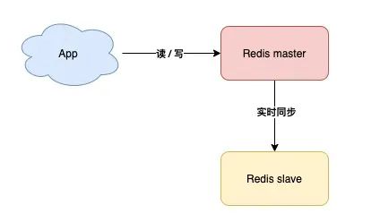

# Redis集群

Redis最小状态是一台服务器，这个服务器的运行状态，直接决定Redis是否可用，如果它离线了，整个项目就会失去Redis服务，这样系统很可能会崩溃！

为防止此种情况发生，我们可以准备一台备用Redis服务机

## 1.主从复制

主机(master)工作时,安排一台备用机(slave)实时同步数据

**优点**：万一主机宕机,我们可以切换到备机运行

**缺点**：这样的方案,slave节点没有任何实质作用,只要master不宕机它就和没有一样,没有体现价值

## 2.读写分离

**优点**：slave在master正常工作时也能分担Master的工作了

**缺点**：但是如果master宕机,实际上主备机的切换,实际上还是需要人工介入的,这还是需要时间的

> 那么如果想实现发生故障时自动切换,一定是有配置好的固定策略的

## 3.哨兵模式

### 作用：***故障自动切换***

**优点**：

哨兵节点每隔固定时间向所有节点发送请求

如果正常响应认为该节点正常

如果没有响应,认为该节点出现问题,哨兵能自动切换主备机

如果主机master下线,自动切换到备机运行

**缺点**：如果哨兵判断节点状态时发生了误判,那么就会错误将master下线,降低整体运行性能

所以要减少哨兵误判的可能性！

## 4.哨兵集群

### 作用：*投票决定，减少误判*

我们可以将哨兵节点做成集群,由多个哨兵投票决定是否下线某一个节点

哨兵集群中,每个节点都会定时向master和slave发送ping请求

如果ping请求有2个(集群的半数节点)以上的哨兵节点没有收到正常响应,会认为该节点下线

> 当业务不断扩展,并发不断增高时，需要实现高可用！

## 5.分片集群

只有一个节点支持写操作无法满足整体性能要求时,系统性能就会到达瓶颈

这时我们就要部署多个支持写操作的节点,进行分片,来提高程序整体性能

分片就是每个节点负责不同的区域

Redis0~16383号槽,

例如

MasterA负责0~5000

MasterB负责5001~10000

MasterC负责10001~16383

一个key根据CRC16算法只能得到固定的结果,一定在指定的服务器上找到数据

有了这个集群结构,我们就能更加稳定和更加高效的处理业务请求了

**为了节省哨兵服务器的成本,有些公司在Redis集群中直接添加哨兵功能,既master/slave节点完成数据读写任务的同时也都互相检测它们的健康状态**

> 有额外精力的同学,可以自己查询Redis分布式锁的解决方案(redission)