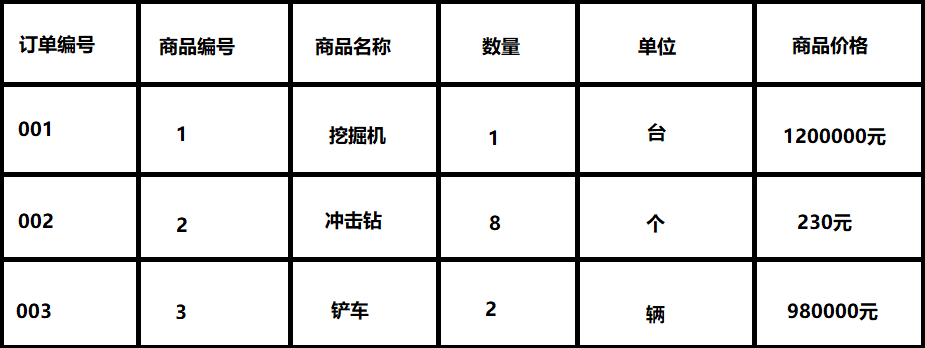
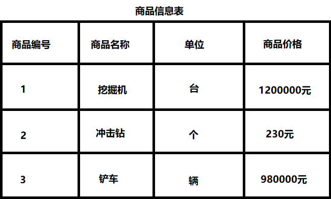
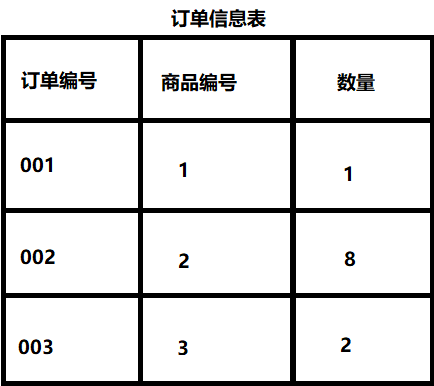
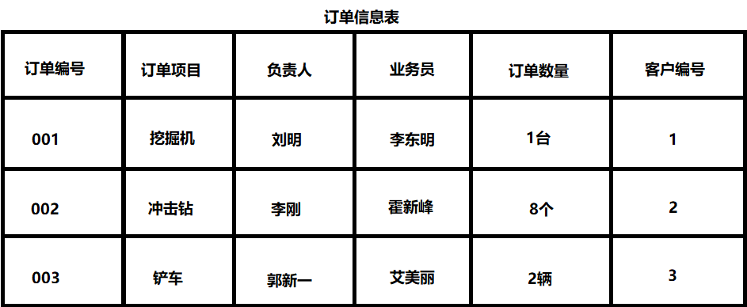
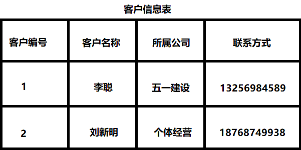

# 数据库三范式

## 首先解读什么是范式?

- #### 范式是符合某一中设计要求的总结.

- #### 要想设计一个结构合理的关系型数据库,必须满足一定的范式.

  - ##### 关系型数据库:以表格为存储方式为关系型数据库,例如MySQL,MariaDB等

  - ##### 非关系型数据库：以键值对或内存为存储方式为非关系型数据库,例如Redis

- #### 实际开发中常见的范式有三个

------

## 第一范式:

- #### 最基本的范式

- #### 如果数据库表中的所有字段值都是不可分解的原子值,就说明该表满足第一范式

> ## 列不可再分

- #### 比如某些字段数据库系统中需要用到"地址"属性设计成一个表的字段就行

- #### 但如果系统经常会访问"地址"属性中的"城市"部分,那就要将"地址"这个属性重新拆分为省份,城市,详细地址等多个部分进行存储,这样操作很方便,满足第一范式

## 第二范式:

- #### 在第一范式基础上更进一步(满足第一范式为前提)

- #### 第二范式需要确保数据库表中每列都与主键相关,也就是说在一个数据库表中,一个表中只能保存一种数据,不可以把多种数据放在一张表中

> ## 属性完全依赖于主键

#### 例如:

- ##### 这样就产生一个问题:这个表中是以订单编号和商品编号作为联合主键.商品名称,单位,价格等信息不与该表主键相关,只与商品编号相关,违背第二范式

- #### 而如果把这个信息表进行拆分,把商品信息分离到另一个表中,就非常完美

#### 例如:

- #### 这样设计,很大程度上减少数据冗余

- #### 如果要获取订单的商品信息,使用商品编号到商品信息表中查询即可

## 第三范式:

- #### 第三范式在第二范式上更进一步(满足一二范式的前提)

- #### 第三范式需要确保数据表中的每一列数据都和主键直接相关,而不能间接相关

- #### 比如在设计一个订单数据表时,可以将客户编号作为外键和订单表建立相应的关系.不可以在订单表中添加相关客户的其他信息,比如姓名,所属公司等 

> ## 属性不依赖与其他非主属性  属性直接依赖于主键

#### 例如:

