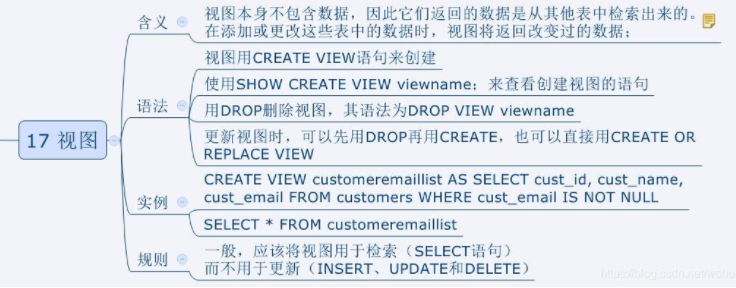

# 数据库视图

### 什么是视图?

视图是数据库中的一个对象,可以将其看成是一张虚拟的表,基于实表创建,**视图中只有结构**,不存储数据,可以通过视图来查询到表中的数据.

### 为什么使用视图?

1. 简化程序对SQL语句的编写
2. 更好的保证数据库的安全(隐藏对实际表的直接访问)
3. 保证数据库的安全性(隐藏对实际数据库的直接访问)
4. 视图提供了mysql的SELECT查询语句层次的封装,可以简化数据处理.



缺点:

修改限制：当用户试图修改视图的某些行时，SQL Server必须把它转化为对基本表的某些行的修改。对于简单视图来说，这是很方便的，但是，对于比较复杂的视图，可能是不可修改的。

### 如何创建视图?

1. 创建视图前先定位表:

   ```mysql
   # 创建视图前,先定位数据库(在哪个数据库下创建?)
   USE csmall_ams;
   ```

2. 创建视图

   ```mysql
   # 创建视图:admin_view为自定的视图名称
   CREATE VIEW admin_view as
   SELECT ams_admin.username, ams_role.name rname, ams_permission.name pname
   FROM csmall_ams.ams_admin
            JOIN csmall_ams.ams_admin_role
                 ON ams_admin_role.admin_id = ams_admin.id
            JOIN csmall_ams.ams_role
                 ON ams_role.id = ams_admin_role.role_id
            JOIN csmall_ams.ams_role_permission
                 ON ams_role.id = ams_role_permission.role_id
            JOIN csmall_ams.ams_permission
                 ON ams_permission.id = ams_role_permission.permission_id;
   ```

3. 基于视图查询数据

   ```mysql
   # 根据视图查询需要的数据
   SELECT username,rname,pname FROM admin_view;
   ```

4. 删除视图

   ```mysql
   # 删除视图
   DROP VIEW IF EXISTS admin_view;
   ```

