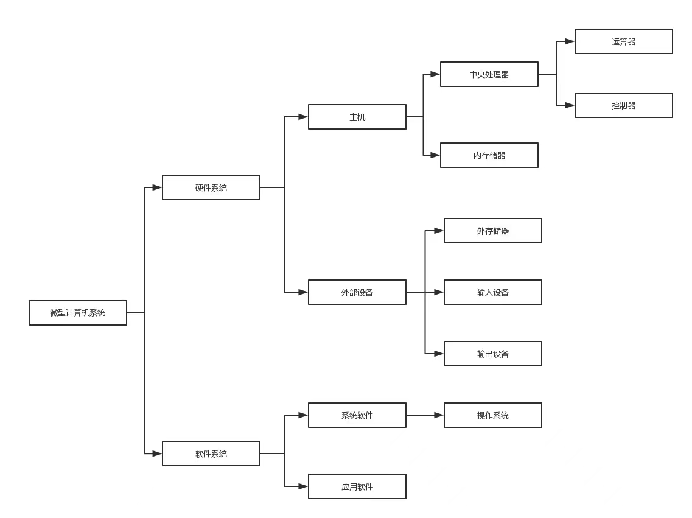

# ⭐计算机组成:

### 计算机中硬件分类

总:主板、显卡、声卡、网卡、CPU、硬盘、显示器、内存条、电源、键盘、鼠标、光驱

#### 核心硬件（必备）

CPU，内存，硬盘

#### 外部设备（非必备）

①输入设备:键盘、鼠标
②输出设备:显示器、打印机
③外储存器:硬盘储存器、移动储存器

#### 计算机软件

##### ⭐概念:软件是一系列按照特定顺序组织的电脑数据和指令，是电脑中的非有形部分

分类:1、系统软件是负责管理计算机系统中各种独立的硬件，使得它们可以协调工作。系统软件使得计算机使用者和其他软件将计算机当作一个整体而不需要顾及到底层每个硬件是如何工作的。
2、应用软件是为了某种特定的用途而被开发的软件。它可以是一个特定的程序，比如一个图像浏览器。也可以是一组功能联系紧密，可以互相协作的程序的集合，比如微软的Office软件。
图像:

### 软件实现过程

##### 1、分析阶段；2、设计阶段；3、实现阶段；4、测试阶段；5、维护阶段。

### 1、分析阶段

软件开发首先需要进行需求调研和分析完善的需求是软件开发项目成败的重要因素， 提炼所收集的用户需求，建立完整的分析模型，把他编写成软件开发过程中需求，规格说明和初步的用户手册。

### 2、设计阶段

软件设计可以分为两个阶段概要设计和详细设计，实际上软件设计的主要任务就是把软件分解成模块是指实现某个功能的数据和程序的说明，概要设计就是结构设计，其主要目标就是给出软件模块结构，用软件结构图表示，详细设计的首要任务是设计模块的程序流程，算法和数据结构，设计人员依据软件需求规格说明文档，确定软件的体系结构，进而确定每个模块实现算法，数据结构和接口等，编写设计说明书，组织设计评审。

### 3、实现阶段

软件开发流程中每上一个阶段都是下一个阶段的实施进行的基础。编程也是根据对软件设计，将软件设计的各部分需求通计算机程序代码来实现运行，编程有统一、规范的程序编写规则，保证软件程序的易懂性、易维护性。

### 4、测试阶段

在根据设计将客户软件需用编程代码来实现之后，也就是软件程序完成之后，需要对编写的程序，形成整体构架、功能进行单元、组装、系统三阶段的测试，以测试程序编写的正确性，以及对客户需求功能满足的充分性，以此来确定软件是否达到开发要求，同时也是一个发现问题、纠正问题的过程。

### 5、维护阶段

维护是指已经完成对软件的研制工作并交付使用后，对软件产品所进行的错误改正，适应环境变化和增强功能等软件工程修订，做好软件维护工作，不仅能排除障碍，使软件能正常工作，而且还可以扩展软件功能，提高性能，为用户带来明显的经济效益。

# ⭐了解计算机基础:

①从基本结构上来讲，电脑可以分为五大部分：运算器、存储器、控制器、输入设备、输出设备。

②电脑:主机(主要部分)、输出设备(显示器)、输入设备(键盘和鼠标)三大件组成。
③电脑的主体，在主机箱中有：主板、CPU、内存、电源、显卡、声卡、网卡、硬盘、软驱、光驱等硬件。
·电脑系统:

### 电脑系统分为硬件和软件两大部分

硬件相当于人的身体，而软件相当于人的灵魂。而硬件一般分为主机和外部设备，主机是一台电脑的核心部件，通常都是放在一个机箱里。而外部设备包括输入设备(如键盘、鼠标)和输出设备(如显示器、打印机)等。

##### (1)、机箱，一般电脑的主要零件都放在这里。

##### (2)、显示器，用来看电脑的工作过程，要不然，你都不知道电脑究竟在做什么。

##### (3)、键盘和鼠标，向电脑输入有用的命令，让它去为我们工作。

##### (4)、主板，这是一块很重要的东西，虽然它长得有点“丑”，这里是决定你这台电脑性能的重要零件之一哦。

##### (5)、内存，当电脑工作时，电脑会在这里存上存储数据，相当于人的记忆。

##### (6)、CPU，也称中央处理器，是电脑运算和控制的核心。

##### (7)、显卡，电脑通过这个玩意传送给显示器。

##### (8)、声卡，电脑通过这个玩意传送声音给音箱。

##### (9)、硬盘，平常人们常说我的硬盘有多少G多少G，就是指这个硬盘的容量，而G数越多能装的东西便越多。

##### (10)、软驱，就是插软盘的玩意，现在一般都用3.5英寸的，古老年代用5.25英寸的，现在我们去买人家都不卖了。

##### (11)、光驱，听CD当然少不了这个，有时候你要安装某些软件都是在光盘上的，所以这个用处太大。

##### (12)、电源，主要用于将220V的外接电源转换为各种直流电源，供电脑的各个部件使用

# ⭐计算机软件开发语言:

#### Python语言、C语言、C++语言,Java语言、PHP语言、GO语言等。编程语言有很多种，总的来说可以划分成三类：机器语言、汇编语言、高级语言。目前使用的较多的是汇编语言和高级语言.