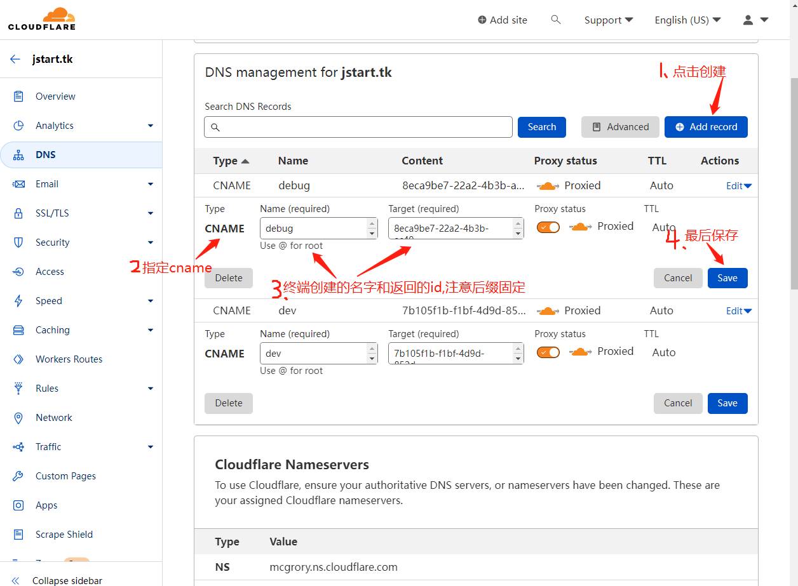

# 公网穿透内网

> #### 我们通常在局域网内部署服务器和应用，当需要将本地服务提供到互联网外网连接访问时，由于本地服务器本身并无公网IP，就无法实现，这时候就需要内网穿透技术。

#### 1.内网穿透是什么意思？

即内网映射，本地服务器内网IP端口，提供到外网连接访问的实现和过程。

#### 2.什么时候需要用内网穿透?

无公网IP时，需要将本地服务器和应用服务，提供到互联网访问时，就需要使用内网穿透的方法。

#### 3.内网穿透原理

快解析内网穿透的原理是通过云服务器与内网服务器建立连接，把内网端口映射到云端，以此实现各类局域网服务基于域名的互联网访问，整个过程不保留用户数据信息，核心数据仍保存在用户内网服务器上，而且，快解析曾荣获国家级高新技术企业认证，是少数获得多项核心专利的软件服务商。支持HTTPS映射的，数据加密传输，安全性非常高。

## 流程:

#### 1.访问并登录CloudFlare,获取证书

```cmd
cloudflared.exe tunnel login
```

目录:C:\Users\Administrator\.cloudflared\cert.pem

##### CloudFlare地址:https://dash.cloudflare.com/

#### 2.创建一个服务,一个服务可以对应多个应用

```cmd
cloudflared.exe tunnel create dev #获取一个证书id
# 会生成一个C:\Users\Administrator\.cloudflared目录,里面含有id和证书文件
```

证书文件目录:C:\Users\Administrator\.cloudflared\7b105f1b-f1bf-4d9d-852d-9cf4de3732b1.json



创建成功后

#### 3.创建一个配置文件,按这个模板

配置目录::\Users\Administrator\.cloudflared\config.yaml

```shell
tunnel: xxxx    #服务通道
credentials-file: C:\Users\Administrator\.cloudflared\xxxx.json  #证书文件
ingress:
  - hostname: dev.jstart.tk    #域名名称,与cname域名一致 名称.域名：如dev.jstart.tk
    service: http://localhost:8080  #本地程序地址
  - service: http_status:404
```

#### 4.解析一个cname域名,后缀固定xxxxx.cfargotunnel.com

```
xxx对应服务id,如：7b105f1b-f1bf-4d9d-852d-9cf4de3732b1
```

#### 5.启动服务,指定一个配置文件

在C:\Users\Administrator\.cloudflared\目录下输入cmd

```
cloudflared.exe tunnel --config C:\Users\Administrator\.cloudflared\config.yaml run
```

