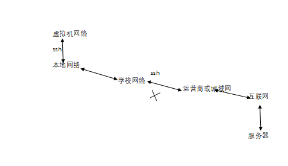

# 关于SSH协议（安全外壳协议）

### 百科概念:

SSH 为 [Secure Shell](https://baike.baidu.com/item/Secure Shell?fromModule=lemma_inlink) 的缩写，由 IETF 的网络小组（Network Working Group）所制定；**SSH 为建立在应用层基础上的安全协议**。SSH 是较可靠，专为[远程登录](https://baike.baidu.com/item/远程登录/1071998?fromModule=lemma_inlink)会话和其他网络服务提供安全性的协议。利用 SSH 协议可以有效防止远程管理过程中的信息泄露问题。SSH最初是UNIX系统上的一个程序，后来又迅速扩展到其他操作平台。SSH在正确使用时可弥补网络中的漏洞。[SSH客户端](https://baike.baidu.com/item/SSH客户端/7091372?fromModule=lemma_inlink)适用于多种平台。几乎所有UNIX平台—包括[HP-UX](https://baike.baidu.com/item/HP-UX?fromModule=lemma_inlink)、[Linux](https://baike.baidu.com/item/Linux?fromModule=lemma_inlink)、[AIX](https://baike.baidu.com/item/AIX?fromModule=lemma_inlink)、[Solaris](https://baike.baidu.com/item/Solaris/3517?fromModule=lemma_inlink)、Digital [UNIX](https://baike.baidu.com/item/UNIX?fromModule=lemma_inlink)、[Irix](https://baike.baidu.com/item/Irix?fromModule=lemma_inlink)，以及其他平台，都可运行SSH。

### 功能:

传统的网络服务程序,如:FTP、POP和Tenlnet在本质上都是不安全的，因为它们在网络上用明文传送口令和数据，别有用心的人非常容易可以截取到这些口令和数据。而且，这些服务程序的安全验证方式也是有其弱点的，就是很容易收到“中间人”（man-in-the-middle）这种方式的攻击。所谓“中间人”的攻击方式，就是“中间人”冒充真正的服务器接收你传给服务器的数据，然后再冒充你把数据传给真正的服务器。服务器和你之间的数据传送被“中间人”一转手做了手脚后，就会出现很严重的问题。

通过使用SSH,你可以把所有传输的数据进行加密，这样”中间人“这种攻击方式就不可能实现了，而且也能够防止DNS欺骗和IP欺骗。

使用SSH，还有一个额外的好处就是传输的数据是经过压缩的，所以可以加快传输的速度。

SSH有很多功能，它既可以替代Telnet，又可以为FTP、PoP、甚至为APP提供一个安全的“通道”。

### 验证：

从客户端来看，SSH提供两种级别的安全验证。

**第一种级别（基于口令的安全验证）**

只要你知道自己账号和口令，就可以登录到远程主机。所有传输的数据都会被加密，但是不能保证你正在连接的服务器就是你想连接的服务器。可能会有别的服务器在冒充真正的服务器，也就是收到“中间人”这种方式的攻击。

**第二种级别（基于密匙的安全验证）**

需要依靠[密匙](https://baike.baidu.com/item/密匙?fromModule=lemma_inlink)，也就是你必须为自己创建一对密匙，并把公用密匙放在需要访问的服务器上。如果你要连接到SSH服务器上，客户端软件就会向服务器发出请求，请求用你的密匙进行安全验证。服务器收到请求之后，先在该服务器上你的主目录下寻找你的公用密匙，然后把它和你发送过来的公用密匙进行比较。如果两个密匙一致，服务器就用公用密匙加密“质询”（challenge）并把它发送给客户端软件。客户端软件收到“质询”之后就可以用你的私人密匙解密再把它发送给服务器。

用这种方式，你必须知道自己密匙的[口令](https://baike.baidu.com/item/口令?fromModule=lemma_inlink)。但是，与第一种级别相比，第二种级别不需要在网络上传送口令。

第二种级别不仅加密所有传送的数据，而且“中间人”这种攻击方式也是不可能的（因为他没有你的私人密匙）。但是整个登录的过程可能需要10秒

### 层次：

SSH 主要由三部分组成：

**传输层协议 [SSH-TRANS]**

提供了服务器认证，保密性及完整性。此外它有时还提供压缩功能。 SSH-TRANS 通常运行在TCP/IP连接上，也可能用于其它可靠数据流上。 SSH-TRANS 提供了强力的加密技术、密码主机认证及完整性保护。该协议中的认证基于主机，并且该协议不执行[用户认证](https://baike.baidu.com/item/用户认证?fromModule=lemma_inlink)。更高层的用户认证协议可以设计为在此协议之上。

**用户认证协议 [SSH-USERAUTH]**

用于向服务器提供客户端用户鉴别功能。它运行在[传输层](https://baike.baidu.com/item/传输层?fromModule=lemma_inlink)协议 SSH-TRANS 上面。当SSH-USERAUTH 开始后，它从低层协议那里接收会话[标识符](https://baike.baidu.com/item/标识符?fromModule=lemma_inlink)（从第一次[密钥](https://baike.baidu.com/item/密钥?fromModule=lemma_inlink)交换中的交换哈希H ）。会话标识符唯一标识此会话并且适用于标记以证明私钥的所有权。 SSH-USERAUTH 也需要知道低层协议是否提供保密性保护。

**连接协议 [SSH-CONNECT]**

将多个加密隧道分成逻辑通道。它运行在用户认证协议上。它提供了交互式登录话路、远程命令执行、转发 TCP/IP 连接和转发 X11 连接。

### 结构：

SSH是由客户端和[服务端](https://baike.baidu.com/item/服务端?fromModule=lemma_inlink)的软件组成的，有两个不兼容的版本分别是：1.x和2.x。 用SSH 2.x的客户程序是不能连接到SSH 1.x的服务程序上去的。OpenSSH 2.x同时支持SSH 1.x和2.x。

服务端是一个[守护进程](https://baike.baidu.com/item/守护进程?fromModule=lemma_inlink)(daemon)，他在后台运行并响应来自客户端的连接请求。服务端一般是sshd进程，提供了对远程连接的处理，一般包括公共密钥认证、密钥交换、[对称密钥](https://baike.baidu.com/item/对称密钥?fromModule=lemma_inlink)加密和非安全连接。

客户端包含ssh程序以及像scp（远程拷贝）、slogin（远程登陆）、[sftp](https://baike.baidu.com/item/sftp?fromModule=lemma_inlink)（安全文件传输）等其他的应用程序。

他们的工作机制大致是本地的客户端发送一个连接请求到远程的服务端，服务端检查申请的包和IP地址再发送密钥给SSH的客户端，本地再将密钥发回给服务端，自此连接建立。SSH 1.x和SSH 2.x在连接协议上有一些差异。

一旦建立一个安全传输层连接，客户机就发送一个服务请求。当用户认证完成之后，会发送第二个服务请求。这样就允许新定义的协议可以与上述协议共存。连接协议提供了用途广泛的各种通道，有标准的方法用于建立安全交互式会话外壳和转发（“[隧道技术](https://baike.baidu.com/item/隧道技术?fromModule=lemma_inlink)”）专有 TCP/IP 端口和 X11 连接。

### 例子：

若某局域网禁用了SSH协议时，远程服务器将无法正常连接

可以在同域的主机中搭建虚拟机，提供虚拟网络来进行连接

