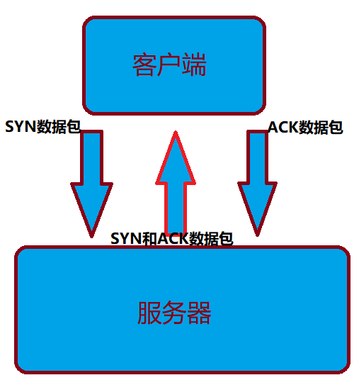

# 关于地址栏中的请求

## DNS

**D**omain**N**ame**S**ystem域名系统

该系统用于命名组织到域层次结构中的计算机和网络服务。域名是由圆点分开一串单词或缩写组成的，每一个域名都对应一个唯一的IP地址，在Internet上域名与IP地址之间是一对应的，DNS就是进行域名解析的服务器。

#### 举例:

当我们在浏览器地址栏输入URL发起请求时,并不会直接找到请求对应的服务器,底层会使用DNS解析,将URL地址解析为IP地址。

DNS是一个数据库,该数据库中记录了很多的URL和对应的IP地址,这样就可以利用URL找到对应的IP地址,进而找到服务器。

## TCP传输

**T**ransmission **C**ontrol **P**rotocol传输控制协议

当我们知道了IP地址后，在正式发送请求数据之前需要进行TCP传输层连接（可靠传输），即：在发送数据之前先建立通道，以供客户端与服务器进行数据传输，进而产生了"TCP三次握手"！

客户端发送SYN数据包表示请求连接，服务器相应SYN和ACK数据包以示同意连接，最终客户端再发送ACK数据包表示成功连接！



## 请求详情

1. **请求行**：请求方法、请求地址、HTTP协议版本
2. **请求头**：浏览器的信息（键值对，一行一对）
3. **空行**：说明请求头结束
4. **请求数据**：告诉服务器要什么数据和数据类型

## 响应详情

1. 状态行：常见的200、404等状态码

2. 响应头：文件类型、数据长度等（键值对，一行一对）

   - ```shell
     Content-Type: text/html
     Content-Length: 220790
     Server: BirdWebServer
     ```

3. 空行：响应头结束

4. 响应正文：客户端要的信息

## 渲染页面

浏览器接收到服务器的响应后，页面就开始渲染，浏览器解析接收到的html、css、JavaScript等文件，有了这些文件，用户就能从浏览器中看到内容了。
