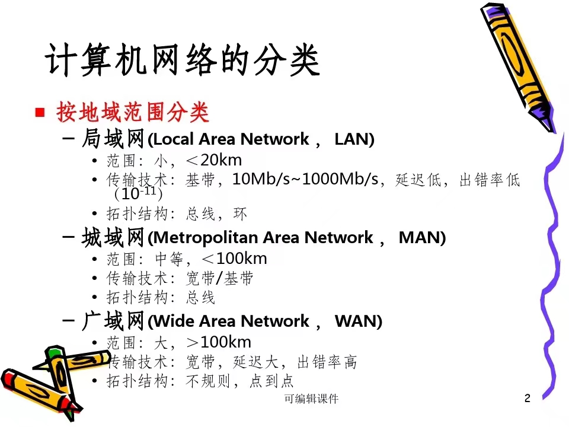
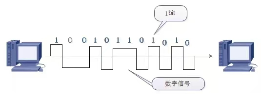
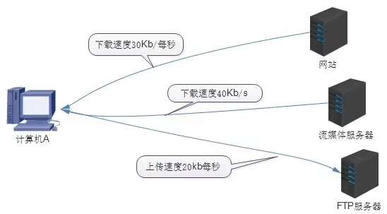
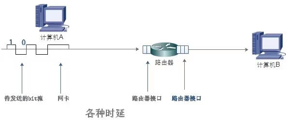
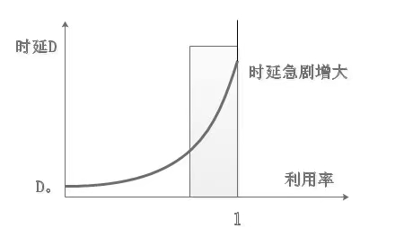

# ⭐计算机网络分类:

- ### 从范围角度分类:

  - ##### 局域网

    范围:小<20km

    传输技术:基带,10Mb/s~1000Mb/s,延迟低,出错率低

    拓扑结构:总线,环

  - ##### 城域网

    范围:中等<100km

    传输技术:基带/宽带

    拓扑结构:总线

  - ##### 广域网

    范围:大>100km

    传输技术:基带,延迟大,出错率高

    拓扑结构:不规则,点到点

  

- ### 从使用角度分类:

  - ##### 公用网

  - ##### 专用网

- ### 按照使用范围划分

##### 按使用范围分类,计算机网络可以分为公用网和专用网.

##### 公用网一般是指由用家的电信部门建造的网络,公用是指所有愿意按电信部门规定付费的人都可以使用,因此公用网也称为公众网

##### 专用网是指由某个部门根据系统的特殊业务工作需要而建造的网络.这种网络不向本系统以外的人提供服务.例如军队,铁路和电力等系统均有本系统的专用网络.

# ⭐计算机网络性能指标:

### ①速率

##### 计算机通常要将发送的信息转换成二进制数字来传输，一位二进制数称为一个比特（bit），二进制数字转换成数字信号在线路上传输，如图所示。

##### 网络技术中的速率指的是每秒传输的比特数量，称为数据率（date rate）或者比特率（bit rate）。

### ②吞吐量

##### 吞吐量表示在单位时间内通过某个网络或接口的数据量，包含全部上传和下载的流量。

### ③带宽

##### 在计算机网络中，带宽用来表示网络通信线路传输数据的能力，即最高速率。

### ④时延

##### 时延（delay或latency）是指数据（一个数据包或bit）从网络的一端传送到另一端所需要的时间。时延是一个很重要的性能指标，有时候也称为延迟或迟延。

##### 发送时延、传播时延、排队时间、处理时延、时延带宽积、往返时间

### ⑤利用率

##### 利用率是指网络有百分之几的时间是被利用的，没有数据通过的网络利用率为0.

##### 网络利用率越高，数据分组在路由器和交换机处理时就需要排队等待，因此时延也就越大。

# ⭐计算机网络分层:

### ①OSI七层协议

##### a.物理层

##### b.数据链路层

##### c.网络层

##### d.传输层

##### e.回话层 

##### f.表示层 

##### g.应用层

### ②TCP/IP协议

##### A.最上面的就是应用层了，这里面有http，ftp,等等我们熟悉的协议。

##### B.而第二层则是传输层，著名的TCP和UDP协议就在这个层次。

##### C.第三层是网络层，IP协议就在这里，它负责对数据加上IP地址和其他的数据以确定传输的目标。

##### D.第四层是叫数据链路层，这个层次为待传送的数据加入一个以太网协议头，并进行CRC编码，为最后的数据传输做准备。

# ⭐计算机OSI七层协议参考:

##### 1.物理层(Physical Layer)：主要功能为定义了网络的物理结构，传输的电磁标准，Bit流的编码及网络的时间原则，如分时复用及分频复用。决定了网络连接类型(端到端或多端连接)及物理拓扑结构。说的通俗一些，这一层主要负责实际的信号传输。

##### 2.数据链路层(Data Link eview)：在两个主机上建立数据链路连接，向物理层传输数据信号，并对信号进行处理使之无差错并合理的传输

##### 3.网络层(Network Layer)：主要负责路由，选择合适的路径，进行阻塞控制等功能。

##### 4.传输层(Transfer Layer)：最关键的一层，向拥护提供可靠的端到端(End-to-End)服务，它屏蔽了下层的数据通信细节，让用户及应用程序不需要考虑实际的通信方法。

##### 5.会话层(Session Layer)：主要负责两个会话进程之间的通信，即两个会话层实体之间的信息交换，管理数据的交换。

##### 6.表示层(Presentation Layer)：处理通信信号的表示方法，进行不同的格式之间的翻译，并负责数据的加密解密，数据的压缩与恢复

##### 7.应用层(Application Layer)：保持应用程序之间建立连接所需要的数据记录，为用户服务。