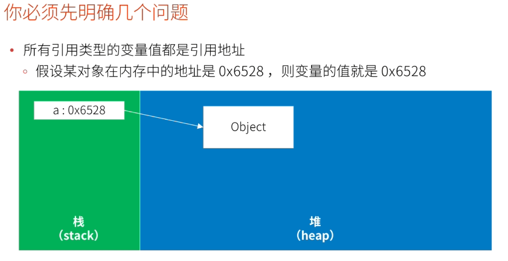
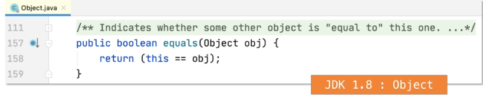
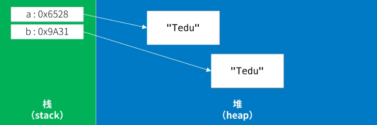
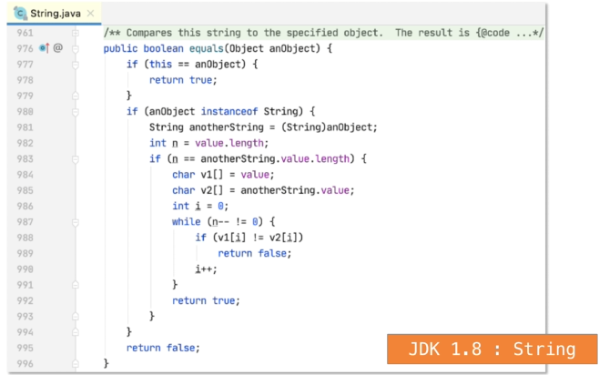
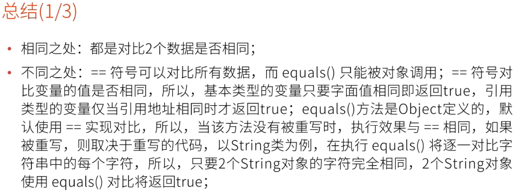
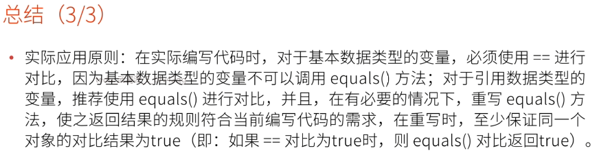

# Java有关==和equals()的区别

- ### 这是有关"对比的"类型的面试题,建议回答时包括:

  - ##### 多个对比项有什么相同/相似之处

  - ##### 多个对比项的区别

  - ##### 在应用中应该如何选取(重要)

  - ##### 可能的话.加入一些扩展(对相关知识点的理解)

- ### 变量与对象是两个不同的概念

  - 假设有以下代码:

    ```java
    Object a = new Object();
    ```

  - 以上代码中的a就是变量,在内存中实际存在的数据就是对象

    

- ### ==与equals()的区别

  - #### ==是基本运算符,使用与所有类型的变量与变量的对比

  - #### equals()是Object类定义的方法,由于Object是Java的基类(所有类的父类),所以,任何对象都可以调用equals()方法实现对比,但是,基本数据类型并不是对象,无法调用该方法实现对比

  - #### 举例1:三个基本数据类型

    ```java
    int a = 100;
    int b = 100;
    int c = 200;
    System.out.println(a==b);//true
    System.out.println(a==c);//false
    ```

    

  - #### 举例2:两个Object对象类型

    ```java
    Object a = new Object();
    Object b = new Object();
    System.out.println(a==b);//false
    ```

    

- ### equals()只是一个方法,到底返回true或false取决于方法的实现

  - ##### 默认情况下,未修改方法时(根据Object的定义),它与==的结果相同

    

  ```java
  Object a = new Object();
  Object b = new Object();
  System.out.println(a==b);//false
  System.out.println(a.equals(b));//false
  ```

  ```java
  Object a = new Object();
  Object b = a;//对b进行赋值操作,将a的地址赋给了b
  System.out.println(a==b);//true
  System.out.println(a.equals(b));//true
  ```

  - 方法可以被重写,在Java中,许多类都重写了equals()方法,例如:String,包装类,日期等

    - 导致尽管是不同的对象,但equals()的结果可能是true

      ```java
      String a = new String("Tedu");
      String b = new String("Tedu");
      System.out.println(a==b);//false
      System.out.println(a.equals(b));//true,因为String重写了equals()方法
      ```

      

    - ##### String类型源代码:

      

- ### 由于Java对常量池的特殊处理,还有些特殊情况:

  - 直接声明的字符串使用==对比也是成立的

    ```java
    String a = "Tedu";
    String b = "Tedu";//发现常量池中已经有Tedu了,所以直接指向同一个Tedu
    System.out.println(a==b);//true
    ```

  - 使用[-128,127]区间值对整型包装类对象使用==对比也是成立的

    ```java
    Integer a = -129;
    Integer b = -127;
    System.out.println(a==b);//false,其中一个超出了范围,在堆中是两个不同的对象
    
    a = -128;
    b = -128;
    System.out.println(a==b);//true,都在范围内,在堆中是同一个对象
    
    a = 127;
    b = 127;
    System.out.println(a==b);//true,都在范围内,在堆中是同一个对象
    
    a = 128;
    b = 128;
    System.out.println(a==b);//false,两者都超出了范围,在堆中是不同的对象
    ```

- 

- ### 总结(2/3):

  - ##### 补充说明:用于Java会在编译期处理常量,并且,常量池中的每一个常量都是唯一的,所以,当使用字符串常量直接对变量赋值,或使用[-128,127]区间值对Byte/Short/Integer/long类型的对象赋值时,使用==对比的结果也是true

- 

