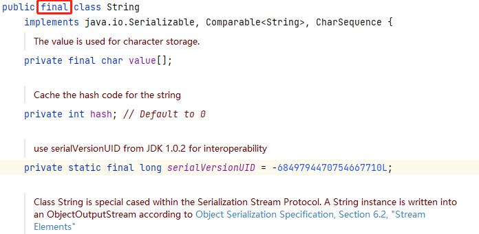
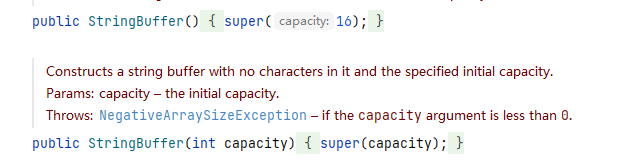
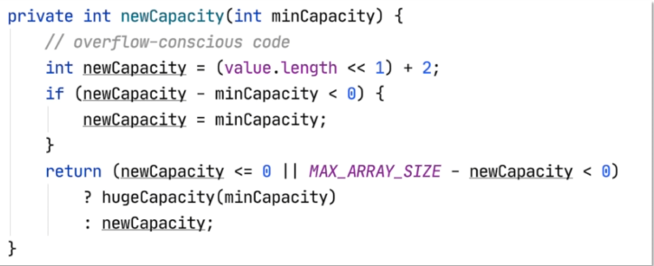
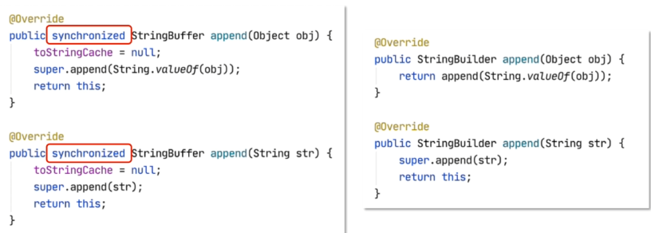

# String,StringBuffer和StringBuilder的区别

### String,StringBuffer和StringBuilder的共同点:

- ##### 都是用于处理字符串数据的类

- ##### 都是管理内部的一个char[]实现的

- ##### 实现的接口大致相同,特别是CharSequence接口

  - ##### 许多API设计中,方法的参数或返回值都使用这个接口,使得参数或返回值更加灵活

- ##### 有许多相同的API,例如replace(),indexOf(),lastIndexOf(),subString()等

### String,StringBuffer和StringBuilder的区别:

- #### 首先,你得知道String的"不可变"特性:每个字符串对象都是不可变的

  ```java
  String s = "hello";
  s = "hello,world!";
  ```

  - ##### 以上代码中声明了1个变量,创建了2个对象(一个字面量对象,一个String对象)

- #### String的"不可变"特性是由于其内部通过管理一个char[]决定的

  - ##### 在Java语言中,数组在内存必须是连续的,则其长度不可变

    

- #### 提示:String的"不可变"特性与该类声明中的final无关

  - ##### 这里的final仅限制该类无法被继承

    

- #### 提示:因为String的"不可变"特性,在String的API中,所有修改字符串的方法都将返回新的String对象

- #### 基于String的"不可变"特性,String的修改操作的效率将非常低下

  - ##### 需要寻址,创建新对象,还可能将原有char[]的某部分复制到新的char[]中

    - 因为在程序中,不存在将就,空间不够时就会寻找新的空间来容纳

  - ```java
    String s = "hello";
    S += "!";//hello!
    ```

    

- ### StringBuffer和StringBuilder从一开始就会使用长度更长的char[],哪怕只用于存放少量的几个字符

  - 其length()方法会返回实际存放的字符数量

    

- ### StringBuffer的构造方法

  - ##### 第一个构造默认初始大小是16个字符,第二个构造方法可以放任意大小字符

    

- ### StringBuffer的扩容

  - ##### 当一次性不够用时自动扩容,底层会将对应二进制进行移位,16->32->64->128....依次往外进行2次方的扩容

    

- #### 在许多调整字符串的操作中,StringBuffer和StringBuilder只需要直接调整内部的char[]即可,不需要频繁的寻址,创建新对象等操作,所以,实际执行效率远高于String类

  - ##### 当然,如果默认的char[]长度(实际长度)不足以满足运算需求时,会自动扩容,也需要创建新的对象,但跟String比较,不会太过于频繁

### 关于执行效率的测试:

- #### String类:

  ```java
  @Test
  void testString(){
      long startTime = System.currentTimeMillis();
      String str = "";
      for(int i = 0; i<100000; i++){//在for循环中字符串会频繁的拼接自增i的值10万次
          str += i;
      }
      long endTime = System.currentTimeMillis();
      System.out.println("测试String操作,耗时:"+(endTime-startTime)+"ms");//23357ms
  }
  ```

- #### StringBuffer类:

  ```java
  @Test
  void testStringBuffer(){
      long startTime = System.currentTimeMillis();
      StringBuffer str = new StringBuffer();
      for(int i = 0; i<100000; i++){//在for循环中字符串会频繁的拼接自增i的值10万次
          str.append(i + "");
      }
      long endTime = System.currentTimeMillis();
      System.out.println("测试StringBuffer操作,耗时:"+(endTime-startTime)+"ms");//23ms
  }
  ```

- #### StringBuilder类:

  ```java
  @Test
  void testStringBuilder(){
      long startTime = System.currentTimeMillis();
      StringBuilder str = new StringBuilder();
      for(int i = 0; i<100000; i++){//在for循环中字符串会频繁的拼接自增i的值10万次
           str.append(i + "");
      }
      long endTime = System.currentTimeMillis();
      System.out.println("测试StringBuilder操作,耗时:"+(endTime-startTime)+"ms");//19ms
  }
  ```

### StringBuffer是线程安全的,而StringBuilder不是线程安全的



### 总结(1/3)

- #### 相同之处:

  - ##### 都是用于管理字符串数据的类

  - ##### 都是管理内部的一个char[]实现的

  - ##### 实现的接口大致相同,特别是CharSequence接口

  - ##### 有许多相同的API,例如replace(),indexOf()等

### 总结(2/3)

- #### 不同之处:

  - String的字符串操作效率低下,是因为它的"不可变"特性决定的
  - StringBuffer和StringBuilder会保证管理的char[]的长度始终高于实际存在的字符长度,在处理字符操作时,效率远高于String
  - StringBuffer是线程安全的,而StringBuilder不是

### 总结(3/3)

- #### 实际使用原则:

  - 尽管StringBuffer和StringBuilder在处理字符串时的效率远高于String,但并不是每个String都需要频繁的改变,相比之下,使用String的语法更加简洁,直观,实际占用的存储空间更小,所以,**当字符串不需要频繁的改变时,优先使用String.**

  - 如果字符串需要频繁改变,原则上来说,仅当单线程运行时,或已经采取措施保障线程安全时,优先使用StringBuilder,因为它的执行效率高与StringBuffer,事实上,尽管StringBuilder的执行效率比StringBuffer高,但差距并不大,为了避免后续调整带来的安全隐患,**当字符串可能频繁改变时,一般使用StringBuffer.**