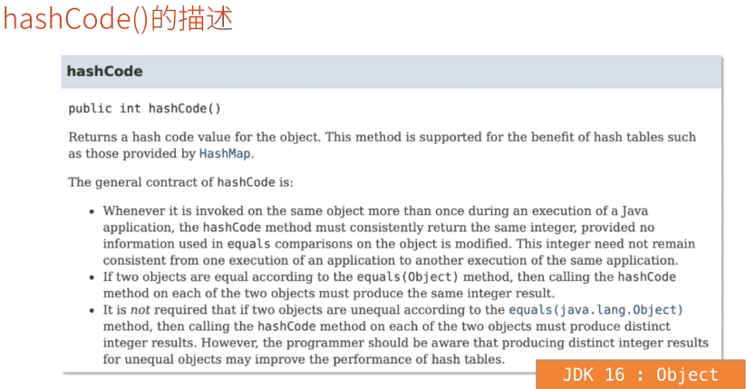
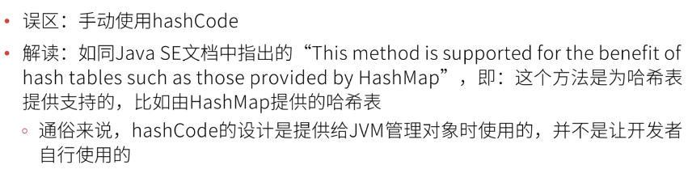

# 什么是hashCode?

### 首先清除所有引用类型引用的都是地址,因为Java是值传递的

- #### 通常,口头描述中的hashCode指的是hashCode()方法,或该方法的返回值

  - hashCode()方法是由Object类定义的,所以,在Java中,所有类都由该方法并且,所有类都可以重写该方法

### hashCode()的描述

- 返回该对象的哈希值.这个方法是为哈希表提供支持的,比如由HashMap提供的哈希表
- hashCode的一般原则是:
- 在Java应用程序的执行过程中,只要对同一个对象调用一次以上,hashCode方法就必须始终返回相同的整数,前提是在对象的equals比较中使用的信息没有被修改.对于同一个应用程序而言,某一次的执行与另一次执行时,该值不需要保持不一致
- 如果两个对象根据equals(Object)方法对比的结果是相等的,那么在这两个对象上调用hashCode方法必须产生相同的整数结果.
- 有种情况并不是强制的:如果根据equals(java.lang.Object)方法,两个对象不相等,那么在这两个对象上调用hashCode方法必须产生不同的整数结果.然而,程序员应该知道,为不相等的对象产生不同的整数结果可能会提高哈希表的性能

### 常见的误区

- 误区:hashCode就是对象的内存地址
- 解读:哈希(Hash)一般值散列算法,也称之为哈希算法,在Object类的实现中,哈希码(hashCode)是通过哈希算法得到的一个整型结果,本质上与内存地址没有关系
- 误区产生原因:根据Object类的hashCode()实现,每个对象的hashCode值(理论上)都不同,通常可以用于判断2个变量是否引用同1个对象

- 反向论证:hashCode无法表示对象的内存地址

  - JVM在进行垃圾管理时,会移动对象的位置,即:经过某次垃圾回收之后,对象在内存中的位置可能就已经发生了变化,但hashCode值并不会变

  - Integer(或int)类型的值区间是-2147483648~2147483647,Java管理的内存已经超过4GB,所以,hashCode不可能是内存地址

    ---2乘1024乘1024乘1024即2GB

    ---2乘1024乘1024乘1024-1=2147483647

### HashCode的作用

- ##### Hash容器可以通过hashCode定位需要使用的对象

  - 典型的Hash容器:HashSet,HashMap,HashTable,ConcurrentHashMap
  - 再次强调:hashCode不是对象的内存地址,只是通过它去找(怎么找是Java内部的事情)

- ##### Hash容器通过hashCode来排除2个不相同的对象

  - 例如,向HashCode的元素,HashMap的Key等都要求"唯一",如果即将添加的元素的hashCode与集合中已有的每个元素的hashCode均不同,则可以视为"当前集合中尚不存在即将添加的元素"

    ---如果2个对象的hashCode相同,Hash容器还会调用equals()方法,晋档equals()也返回true时,才会视为"相同"

## 总结(1/2)

- ##### hashCode()是Object定义的方法,它将返回一个整型值,它并不代表对象在内存中的地址,它存在的价值视为Hash容器处理数据时提供支持,Hash容器可以根据hashCode定位需要使用的对象,也可以根据hashCode来排除2个不相同的对象,即:hashCode不同,则视为2个对象不同

## 总结(2/2)

- 在重写hashCode()时,应该遵循Java-SE的官方指导
  - 如果2个对象使用equals()对比的结果为true,则这两个对象的hashCode()返回的结果应该相同
  - 如果2个对象使用equals()对比的结果为false,则这两个对象的hashCode()返回的结果应该不同
  - 通常,不必关心如何重写equals()方法和hashCode()方法,而是使用IDEA生成
    - 例如Eclipse,IntelliJ IDEA,它们生成的方法是符合以上指导意见的Alt+Insert快捷键